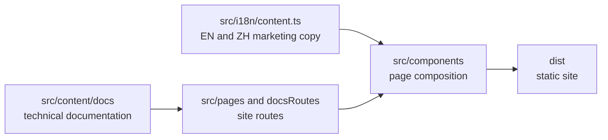

# awakenworks.com

AwakenWorks 的公司与产品官网，包含三条产品线：

- **Awaken Agents** 负责 Agent 的定义、运行、恢复与托管。
- **Awaken Objects** 负责业务对象、关系、操作、权限与连接器。
- **Awaken Workforce** 负责把需求转换为可持续推进、可恢复、可验收的工作。

产品边界由用户任务和产品契约决定，与代码仓、crate 或安装包的划分无关。

站点使用 [Astro](https://astro.build) 和 [Tailwind CSS v4](https://tailwindcss.com)，
默认英文，中文位于 `/zh/`。

## Develop

```sh
pnpm install
pnpm dev        # http://localhost:4321
pnpm build      # static output in dist/
pnpm preview
```

需要本地 Git hooks 的贡献者可另外运行 `pnpm hooks:install`。安装依赖和发布构建不会
修改 Git 配置，也不要求 `.git` 目录存在。

## Deploy

使用公开 GitHub 仓库管理官网源码，并通过 GitHub Pages 发布静态站点：

1. 创建公开仓库，例如 `AwakenWorks/awakenworks.com`。
2. 推送本仓库。
3. 在 **Settings → Pages** 中将 **Build and deployment → Source** 设为 **GitHub Actions**。
4. 推送 `main`；`.github/workflows/pages.yml` 构建 Astro 并发布 `dist/`。
5. 在 Pages 设置中绑定 `awakenworks.com`。

绑定完成后运行 `pnpm check:live`。该只读门禁会检查 DNS、HTTP 到 HTTPS、根域与
`www`、首页资源类型、核心产品与中文路由，以及 AwakenWorks canonical 身份；它不会
修改域名或 Pages 设置。

## Structure



本站的安装、构建和质量门禁只读取本仓库内容，不依赖固定目录、兄弟仓库或本机
Git 工作树。`config/source-provenance.json` 锁定已核对源码的精确 revision 和文档引用的
实现证据。产品仓库中的类型、测试和可执行合约仍是技术行为的最终权威。

只有在升级文档源码基线时，维护者才需要显式提供两个源码仓路径并刷新锁文件：

```sh
pnpm provenance:refresh --awaken /path/to/awaken --flow /path/to/awaken-flow
```

该维护命令不属于安装、构建或发布门禁。它在本地核对两个精确 revision，并验证
Awaken 页面引用的证据路径。更新后必须在同一变更中审查并提交 revision、证据坐标和
相关文档。

## Rights

官网源码、文案和品牌资产保留全部权利，具体见 [`LICENSE`](LICENSE)。Awaken Agents
产品仓库的开源许可独立维护，不由本仓库的权利声明覆盖。

## Content quality gates

- `pnpm brand:generate`：从唯一几何与配色来源生成明暗两套品牌 SVG 和 favicon。
- `pnpm build`：生成中英文静态站点。
- `pnpm check:home`：检查产品路径、首页导航、GitHub Star 入口和逐页内容契约。
- `pnpm check:standalone`：拒绝安装生命周期副作用、固定本机路径、兄弟仓读取和 Git 工作树依赖。
- `pnpm check:docs`：检查文档路由、搜索索引、链接、架构图，以及仓内锁定的源码证据。
- `pnpm check:live`：只读检查正式域名是否真正返回当前 AwakenWorks 站点，而非停放页或错误重定向。
