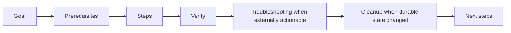

# Documentation and blog architecture

The site publishes bilingual, version-aware product documentation from Astro
Content Collections.

## Routes and storage

```mermaid
flowchart TD
  Site[Site routes] --> Agents[/agents and /docs/agents]
  Site --> Objects[/objects and /docs/objects]
  Site --> Workforce[/workforce and /docs/workforce]
  Site --> Blog[/blog/slug]
  Site --> Zh[/zh mirror]
  Source[Source collections] --> AgentsProduct[src/content/docs/platform]
  Source --> AgentsCore[src/content/docs/harness]
  Source --> FlowSource["src/content/docs/flow<br/>awaken-flow source"]
  AgentsProduct --> Agents
  AgentsCore --> Agents
  FlowSource --> Objects
  FlowSource --> Workforce
```

Product slugs are `agents`, `objects`, and `workforce`. Source collection
slugs remain `platform`, `harness`, and `flow`: both Agents source collections map into
Awaken Agents; object-owned concepts map into Objects; the remaining `awaken-flow` source material maps
into Workforce. `src/lib/docsRoutes.ts` is the sole mapping owner.

`src/i18n/docsVersions.ts` is the single owner of version labels, delivery
mode, verified source revision/date, material cross-repository pins, and
current/archived routing. Landing pages, the documentation hub, selectors, and
status banners render that registry; they must not maintain parallel literals.
The latest version uses the unversioned canonical URL. A release snapshot must
copy content into a version directory and add a registry entry; do not relabel
mutable development docs as a stable release.

## Sources of truth

- Agents behavior: the Awaken revision recorded in
  `config/source-provenance.json` and its checked evidence coordinates.
- Objects and Workforce behavior: the Flow revision recorded in the same lock.
- Product wording and bilingual navigation: this repository.

The website is a self-contained build unit. Normal install, build, documentation
checks, and release never inspect a sibling checkout. The committed provenance
lock gives each documentation family a deterministic reviewed revision.
Refreshing that lock is a separate, explicit maintenance operation that requires
the source repositories; consuming the lock does not.

Product ADRs explain intent but do not by themselves prove a feature ships.
Reference claims should be checked against executable contracts/tests; planned
behavior must be labeled. There is no supported bulk-import porter: product docs
are audited against the named source revision and updated through their existing
canonical page owners.

## Information architecture

The site has two navigation layers with different ownership:

1. the **adoption layer** starts from the reader's situation and links to
   canonical tasks;
2. the **product layer** preserves Agents, Objects, and Workforce ownership.

The adoption layer may offer “start from work,” “create or adopt an Agent,”
“connect an Agent,” and “operate in production.” It is navigation, not another
documentation tree. It must link to the existing task, concept, status, and
reference owners instead of copying their steps or contracts.

The Awaken journey exposes five reader lanes without creating five copies of the
same facts:

| Audience lane | Reader outcome | Canonical ownership |
|---|---|---|
| User manual | start AllInOne, use Console and Sessions, complete an everyday task | `platform` Start |
| Developer guide | configure/connect an Agent and integrate an application | `platform` Build |
| Operator guide | deploy, observe, recover, and scale the Agent infrastructure | `platform` Operate |
| Internal mechanisms | understand ownership, state machines, persistence/consistency, failure and recovery | `platform` concepts marked internal plus `harness` Maintain |
| Reference | use exact config, protocol, route, type, enum and error contracts | each product's `reference/` |

The first three lanes serve everyday product decisions. Internal mechanisms are
for Awaken contributors, Runtime extenders, and deep self-host maintainers; they
may compose `platform` and `harness` navigation, but content ownership, source
paths, and canonical URLs remain separate so the merge does not create a second
Runtime documentation tree. Reference remains audience-neutral and is linked
from all lanes instead of copied into them.

The Workforce tree starts from a durable Issue and desired outcome. Agent creation,
adoption, and connection remain Agents tasks; Workforce binds an exact publication
when work is dispatched. Workforce tutorials prove business completion through typed
outputs and external Resource evidence rather than treating a successful Agent
Run as the terminal outcome.

Coding examples may remain where they provide high-coverage executable evidence,
but the adoption layer must not imply that customers already own an Agent or
that AwakenWorks is a standalone Coding Agent product.

Each documentation tree should offer, where applicable:

1. outcome-led overview and honest maturity;
2. reproducible quickstart;
3. concepts explaining the mental model;
4. task-oriented design/how-to/operations guidance;
5. exact reference generated or checked against code;
6. troubleshooting that starts from observable evidence.

English frontmatter is the sole owner of `audience`, `section`, `subsection`, and
`order`; localized peers derive those fields at build time. `src/lib/docsTaxonomy.ts`
supplies the one canonical audience mapping. This document explains the lanes but
does not override that executable mapping. Use an explicit audience only when a
page intentionally crosses the default; never encode the same classification in
another component or localized page. Cross-product
links must land in the selected product, language, and version. English and
Chinese pages should have equivalent scope, status caveats, examples, and next
steps.

### One owner per kind of information

The same fact must not be independently maintained in several pages. Classify it
before writing and link to its owner:

| Information | Canonical home | Must not be copied into |
|---|---|---|
| Why a boundary exists; static and dynamic architecture | `concepts/` or execution-core `explanation/` | step-by-step guides and API inventories |
| A task a reader performs | `how-to/`, `tutorials/`, or product quickstart | concept pages and exact type reference |
| Exact route, field, type, enum, or error contract | `reference/`, preferably generated or code-checked | Console walkthroughs and overview pages |
| Version, delivery mode, revision and verification date | `src/i18n/docsVersions.ts` rendered banner | Markdown, landing literals, or release-page prose |
| Delivery maturity and capability proof boundary | release/status pages | timeless concept or marketing copy |
| Editorial interpretation and announcements | blog | product contract documentation |
| Reader situation and adoption-stage routing | documentation hub or use-case landing | technical steps, API fields, or product status |
| Use-case problem, outcome, and evidence | `/use-cases/*` when such a route is shipped | concept, protocol, and reference owners |

An overview may summarize a lower-level page in one sentence, but it must link to
the canonical owner rather than reproduce its table, route list, or code sample.
When two pages answer the same reader question, keep the page in the category that
owns the answer, migrate unique material into it, redirect inbound links, and
delete the duplicate.

Current configuration terminology has one authoritative chain:
`AgentConfig` (mutable authoring) → `ExecutableAgentSnapshot` (immutable
publication) → `Runtime::run` (execution). Retired `ProjectAgentConfig` and
`RunnableConfig` paths must not be restored from archived drafts.

## Blog and brand

Blog content is editorial and may use a product tone, but product names and
license/status claims still follow the product pages and version registry. Blog posts must not
freeze a development claim as timeless fact; link readers to the current release
status or docs where behavior may change.

## Verification

Run `pnpm check:docs` before publishing. It rebuilds the content cache from the
single collection path, builds the site, and validates only repository-owned
content plus the committed source provenance lock. It rejects missing
frontmatter, missing bilingual peers, broken generated internal links, retired
Run lifecycle vocabulary, and legacy Platform deployment keys outside their one
migration owner. Treat every Astro duplicate-id warning as a failure that must be
explained and removed even when the process exits successfully.

When changing a product claim, review it against the exact pinned source revision
and refresh the provenance lock deliberately. A rendered page is not evidence
that a command, route, type, or state transition exists.

### Evidence levels for examples

Every substantial example should make its evidence level clear in nearby prose:

| Level | Meaning | Publication rule |
|---|---|---|
| Tested | An integration, conformance, or E2E test executes the path | Link or name the test owner |
| Compiled | The snippet comes from a compiled example or doctest | Link or name the example crate/file |
| Illustrative | It explains shape but is not run verbatim | Label it illustrative; do not present it as copy/paste quickstart code |

Quickstarts and tutorials require a tested or compiled critical path. Reference
snippets may be illustrative when the exact code owner is named and the snippet
does not masquerade as a complete program.

A use-case page may link to several evidence owners, but it must not assemble an
untested marketing-only execution path. A coding fixture demonstrates runtime
mechanisms; it becomes a commercial outcome claim only after a customer-facing
workflow, external completion evidence, and an explicitly measured result exist.

### Writing contract

- Start with the reader's outcome, prerequisites, and success signal.
- On landing and overview pages, lead with the shortest complete functional
  journey—configure/publish, bind capabilities, connect, run/observe, and scale
  for Agents; define, bind, dispatch, and accept for Workforce. Reliability mechanisms
  prove that journey and belong after the reader understands what the product does.
- Give the whole system first, then the bounded component, then implementation
  detail. Architecture material includes both a static ownership/dependency view
  and a dynamic trigger-to-terminal-outcome view.
- Put exact fields, enums, routes, defaults, and errors in one Reference owner.
  Other pages summarize and link; they do not copy the table.
- Use version or verification dates instead of “today”, “currently”, or “the
  current release” for delivery claims.
- A how-to includes prerequisites, ordered actions, observable verification,
  and cleanup or rollback when it changes durable state. Add troubleshooting only
  for a source-reachable condition that remains after built-in recovery and needs
  an external action.
- A concept page explains boundaries and decisions; it does not become an API
  inventory or a second operations guide.

Canonical task pages use this scan order. Omit troubleshooting when the
documented behavior is expected, cannot occur on the supported path, or is
handled automatically. Omit cleanup when the task does not create or mutate
durable state:



Before adding a troubleshooting entry, verify five things against the owning
code and tests: the condition is reachable, externally observable, not expected
contract behavior, not resolved by automatic retry or convergence, and fixed by
an action the reader can perform. If any check fails, explain the behavior in
the normal task or verification flow instead of manufacturing a fault path.

The English page owns this structure and the Chinese peer mirrors its scope. A
landing page may route tasks instead of executing them; a concept or reference
page must not add empty procedural headings merely to resemble a how-to.
