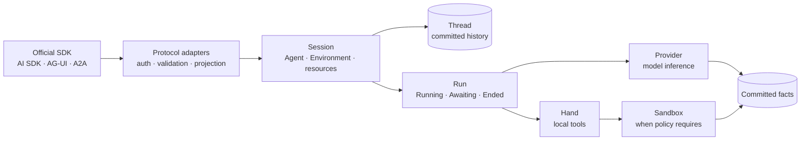
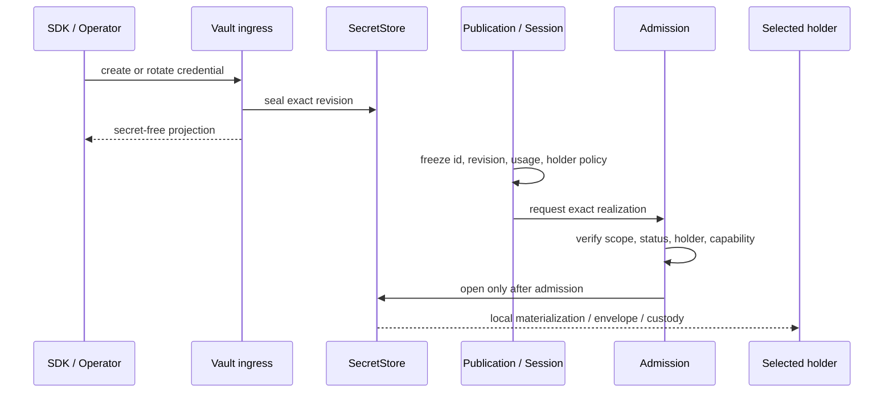
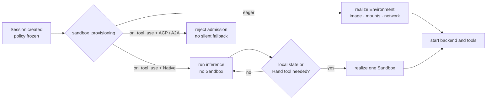

Before connecting an Agent application, make three decisions: which system owns
the Session history, where a credential may become plaintext, and when the task
actually needs a Sandbox. These decisions determine whether work can resume and
whether an operator can explain what happened.

Awaken keeps those choices inside one execution boundary. Client protocols enter
through adapters, but they do not create separate histories or separate ways to
authorize work.

## Send every client into the same Session

Awaken accepts the official Anthropic SDK's Managed Agents wire alongside AI
SDK, AG-UI, A2A, and HTTP. An adapter handles authentication, validation, and DTO
projection. Beyond that edge, every protocol enters the same Session, Thread,
and Run. No adapter keeps a private conversation history.

When you add a client protocol, keep the adapter narrow: authenticate the request,
validate it, and project its DTOs. Put the resulting work into the same Session,
Thread, and Run used by every other client.

A live stream can update the interface quickly. After a disconnect, rebuild the
view from committed Thread facts. For approval, commit `Awaiting` and a
`ResumeTicket` before the interface shows a task to a person. This gives the
reconnected client one place to continue from.

## Pin the credential before the Run starts

At credential ingress, a `SecretStore` seals the material. Agent publications
and Session baselines carry only credential id, revision, Workspace, usage, and
holder policy. At execution, Awaken checks those facts before the exact revision
reaches one selected last-mile holder.

Store credential id, revision, Workspace, usage, and holder policy with the Agent
publication or Session baseline. At admission, check that exact reference. Open
the sealed material only for the selected last-mile holder, then send the tool
action through the Runtime permission gate.

Open-source, hosted, and enterprise deployments can use different `SecretStore`
or custody implementations. The rule stays the same: a Run cannot search for a
replacement credential after it has started, and possessing material does not
grant permission to use it.

## Choose when the Sandbox should begin

Awaken separates the Session lifecycle from the physical Sandbox lifecycle.
`eager` realizes the environment before a backend or local resource uses it. A
Native `on_tool_use` Session can run model-only inference first and wait until
the first Hand tool to create its Sandbox.

Choose `eager` when the backend, input, Skill, or delegate needs a local
environment before inference. Choose Native `on_tool_use` only when model-only
work can begin without local state and the first Hand tool is the honest moment
to pay the startup cost.

Do not silently defer an unsupported combination. Filesystem inputs, a
filesystem Skill, or a published delegate require earlier realization. ACP and
A2A backends do not accept `on_tool_use`. Measure Session creation and the first
local tool separately. A warm pool may reduce cold-start time, but it does not
change isolation or ownership.

## Check one operating record

Use the Console to answer practical questions: which Run is current, which
Provider and MCP connection it used, whether it is waiting for approval, and
what was committed before a failure. The Console projects the same execution
record; it does not ask the operator to reconcile a second state model.

The [compatibility matrix](/docs/agents/compatibility/) owns exact external
differences. Read the full designs in [Sessions and events](/docs/agents/concepts/sessions-and-events/),
[Credential custody and last-mile realization](/docs/agents/concepts/credential-custody/),
[Brain, Hand, and Session Environment](/docs/agents/concepts/brain-and-hand/).
If you are deciding how a Skill should load, continue with [one Skill through
files or semantic tools](/blog/2026-08-skill-tool-or-prompt/).
