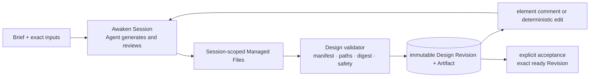
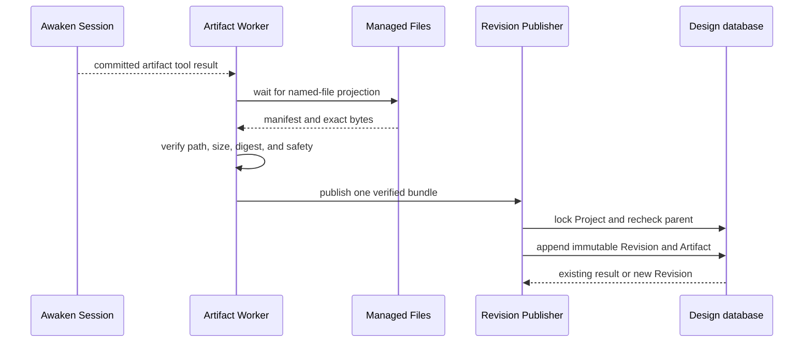

We wanted a person to begin with a rough brief and finish with one design they
could preview, revise, and accept. The result had to remain available after the
Agent stopped, and feedback had to refer to the exact version the person saw.

That requirement leads to two different jobs. The design product keeps projects,
revisions, comments, previews, and accepted artifacts. An Agent runtime carries
the work that creates and changes them. Keeping those jobs separate avoids
turning every design feature into a new execution system.

Awaken Design is a first-party reference application built on Awaken Agents.
Public products such as [Claude Design](https://claude.com/product/design)
helped frame the user journey from prompt to editable result, but this is an
independent implementation and does not claim product parity.

## Begin with one reviewable result

The first useful path has five steps:

1. Create a Project from a brief and exact input material.
2. Generate a ready visual Revision that can run without the authoring process.
3. Inspect it in an isolated Preview and attach feedback to a precise target.
4. Produce a child Revision without overwriting the reviewed parent.
5. Accept one exact ready Revision and deliver its immutable Artifact.

Write the finish line before choosing Agent tools: the person can open a ready
Revision, compare it with its parent, attach feedback to what they saw, and
accept one immutable Artifact. Invalid files stop before publication. A stale
comment cannot modify a newer Revision. Untrusted output never shares the
product origin. A retry cannot publish the same tool result twice.

## Keep design facts with the design product

Awaken Design owns `DesignProject`, immutable
`DesignRevision`, review comments, Preview capability, the accepted-Revision
pointer, and a content-addressed Artifact store. These are product facts.

Awaken owns Agent publication, Environment, Session, Run, execution Files,
credentials, tools, Worker, Sandbox, permissions, and recovery. These are
execution facts. The Design Artifact store cannot become a fallback Session
filesystem, and Awaken Files cannot become the permanent Design library.

## Turn Session files into an immutable Revision

The Agent writes an artifact manifest and declared files inside its Session
scope. A committed tool result wakes the Artifact Worker. The Worker downloads
only the named files, then checks paths, byte sizes, SHA-256 digests, optional
preview images, and security rules.

Valid content enters one TypeScript publisher. That publisher creates the
immutable Revision and stores the content-addressed Artifact. A durable inbox
controls claim, retry, and result redelivery. The Worker does not scan every
Session, judge design quality, run another Agent, or maintain a second
publication path.

Two implementation findings changed this path. An early sequence allocator read
`MAX(sequence) + 1` before the publication transaction; concurrent publishers
could choose the same number. The parent foreign key proved tenant ownership but
not that the parent belonged to the same Project. The publisher now locks the
Project inside the transaction, rechecks the parent there, and appends through
one publication owner. Retrying the same tool result returns the existing
Revision instead of creating another one.

## Let feedback create the next Revision

Review follows two paths. A natural-language comment asks the same Project
Session to generate a child Revision. Direct text or style editing uses typed,
deterministic operations. Both paths end at the same Revision publisher. A
canvas gesture does not become a private Agent protocol.

This boundary also removed a duplicate design. One earlier architecture path
treated every manual Apply as an Agent task even though the product already had
a typed `DesignWritebackPort` for deterministic edits. Keeping that port for
known text and style changes, while sending open-ended comments back to the
Agent, gives each action one owner and still converges on the same publisher.

## Accept the result explicitly

Explicit acceptance uses optimistic concurrency on the Project. The operation
accepts only a ready Revision from that Project. It changes the accepted pointer;
it never mutates the Revision.

The acceptance command is idempotent for the same Revision. If another actor has
changed the Project lock version, it reports a conflict instead of silently
overwriting the newer decision. A Revision that is not ready, or belongs to a
different Project, is rejected before the pointer moves.

This matters to the user because acceptance remains a deliberate product action.
The last Agent message cannot silently choose the result, and a later edit cannot
change an Artifact that was already accepted.

## What the first implementation covers

The repository has three fixed forward examples. It also has a canonical
100-case corpus across ten design categories. Structural tests prove that each
case has a brief, feedback, acceptance contract, and expected evidence shape.
Browser and real-Agent campaigns can bind screenshots, operated state traces,
child Revisions, and delivery records to the accepted Revision.

These materials are useful for checking the workflow, not for declaring design
quality. A validator can find a malformed Artifact. An automated campaign can
exercise revision and delivery behavior. A person still has to decide whether a
design is good and whether the result serves the brief. PPTX, video, and PNG are
future derived formats, not current native authoring formats.

The first repository commit was recorded at `2026-08-01 14:24:02 +08:00`. The
complete managed design workflow milestone was committed at
`2026-08-07 05:08:58 +08:00`, an exact repository interval of 5 days, 14 hours,
44 minutes, and 56 seconds.

This is repository time, not person-time or a delivery estimate. It does not say
that Claude Design was cloned, or that the two products are equivalent. It only
dates the implementation described here.

## Known limits

Rich responsive CSS selection, dynamic JSX expressions, native PPTX/video/PNG
authoring, and production identity integration are not part of the current
boundary. The 100-case corpus does not imply 100 completed user validations.
Awaken Design source remains local evidence until a fixed public revision is released.

To try the same pattern, begin with the [Awaken quickstart](/docs/agents/get-started/)
and define one immutable result your application will accept. The [Awaken Design
reference build](/cases/design) shows the product path, while [Awaken
architecture](/docs/agents/concepts/architecture/) explains the execution
boundary. The platform source is in the [Awaken repository](https://github.com/AwakenWorks/awaken).
