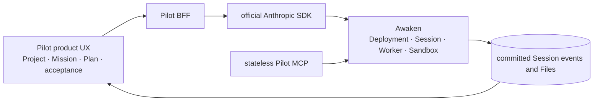
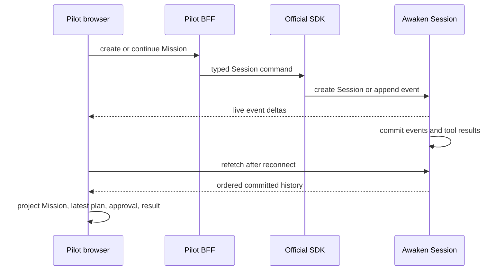

We wanted a user to create a Project, give it one Mission, review the plan,
approve a sensitive step, leave the browser, and return to the same work later.
Files, progress, and the final result had to remain attached to that Mission.

This is the recognizable product experience behind long-running Agent products,
including the public Manus product shape. Awaken Pilot is an independent
reference implementation. It does not use Manus code or claim to reproduce
private Manus behavior.

The implementation question is practical: what must Pilot build for the user,
and what should it ask Awaken to carry?

## Begin with one Mission that can continue

Write requirements as actions the user can complete:

- keep reusable instructions, knowledge, Agent choice, and schedule in a Project;
- start one Mission in Execute Mode or Plan Mode;
- follow progress, inspect sub-Agent work, approve or deny an action, and resume;
- receive files and a result that remain attached to the Mission;
- share the same Mission with an authorized teammate;
- recover after a browser disconnect without asking the Agent to repeat the work.

For the first version, choose one small success condition: create a Mission with
a visible acceptance criterion, interrupt it or approve one step, then reopen the
same work and inspect the result. Recurring work, integrations, and parallel
research can follow after this path is clear.

## Build the product experience in Pilot

Pilot owns Project setup, Mission wording, Execute/Plan Mode, acceptance
criteria, and browser projections. It also owns a same-origin BFF and a stateless
application MCP for plan, notification, and result tools.

## Reuse Awaken for execution

Everything related to Agent execution stays in Awaken. Each Pilot Project is one
Awaken Deployment. Each Mission is one Awaken Session. The official Anthropic
SDK is the only Managed Agents wire client.

There is no Pilot Project database, Mission status table, transcript, scheduler,
Worker registry, artifact catalog, retry loop, or billing model. Awaken already
owns Agent versions, Environments, Vault references, Files, Memory Stores,
Deployment schedules, Session events, tool permissions, leases, Sandboxes,
recovery, and outcome evaluation.

This gives the team a simple implementation rule: do not add a Pilot task engine
or private transcript. If the Mission view needs more information, project it
from committed Session events or add a product fact that Pilot genuinely owns.

## Follow one command to its result

The browser sends a product command to the Pilot BFF. The BFF translates it into
the official SDK request, using the selected Workspace and upstream identity.
Awaken creates or reads the Deployment and Session, dispatches the work, runs it
on a Worker, and commits events and Files. Pilot folds those committed facts into
the Mission view.

Plan approval uses the same event history. A plan tool publishes one complete
snapshot. The user decision becomes a canonical inbound event. There is no Plan
table to synchronize with the Session.

Recovery is equally plain. Live deltas make the interface responsive, but a
reconnect reads committed history. The browser does not decide which attempt is
current or whether a Worker lease is still valid.

The implementation makes that rule concrete. `projectMission` folds the ordered,
committed event list into the screen model. A plan becomes visible only after a
successful plan-tool result; a newer complete plan replaces the earlier snapshot
and makes the earlier approval inapplicable. The live hook merges stream updates
for responsiveness, then refetches committed history after a stream failure.
Status, plan, and transcript therefore cannot disagree because Pilot does not
persist competing copies of them.

The tempting alternative was a Pilot status table plus a Plan table synchronized
from the stream. That would add two races: a reconnect could replay older progress
over a newer state, and a new plan could leave an approval attached to the wrong
snapshot. Projecting committed facts removes both synchronization problems rather
than hiding them behind more retry code.

## Run the path before adding more features

The current acceptance path starts Pilot Web, Pilot API, Awaken Managed Agents,
IAM, a Worker, the Pilot MCP, an official Playwright MCP process, and an isolated
browser. It uses either a host-login ACP Agent or Awaken Native with a managed
Provider Connection. The browser creates the product objects and follows the
result through production HTTP contracts.

The first repository commit was recorded at `2026-08-13 14:48:34 +08:00`. A real
cross-service Agent check was committed at `19:52` that day. The complete real
Agent workflow milestone was committed at `2026-08-14 07:28:05 +08:00`, exactly
16 hours, 39 minutes, and 31 seconds after the first commit.

This is repository time, not a claim of 17 person-hours or a delivery estimate.
It does not establish Manus parity. It dates the point at which this one bounded
product path appeared after Pilot reused the existing execution platform.

## Known limits

Branch conversation is disabled until the official Managed SDK has one typed
create command. Publishing, payments, analytics, Gmail, and Slack each require a
real provider account and connector acceptance. Pilot presents generic files; it
does not rebuild document or media editors. Awaken Cloud keeps billing authority.
The Pilot source is local evidence until a fixed public revision is released.
Session creation also remains deliberately non-retrying when a lost response
makes success ambiguous; safe automatic retry needs an upstream idempotency key,
not a guessed duplicate-creation check in Pilot.

To build the first Mission, run the [Awaken quickstart](/docs/agents/get-started/)
and write one acceptance criterion your application can display. The [Pilot
reference build](/cases/pilot) shows the product path; [Awaken
architecture](/docs/agents/concepts/architecture/) explains the execution
boundary. You can [inspect the source and Star Awaken](https://github.com/AwakenWorks/awaken)
when the approach is useful.
