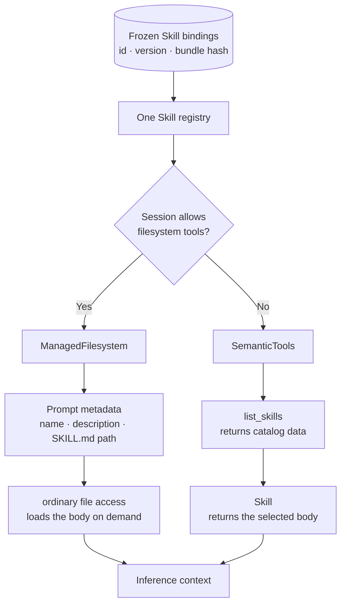
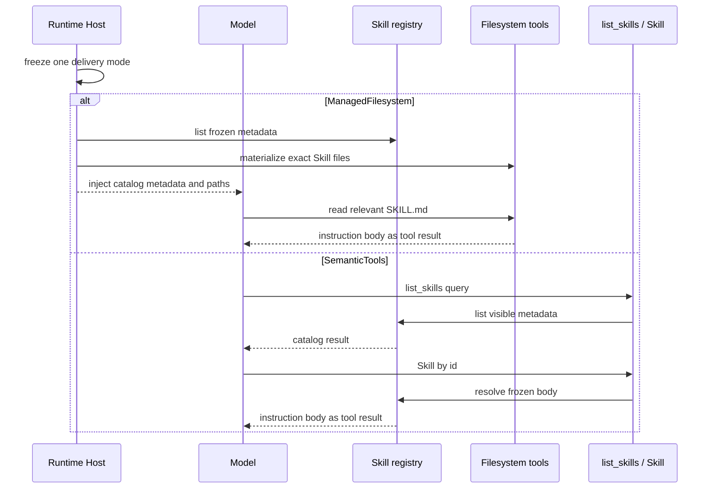
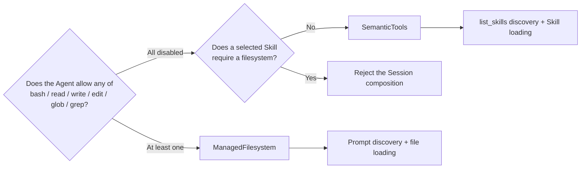

A Skill may be a few paragraphs of instructions. It may also include references,
scripts, and a directory tree. Before attaching it to an Agent, describe which
of those resources it needs. The product should not ask the user to choose an
internal delivery mode.

Awaken derives the delivery mode from the Session. If the Agent already has file
tools, the model discovers `SKILL.md` paths and reads the relevant files. If all
file tools are disabled and the Skill contains instructions only, the model uses
`list_skills` and `Skill` without starting a Sandbox.

## Start with what the Skill needs

Use file delivery when the Skill needs adjacent references, scripts, or other
bundle files. Instruction-only Skills can use semantic tools when the Session has
no filesystem capability. A Skill that requires files cannot be attached to a
Session that disables every file tool; reject that combination and ask the user
to change the Agent capability or the Skill.

## Freeze one delivery path for the Session

Session creation pins `skill_id + version + bundle_sha256`. The Runtime Host
then checks the Agent's effective tool surface. If any filesystem tool is
enabled, it selects `ManagedFilesystem`. If every filesystem tool is disabled,
a Native Session uses `SemanticTools`. The choice cannot change after the first
runtime projection.

Keeping only file delivery would start an environment just to load a short set of
instructions. Keeping only semantic tools would need another resource protocol
for references and scripts. Instead, one Registry holds the selected Skill
versions and produces the path the Session can support.

In file delivery, the prompt contains names, descriptions, and exact paths, not
every Skill body. The model reads a relevant `SKILL.md` only when the task needs
it, then may read a nearby reference or script. In semantic delivery, catalog and
body remain behind two fixed tools and load only when called.

## See what happens in each path

Discovery grants no authority in either path. Filesystem and `Skill` calls still
cross the platform gate. In semantic-tool delivery, `allowed_tools` may narrow
the tool surface further, but it cannot restore a capability the platform
denied.

## Choose from capability, not preference

| Dimension | `ManagedFilesystem` prompt discovery | `SemanticTools` semantic tools |
| --- | --- | --- |
| Discovery | Prompt contains catalog metadata and `SKILL.md` paths | `list_skills` returns structured catalog data |
| Body loading | Ordinary file access loads the body on demand, typically through `read` | `Skill` returns the body by id |
| Main advantage | The Skill shares a directory boundary with references and scripts; existing file tools do the work; no dedicated Skill tool surface | Instruction-only Skills need no filesystem or Sandbox; discovery is structured; the tool surface stays fixed at two |
| Main cost | Catalog metadata remains in the prompt; requires file tools and materialized paths; activation appears as an ordinary file read | Usually adds a discovery or activation call; the backend must support semantic tools; it cannot carry an unmaterialized filesystem Skill |
| Catalog growth | Projected entries enter inference context with the prompt | The catalog is returned only when called and can be filtered by query or touched path |
| Activation evidence | A `read` event records the exact path, but remains a filesystem operation | The `Skill` call records the activated id directly |
| Best fit | The Agent has filesystem capability and the Skill carries references, scripts, or other bundle files | Every filesystem tool is disabled, the Skill contains instructions only, and structured discovery is preferred |

File delivery is the right choice when a Skill and its supporting material belong
to one file boundary. The model reads `SKILL.md`, then reads a nearby reference
or script only if needed. The cost is real filesystem capability and timely
environment materialization.

Semantic tools keep instruction-only Skills inside the Host. A few paragraphs
of instructions do not require a Sandbox, and a larger catalog does not add one
tool per Skill. If a selected Skill requires a filesystem, includes support
files, or uses fork context while the Session disables every filesystem tool,
Awaken rejects the composition instead of silently offering a weaker version.

## Let the Runtime make the final choice

In the product interface, ask which Agent capabilities are allowed and whether a
Skill needs files. The Runtime can derive the rest. The first runtime projection
freezes the choice, so recovery does not guess again and one Session never
exposes both delivery paths.

To add a Skill, follow [Use Skills Subsystem](/docs/agents/runtime/how-to/use-skills-subsystem/).
Use [Capability and permissions](/docs/agents/runtime/explanation/capability-and-permissions/)
when deciding which tools the Agent may call, and [Sessions and
events](/docs/agents/concepts/sessions-and-events/) when you need the version
and recovery rules.
