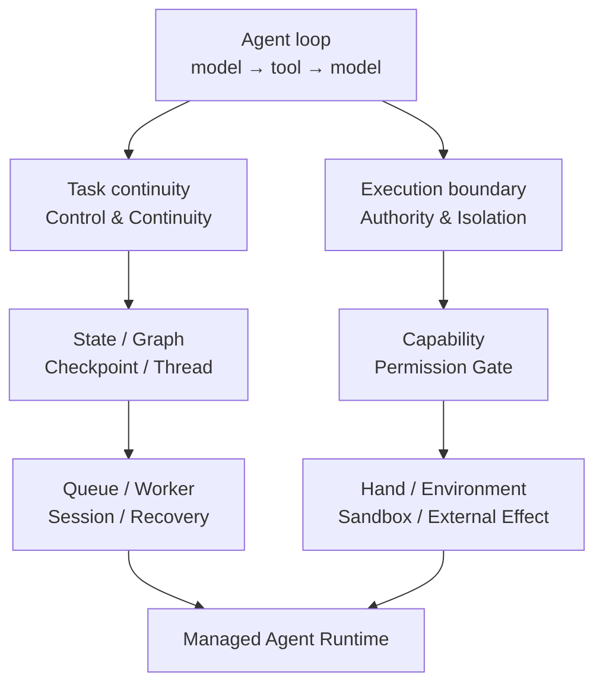
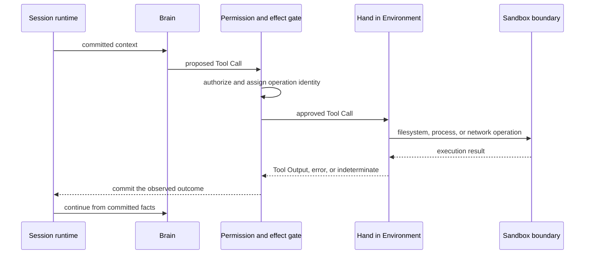

The first Agents were not mysterious. Most were loops: send messages to a model,
let the model choose a tool, run the tool, and return its result. Stop when the
model produces a final answer.

```python
while True:
    response = model(messages, tools)
    if response.is_final:
        return response
    result = run_tool(response.tool_call)
    messages.extend([response.tool_call, result])
```

That loop is enough for a demo. It says little about production. Where does work
resume after a process dies? Can a tool be retried if it ran but its reply never
arrived? Which files and networks may a model-generated command reach? Who keeps
the facts for an Agent that works for hours and pauses for human approval?

Agent infrastructure has grown around those questions. This was not one straight
line from a particular framework to a particular product. Different teams hit
the same failures and ended up drawing similar boundaries.

## Two problem lines that eventually converge

A release timeline makes this history look like a relay from graphs to
checkpoints, Sandboxes, and then Managed Agents. A more general view starts with
two problems exposed by the same Agent loop. One line asks how work continues.
The other asks how an action lands safely in the world.

| Problem line | What it asks | Mechanisms that accumulated around it |
| --- | --- | --- |
| Task continuity (Control & Continuity) | Where is the task? After a pause, crash, or Worker change, which accepted fact is the continuation point? | State, Graph, Checkpoint, Thread, Queue, Session, Recovery |
| Execution boundary (Authority & Isolation) | May this action happen? Who runs it, where does it run, what may it reach, and how is its outcome committed? | Capability, Permission Gate, Hand, Environment, Sandbox, Effect Commit |



The lines do not replace each other. A checkpoint can say where to resume, but
it cannot stop a Shell process from reading the host. A Sandbox can block an
out-of-bounds system call, but it does not know whether an email was sent and
recorded as a Session fact. A Managed Agent Runtime matters when both lines close
inside one Session lifecycle, not when their vocabulary appears on one feature list.

## The loop solved autonomous decisions first

Early AgentExecutor-style designs put the model inside a `model → tool → model`
loop. The model could react to a tool result and choose another step instead of
answering once. Model calls, tool code, memory, and application lifecycle usually
stayed in one runtime process.

LangGraph moved the design forward in early 2024. It represented an Agent runtime
as a cyclic graph, joined nodes through central State, and let developers specify
conditional edges, updates, and stopping conditions. Control flow that had been
buried in a `while` loop became an inspectable state machine. The original
[LangGraph announcement](https://www.langchain.com/blog/langgraph) was explicit
about the goal: add control to Agent runtimes that need cycles.

There was no independent execution environment in that abstraction. Model nodes
and tool nodes began as functions in application code. A graph chooses which
function runs. It does not restrict which disk that function can read, which
processes it can start, or where its network traffic can go.

This distinction matters: **State is not an Environment, and a Graph is not a
Sandbox.**

The paths diverge here. Start with task continuity.

## Task continuity: persistence exposed the side-effect problem

Checkpointing, Threads, Interrupts, and resumption came next. LangGraph can save
State between graph steps, pause for human input, and continue from an existing
checkpoint. It can also preserve completed writes within a super-step so those
nodes do not all need to run again. The current
[LangGraph persistence guide](https://docs.langchain.com/oss/python/langgraph/persistence)
documents those mechanics.

Persistence answers “where was the graph?” It also exposes a harder question.
Resuming a node can trigger its external calls again. Payments, email, ticket
creation, and repository edits are not pure functions. A checkpoint cannot, by
itself, prove whether an effect happened before a pause or crash.

Durable execution therefore needs more than saved State. Each external operation
needs a stable identity, an honest replay policy, and an explicit outcome:
success, failure, or indeterminate. Turning every ambiguous failure into “retry”
only makes duplicate effects more likely.

## Task continuity: Agent Server separated ingress from graph execution

Once Agents moved into cloud deployments, API ingress and execution workers were
often separated. LangSmith Agent Server now organizes work around Assistants,
Threads, Runs, and a task queue. An API Server accepts and queues a request. A
Queue Worker claims the Run, executes the graph, writes checkpoints, and streams
events back. The [Agent Server architecture](https://docs.langchain.com/langsmith/agent-server)
describes that path.

This separation matters, but it is not yet brain-hand separation. API Server and
Queue Worker divide request handling from graph execution. Model nodes and tool
nodes can still run inside the same Worker process. A Worker container is a
deployment boundary, but it is not necessarily a least-privilege Sandbox owned
by one Session.

The system can now carry an interrupted task more reliably. It still has not
fully answered the authority and isolation questions around an action. That is
the second line.

## Execution boundary: Skills turned model output into execution input

The growth of Skill and tool ecosystems did push Sandboxes from a feature of
code interpreters into a basic Agent-platform capability. The cause is not the
number of Skills. The risk changes when model output enters an execution path
that can reach files, processes, and networks.

A Skill is not necessarily an executable tool. It may be an instruction bundle
loaded into context, or it may carry scripts, supporting files, and an allowed
tool set. The first form changes model context. The second can send model-chosen
arguments or code into the execution plane. Sandbox requirements should follow
the effective capability, not the Skill label.

Once a model can produce arbitrary Shell, Python, or other code, prompt injection
and hallucination no longer produce only a bad answer. They can become `rm`, a
new process, a credential read, or an unrestricted network request. Tasks also
start installing conflicting packages, mutating working directories, and leaving
files that the next turn must reuse. Isolation now has two jobs: contain execution
authority and provide reproducible dependencies and state for one body of work.
It still does not replace tool authorization, secret custody, or effect commits.

Decide from the effective capability rather than the Agent category:

| Effective capability | Local Sandbox | Controls still required |
| --- | --- | --- |
| Text generation, routing, or an instruction-only Skill | No | Context boundary and model/data access policy |
| A fixed function in trusted code, such as time conversion or structured formatting | Usually no | Parameter schema, timeout, and resource limits |
| A typed remote API for weather, retrieval, email, or Slack | No local Sandbox | Least-privilege credentials, approval, idempotency keys, and audit |
| Database access through a governed query service | No local Sandbox | Row and column policy, query budget, redaction, and result limits |
| Arbitrary code, Shell, local files, dynamic packages, or untrusted binaries | Yes | Filesystem, process, network, secret, and resource isolation |

“No Sandbox” only means the Agent runtime does not create a local execution
environment for that operation. It does not mean the operation is safe. An email
is a remote side effect; the recipient does not provide authorization,
deduplication, and audit for the caller. A read-only database query can still
leak sensitive rows or exhaust query capacity. A Sandbox isolates execution.
Permission gates and effect protocols decide whether an action may happen and
how many times it happened.

On-demand provisioning also should not let the model choose a risky Skill and
then decide whether isolation is needed. Session admission freezes the Skills,
tools, resources, and execution placement first. That produces one of three
outcomes: no local Environment, an Environment required before inference, or an
already-declared Environment that may be realized before the first local
operation while model-only work begins. Only the third case supports delayed
startup. Filesystem input, support files, dynamic dependencies, or a remote
execution backend may require the Environment earlier. A warm pool can reduce
the wait, but it does not lower the required isolation tier.

## Execution boundary: Sandbox made the environment first-class

Once the effective capability requires local execution, function interfaces stop
being sufficient. An opaque process makes its own `open()`,
`exec()`, and network system calls. It does not honor path rewriting in a tool
adapter. Isolation has to exist at the operating-system or container boundary.

Current Deep Agents documentation names two patterns:
[Agent in Sandbox and Sandbox as Tool](https://docs.langchain.com/oss/python/deepagents/sandboxes).

| Pattern | Structure | Benefit | Cost |
| --- | --- | --- | --- |
| Agent in Sandbox | Model loop and tools enter the isolated environment | Direct file access and behavior close to local development | Model credentials enter the environment, updates require new images, and the trust surface grows |
| Sandbox as Tool | Model loop stays outside; command and file tools run inside | Credentials and commit authority can stay outside, with a clear execution boundary | Another remote round trip and an indeterminate outcome to handle after a disconnect |

A Sandbox is no longer just “a container where Bash is safe.” It owns a
workspace, packages, networking, secrets, resource limits, process lifecycle,
and output retrieval. At that point, the Environment is part of the Agent's
runtime contract rather than a deployment-script detail.

## The two lines converge in a Managed Agent Runtime

Managed Agents go one step further. Developers no longer deploy only graph code.
They use a runtime that already owns the Agent loop, durable state, tool policy,
environment provisioning, and recovery.

Claude Managed Agents, for example, exposes four first-class concepts: Agent,
Environment, Session, and Events. The Agent stores the model, instructions,
tools, and Skills. The Environment says where a Session runs. The Session keeps
the context of continuing work. Events carry input, progress, pauses, and results.
The [Managed Agents overview](https://platform.claude.com/docs/en/managed-agents/overview)
defines those boundaries.

In a hosted Cloud Environment, every Session receives its own Linux Sandbox.
Provisioning begins when the Session is created, before the first Bash call. The
[Cloud Environment](https://platform.claude.com/docs/en/managed-agents/environments)
and [Session lifecycle](https://platform.claude.com/docs/en/managed-agents/sessions)
make that behavior part of the public contract. A self-hosted environment keeps
orchestration on the platform while moving files, processes, and network access
onto infrastructure controlled by the customer.

That is the difference between Managed Agents and an Agent HTTP service. The
platform operates the Session, Environment, and tool-effect lifecycle, not just
the endpoint.

## Brain and Hand inside the execution boundary

At this point, “Brain” and “Hand” become useful architecture terms.

The Brain owns model inference, context, and the next decision. The Hand receives
an authorized Tool Call, executes it in a concrete Environment, and returns a
Tool Output. The Sandbox is the Hand's physical boundary for files, processes,
networking, and resources. A commit boundary outside the Hand owns durable
Session facts. The Hand cannot declare its own success.



The split has practical benefits. Models and durable state can stay out of an
untrusted execution environment. Customers can keep the Hand inside their own
network. Models and Sandbox images can be upgraded separately. The costs are
equally concrete: each tool call crosses another boundary, Brain and Hand must
agree on the tool catalog, and a lost reply forces the system to distinguish
“not dispatched” from “possibly executed.”

It is also possible to split too far. If Brain and Hand have independent
schedulers and independently select workspaces, one Session soon has two file
truths. A safer invariant is that one Session owns at most one Environment when
it needs local execution, and its Hand belongs to that Environment. Brain and
Hand may live in different processes. They should not become competing lifecycle
authorities.

## Failure reveals the managed boundary

Ignore the feature checklist for a moment. Four questions reveal whether an
Agent system has become a managed runtime:

1. After a client disconnects, who owns the continuation point for the same Session?
2. If a Worker disappears during a tool call, can the system say whether the effect was absent, completed, or indeterminate?
3. Who creates the Environment, projects credentials into it, recovers it, and destroys it?
4. Which facts remain reconstructible after the Sandbox has gone?

If the answer is still “the application handles it,” the system is usually a
hosted Agent loop. It may already have graphs, queues, and containers, but the
runtime responsibility has not become the product.

The value of a managed Agent runtime is not that it hides the `while` loop. The
loop was always the easy part. What gets managed is everything around it that
only becomes visible during disconnects, retries, privilege mistakes, and work
that lasts longer than one process.

For a concrete execution design, continue with
[three boundaries that keep an Agent Session recoverable](/blog/2026-08-awaken-runtime-boundary/)
and [Brain, Hand, and Session Environment](/docs/agents/concepts/brain-and-hand/).
