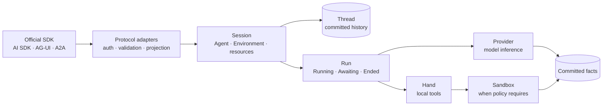
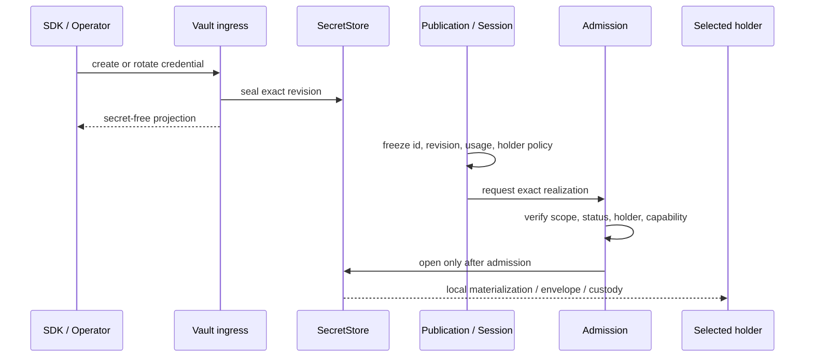
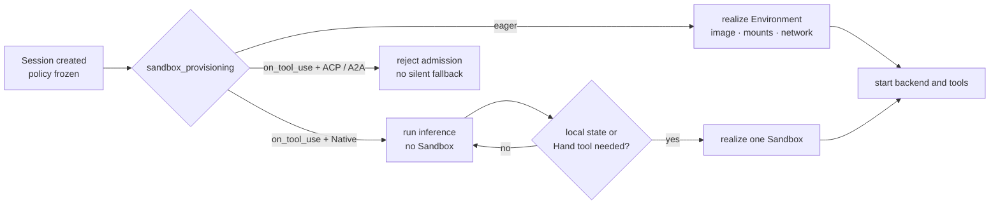

接入 Agent 应用之前，先做三个决定：哪个系统保存 Session 历史，凭据可以在哪里变成明文，
以及任务什么时候真正需要 Sandbox。这些决定会影响工作能不能继续，也决定运营者能不能
说明刚才发生了什么。

Awaken 把这些选择放在同一条执行边界里。客户端协议可以从不同 Adapter 进入，但不会因此
产生多份历史或多套授权方式。

## 让所有客户端进入同一个 Session

Awaken 可以接收官方 Anthropic SDK 的 Managed Agents wire，也可以接收 AI SDK、AG-UI、
A2A 和 HTTP。Adapter 负责认证、校验和 DTO 投影。越过这层之后，所有协议进入同一份
Session、Thread 和 Run，不会各自维护一套对话历史。

增加客户端协议时，让 Adapter 只做认证、校验和 DTO 投影，再把工作交给所有客户端共用的
Session、Thread 和 Run。

实时 stream 可以快速更新界面。断开以后，则从已提交的 Thread facts 重建视图。审批也按
同一顺序进行：先提交 `Awaiting` 和 `ResumeTicket`，界面再向人显示待办。这样重连后的
客户端只有一个继续位置。

## Run 开始前固定凭据

凭据写入时，`SecretStore` 保存密封材料；Agent publication 和 Session baseline 只保存
credential id、revision、Workspace、usage 和 holder policy。执行开始后，系统先校验这些
事实，再把指定 revision 交给唯一的最后一跳持有者。

把 credential id、revision、Workspace、usage 和 holder policy 随 Agent publication 或
Session baseline 固定下来。Admission 只检查这一个引用，密封材料只向选定的最后一跳
持有者解封，随后工具动作仍要经过 Runtime permission gate。

开源自托管、云端托管和企业部署可以采用不同的 `SecretStore` 或保管实现，规则不变：Run
开始后不能再寻找替代凭据，拿到材料也不等于获得使用权限。

## 决定 Sandbox 何时启动

Awaken 把 Session 生命周期和物理 Sandbox 生命周期分开。`eager` 会在后端或本地资源
使用环境前完成创建；Native 的 `on_tool_use` 可以先做纯模型推理，直到第一次调用 Hand
tool 时才创建 Sandbox。

当 backend、输入、Skill 或 delegate 在推理前就需要本地环境，选择 `eager`。只有 Native
任务能够先完成纯模型工作，并且第一次 Hand tool 调用确实是需要本地状态的时刻，才选择
`on_tool_use`。

不支持的组合不能悄悄延迟。Filesystem input、filesystem Skill 或已发布 delegate 会要求
更早实现环境；ACP 与 A2A backend 不接受 `on_tool_use`。应分别度量 Session 创建耗时和
第一次本地工具调用耗时。Warm pool 可以缩短冷启动，但不会改变隔离级别或所有权。

## 在一份运营记录里检查结果

用 Console 回答实际问题：当前是哪一个 Run、用了哪个 Provider 与 MCP 连接、是否正在等待
审批，以及失败前已经提交了什么。Console 投影同一份执行记录，不要求运营者再对齐另一套
状态。

外部可见的精确差异由[兼容矩阵](/zh/docs/agents/compatibility/)维护。更完整的设计分别见
[Session 与事件](/zh/docs/agents/concepts/sessions-and-events/)、
[凭据保管与最后一跳物化](/zh/docs/agents/concepts/credential-custody/)、
[Brain、Hand 与 Session Environment](/zh/docs/agents/concepts/brain-and-hand/)。如果正在
决定 Skill 应怎样加载，可以继续阅读[一份 Skill，怎样通过文件或语义工具交付](/zh/blog/2026-08-skill-tool-or-prompt/)。
