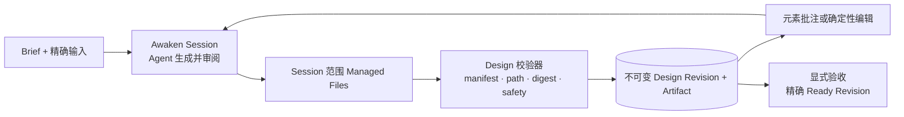
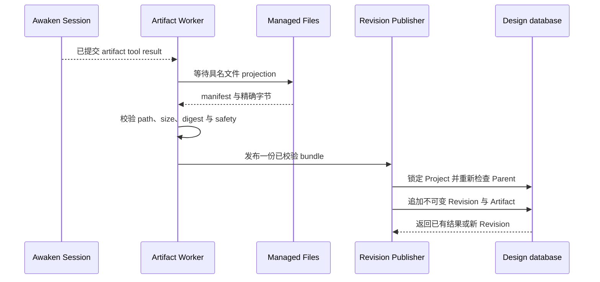

我们希望用户从一份大致 Brief 开始，最后得到一个可以 Preview、修改和验收的设计。Agent
停止以后，结果仍然可以打开；用户的反馈也必须指向刚才真正看到的那个版本。

这项需求包含两类不同的工作。设计产品保存 Project、Revision、评论、Preview 和已验收
Artifact；Agent Runtime 负责产生和修改这些内容。把两者分开，设计功能就不必各自带一套
执行系统。

Awaken Design 是构建在 Awaken Agents 上的第一方参考应用。
[Claude Design](https://claude.com/product/design)等公开产品帮助我们梳理了从 Prompt 到
可编辑结果的用户路径，但这是独立实现，也不主张产品对等。

## 先得到一个可以评审的结果

第一条有用路径包含五步：

1. 用 Brief 和精确输入材料创建 Project。
2. 生成一个离开创作进程也能运行的 Ready Revision。
3. 在隔离 Preview 中检查，并把反馈绑定到精确目标。
4. 产生 Child Revision，不覆盖已经审阅的 Parent。
5. 验收一个精确的 Ready Revision，并交付其不可变 Artifact。

选择 Agent 工具之前，先写清完成条件：用户可以打开 Ready Revision，与 Parent 比较，把
反馈留在实际看到的内容上，并验收一个不可变 Artifact。非法文件在发布前停止；过期评论
不能修改更新版本；不可信输出不与产品共用 Origin；重试不能重复发布同一个工具结果。

## 设计事实留在设计产品里

Awaken Design 拥有 `DesignProject`、不可变 `DesignRevision`、评审批注、
Preview capability、accepted-Revision 指针与 content-addressed Artifact Store。这些是产品事实。

Awaken 拥有 Agent 发布、Environment、Session、Run、执行期 Files、凭据、工具、Worker、
Sandbox、权限与恢复。这些是执行事实。Design Artifact Store 不能成为 Session filesystem
的后备实现，Awaken Files 也不能成为永久 Design Library。

## 把 Session 文件发布成不可变 Revision

Agent 在自己的 Session 范围内写入 Artifact manifest 与声明文件。已提交工具结果唤醒
Artifact Worker。Worker 只下载具名文件，然后校验路径、字节大小、SHA-256、可选 Preview
图与安全规则。

合格内容进入唯一 TypeScript Publisher，由它创建不可变 Revision，并保存 content-addressed
Artifact。Durable Inbox 控制领取、重试与结果重投。Worker 不扫描所有 Session，不判断设计
质量，不运行另一个 Agent，也不维护第二条发布路径。

实现中的两个发现改变了这条路径。早期 sequence allocator 在 publication transaction 之外读取
`MAX(sequence) + 1`，两个并发 Publisher 可能选到相同序号。Parent foreign key 可以证明租户
所有权，却不能证明 Parent 属于同一个 Project。现在 Publisher 会在事务中锁定 Project，重新
检查 Parent，再通过唯一发布 owner 追加 Revision。同一 tool result 重试时会返回已有 Revision，
不会再发布一份。

## 让反馈产生下一个 Revision

评审有两种动作。自然语言批注让同一个 Project Session 生成 Child Revision；直接修改文字
或样式时，系统使用类型化的确定性操作。两条路径最终进入同一个 Revision Publisher。
Canvas 手势不会变成私有 Agent 协议。

这条边界还消除了一项重复设计。早期架构曾把所有手动 Apply 都描述为 Agent task，但产品已经
有用于确定性编辑的类型化 `DesignWritebackPort`。保留它处理已知的文字和样式变更，把开放式
批注交给 Agent，两类动作各有一个 owner，最后仍汇入同一个 Publisher。

## 明确验收结果

显式验收通过 Project 上的乐观并发控制完成。操作只接受该 Project 中的 Ready Revision，
只修改 accepted pointer，不修改 Revision 本身。

同一个 Revision 的重复验收是幂等的。如果另一项操作已经改变 Project lock version，命令会
返回 conflict，而不是静默覆盖更新的决定。未 Ready 或属于另一个 Project 的 Revision，会在
pointer 移动前被拒绝。

这对用户的直接意义是，验收始终是一次明确的产品动作。最后一条 Agent 消息不能替用户
选择结果，后续修改也不能改变已经验收的 Artifact。

## 第一版覆盖到哪里

仓库有 3 个固定前向样例，以及覆盖 10 类设计场景的 100 项规范语料。结构测试证明每项
Case 都有 Brief、反馈、验收契约与期望证据形态。浏览器和真实 Agent Campaign 可以把截图、
实际操作的状态轨迹、Child Revision 与交付记录绑定到 Accepted Revision。

这些材料适合检查 Workflow，不适合宣称设计质量。Validator 可以发现格式错误的 Artifact，
自动 Campaign 可以运行 Revision 与交付路径，设计好不好、是否满足 Brief，仍然要由人判断。
PPTX、视频与 PNG 是未来派生格式，不是当前原生创作格式。

仓库第一个提交记录在 `2026-08-01 14:24:02 +08:00`。完整 Managed Design Workflow
里程碑提交于 `2026-08-07 05:08:58 +08:00`，精确仓库间隔为 5 天 14 小时 44 分 56 秒。

这是仓库时间，不是人力投入，也不是交付周期。它不表示复制了 Claude Design，更不表示
两个产品对等，只用于标明本文所述实现出现的时间。

## 已知限制

复杂响应式 CSS 选择、动态 JSX 表达式、原生 PPTX/视频/PNG 创作，以及生产身份接入不在
当前边界内。100 项语料不代表完成了 100 次真实用户验证。Awaken Design 源码在发布固定公开
revision 前仍属于本地证据。

如果要尝试这套方法，先完成 [Awaken 快速开始](/zh/docs/agents/get-started/)，再为应用定义
一个必须明确验收的不可变结果。[Awaken Design 参考实现](/zh/cases/design)展示产品路径，[Awaken
关键架构](/zh/docs/agents/concepts/architecture/)说明执行边界。平台源码位于 [Awaken
仓库](https://github.com/AwakenWorks/awaken)。
