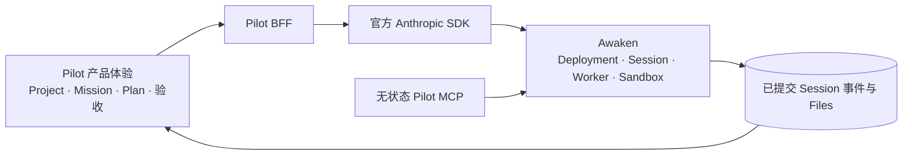
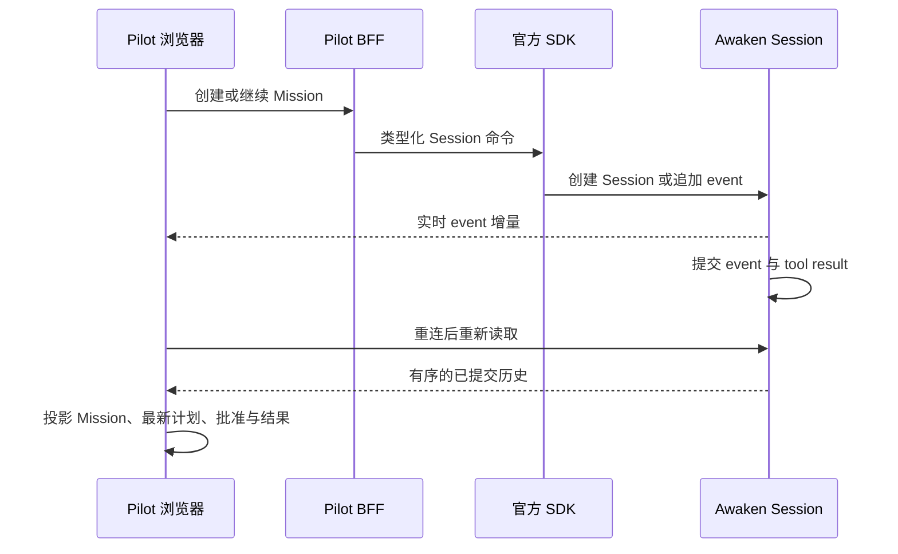

我们希望用户创建一个 Project，提出一项 Mission，审阅计划，批准一次敏感操作，离开
浏览器以后仍能回到同一项工作。文件、进展与最终结果都要留在这项 Mission 里。

这是长时 Agent 产品中容易识别的使用体验，也包括 Manus 公开展示的产品形态。Awaken
Pilot 是独立参考实现，不使用 Manus 代码，也不主张复现 Manus 的私有行为。

真正需要回答的是：Pilot 应该为用户实现什么，又应该让 Awaken 承担什么？

## 先完成一项可以继续的 Mission

把需求写成用户可以完成的动作：

- 在 Project 中保存长期指令、知识、Agent 选择和计划；
- 用 Execute Mode 或 Plan Mode 启动一项 Mission；
- 查看进展与子 Agent 工作，批准或拒绝操作，然后继续；
- 得到始终属于该 Mission 的文件与结果；
- 把同一项 Mission 分享给有权限的同事；
- 浏览器断开后从已有事实恢复，而不是要求 Agent 重做。

第一版只需要一个很小的成功条件：创建一项带可见验收标准的 Mission，中断一次或批准一个
步骤，再重新打开同一项工作并检查结果。周期运行、集成与并行研究可以在这条路径清楚以后
继续增加。

## 在 Pilot 中实现产品体验

Pilot 拥有 Project 设置、Mission 语言、Execute/Plan Mode、验收标准与浏览器投影。它还
拥有一个同源 BFF，以及提供计划、通知和结果工具的无状态应用 MCP。

## 让 Awaken 承担执行

Agent 执行相关职责全部留在 Awaken。每个 Pilot Project 对应一个 Awaken Deployment，
每个 Mission 就是一个 Awaken Session。官方 Anthropic SDK 是唯一 Managed Agents
线协议客户端。

Pilot 没有 Project 数据库、Mission 状态表、对话存储、调度器、Worker 注册表、Artifact
目录、重试循环或计费模型。Agent 版本、Environment、Vault 引用、Files、Memory Store、
Deployment 调度、Session 事件、工具权限、租约、Sandbox、恢复与结果评估均由 Awaken 拥有。

团队因此得到一条直接的实现规则：不要增加 Pilot 任务引擎或私有 Transcript。如果 Mission
界面需要更多信息，先从已提交 Session 事件投影；只有确实属于产品的事实才放进 Pilot。

## 跟随一条命令直到结果

浏览器把产品命令交给 Pilot BFF。BFF 带着选定的 Workspace 与上游身份，把命令翻译为
官方 SDK 请求。Awaken 创建或读取 Deployment 与 Session，持久化分派，由 Worker 执行，
再提交事件和 Files。Pilot 只把这些已提交事实投影成 Mission 界面。

计划审批也使用同一份事件历史。Plan tool 发布完整快照，用户决定作为规范输入事件写回。
系统中没有需要与 Session 同步的 Plan 表。

恢复路径同样简单。实时增量让界面更快，但重连后只读取已提交历史。浏览器不判断哪个
Attempt 有效，也不判断 Worker 租约是否仍然成立。

实现把这条规则落到了一个明确位置。`projectMission` 按顺序折叠已提交 event，生成界面模型；
plan tool 成功以后计划才会出现，较新的完整计划会替换旧快照，并让旧计划上的批准失去适用性。
实时 hook 合并 stream 增量以保持响应速度；stream 失败后，再重新读取已提交历史。Pilot 不
持久化另一份 status、plan 或 transcript，因此这三者没有互相同步的机会。

更容易想到的做法，是在 Pilot 中增加 status 表和 Plan 表，再从 stream 同步。这样会引入两种
竞态：重连可能把旧进展盖到新状态上，新计划也可能继续带着旧快照的批准。直接投影已提交事实，
是在结构上消掉这两类同步问题，而不是用更多重试掩盖它们。

## 跑通这条路径，再增加功能

当前验收路径会分别启动 Pilot Web、Pilot API、Awaken Managed Agents、IAM、Worker、
Pilot MCP、官方 Playwright MCP 与隔离浏览器，并使用 Host 登录的 ACP Agent，或使用受管理
Provider Connection 的 Awaken Native。浏览器通过生产 HTTP 契约创建产品对象并跟随结果。

仓库第一个提交记录在 `2026-08-13 14:48:34 +08:00`。当天 `19:52` 提交了真实跨服务 Agent
验证，完整真实 Agent 工作流里程碑提交于 `2026-08-14 07:28:05 +08:00`，与第一个提交的
精确间隔为 16 小时 39 分 31 秒。

这是仓库时间，不代表只投入了 17 个人时，也不是交付周期。它不能说明 Manus 对等，只用于
标明 Pilot 复用既有执行平台以后，这条有边界的产品路径何时出现在仓库中。

## 已知限制

在官方 Managed SDK 提供唯一的类型化创建命令前，Branch Conversation 保持关闭。发布、
支付、分析、Gmail 和 Slack 都需要对应真实服务账号与连接器验收。Pilot 提供通用文件入口，
不重做文档或媒体编辑器。计费权威属于 Awaken Cloud。Pilot 源码在发布固定公开 revision
之前仍属于本地证据。
如果 Session 创建响应丢失、结果变得不确定，当前也不会盲目自动重试；安全重试需要上游提供
幂等键，而不是由 Pilot 猜测是否应再创建一项工作。

要构建第一项 Mission，先完成 [Awaken 快速开始](/zh/docs/agents/get-started/)，再写一个
可以显示给用户的验收标准。[Pilot 参考实现](/zh/cases/pilot)展示产品路径，[Awaken 关键
架构](/zh/docs/agents/concepts/architecture/)说明执行边界。如果这套方法有用，可以
[查看源码并 Star Awaken](https://github.com/AwakenWorks/awaken)。
