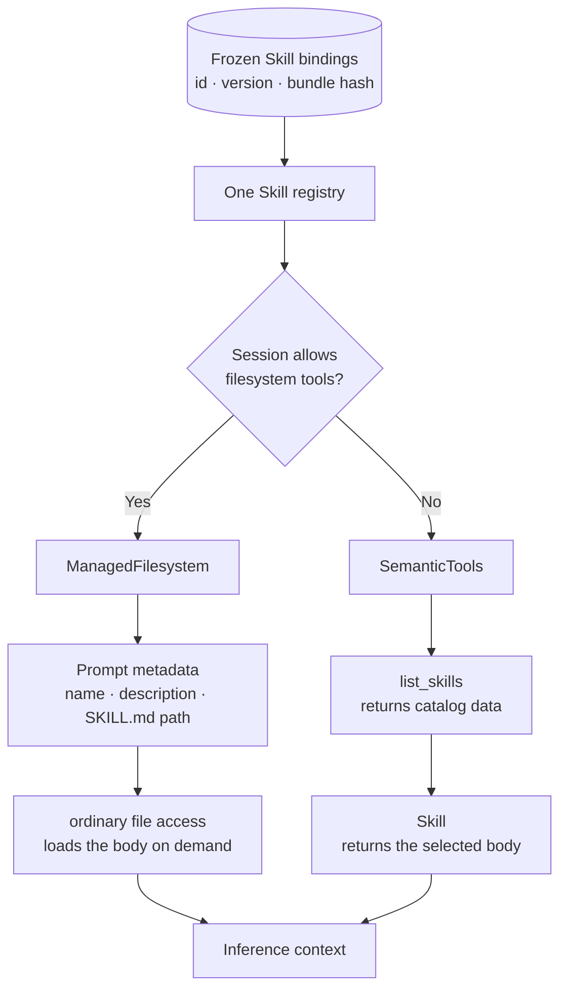
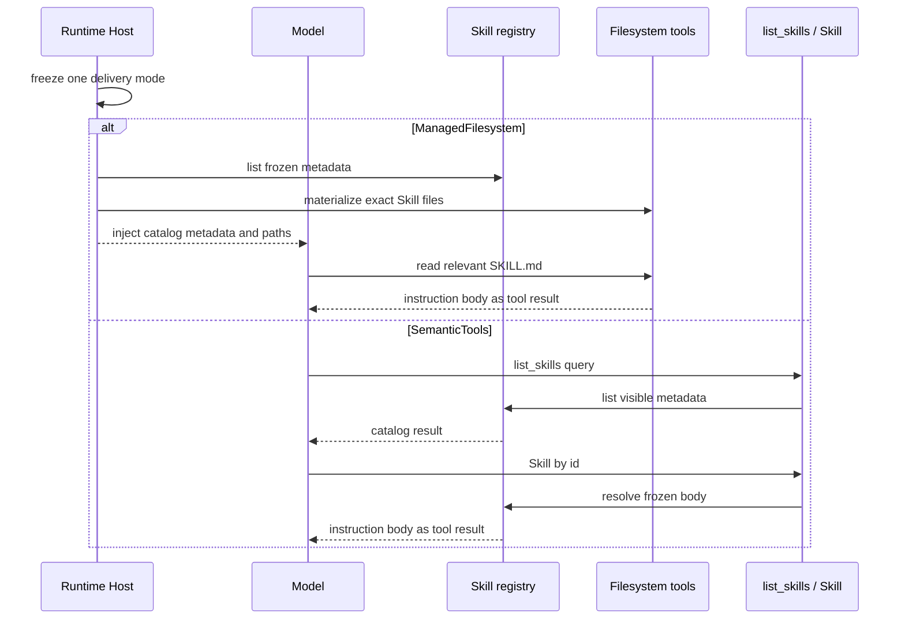
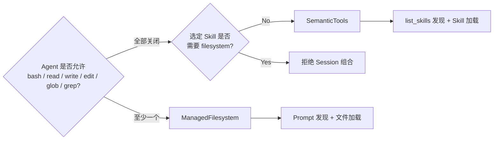

一份 Skill 可能只有几段指令，也可能带着 references、scripts 和完整目录。把它交给 Agent
之前，先说明它需要哪些资源。产品不应该让用户选择内部交付模式。

Awaken 根据 Session 派生交付方式。Agent 已有文件工具时，模型发现 `SKILL.md` 路径并读取
相关文件；所有文件工具都关闭，而且 Skill 只有指令时，模型使用 `list_skills` 和 `Skill`，
不需要启动 Sandbox。

## 先说明 Skill 需要什么

Skill 需要相邻 reference、script 或其他 bundle 文件时，使用文件交付。Session 没有文件
能力时，instruction-only Skill 可以使用语义工具。需要文件的 Skill 不能绑定到关闭全部
文件工具的 Session；此时应拒绝组合，让用户调整 Agent 能力或 Skill。

## 为 Session 固定一条交付路径

Session 创建时先固定 `skill_id + version + bundle_sha256`。Runtime Host 随后检查 Agent 的
有效工具面：只要允许任一文件系统工具，就选择 `ManagedFilesystem`；全部禁用时，Native
Session 使用 `SemanticTools`。这个选择在首次运行投影后不能改变。

如果只保留文件交付，短小指令也要先创建环境。如果只保留语义工具，references 和 scripts
又需要另一套资源协议。Awaken 用一个 Registry 保存选定的 Skill 版本，再产生 Session 能够
支持的那条路径。

文件交付时，Prompt 只包含名称、描述和精确路径，不包含所有 Skill 正文。模型只在任务需要
时读取相关 `SKILL.md`，随后再按需读取相邻 reference 或 script。语义交付则把目录与正文
留在两个固定工具之后，调用时才加载。

## 看清两条路径怎样运行

两条路径都不会因为“Skill 已被发现”就获得权限。文件工具和 `Skill` 调用先经过平台 gate；
语义工具模式中的 `allowed_tools` 只能继续收窄工具面，不能恢复平台已经拒绝的能力。

## 按能力选择，不按偏好选择

| 维度 | `ManagedFilesystem` 提示词发现 | `SemanticTools` 语义工具 |
| --- | --- | --- |
| 发现方式 | Prompt 提供目录元数据和 `SKILL.md` 路径 | `list_skills` 返回结构化目录数据 |
| 正文加载 | 普通文件访问按需读取，通常使用 `read` | `Skill` 按 id 返回正文 |
| 主要优势 | Skill 与引用、脚本共享目录边界；复用已有文件工具；不增加专用 Skill 工具面 | Instruction-only Skill 不需要文件系统或 Sandbox；发现结果有结构；工具面固定为两个 |
| 主要成本 | 目录元数据持续占用 prompt；依赖文件工具和已物化路径；激活表现为普通文件读取 | 通常多一次发现或激活调用；backend 必须支持语义工具；不能承载未物化的 filesystem Skill |
| 目录增长 | 可投影条目随 prompt 一起进入推理上下文 | 目录只在调用时返回，并可用 query 和已触达路径筛选 |
| 激活证据 | `read` 事件记录了具体路径，但语义上仍是一次文件读取 | `Skill` 调用直接记录激活 id |
| 适合场景 | Agent 已有文件能力，Skill 带引用、脚本或其他 bundle 文件 | 文件系统工具全部关闭、Skill 只有指令、希望使用结构化发现与激活 |

文件交付适合 Skill 与引用资料处在同一个文件边界的情况。
模型看到路径后可以读取 `SKILL.md`，再按需读取相邻的 reference 或 script。代价是必须先有
可用的文件系统能力，相关环境也要及时物化。

语义工具路径把 instruction-only Skill 留在 Host 内。它不需要为了几段文字创建 Sandbox，
目录再大也只增加 `list_skills` 的返回数据，不会增加每个 Skill 一个工具。如果某个 Skill
声明需要 filesystem、携带支持文件或使用 fork context，而 Session 又禁用了所有文件工具，
Awaken 会拒绝这次组合，不会静默换成一个能力不足的版本。

## 让 Runtime 完成最终选择

在产品界面里，只需要询问 Agent 允许哪些能力，以及 Skill 是否需要文件。其余选择由
Runtime 派生。首次运行投影会固定交付方式，恢复时不必重新猜测，同一个 Session 也不会
同时暴露两条路径。

要增加一份 Skill，请从[使用 Skills 子系统](/zh/docs/agents/runtime/how-to/use-skills-subsystem/)开始。
决定 Agent 可以调用哪些工具时阅读[能力与权限](/zh/docs/agents/runtime/explanation/capability-and-permissions/)，
需要了解版本与恢复规则时阅读[Session 与事件](/zh/docs/agents/concepts/sessions-and-events/)。
