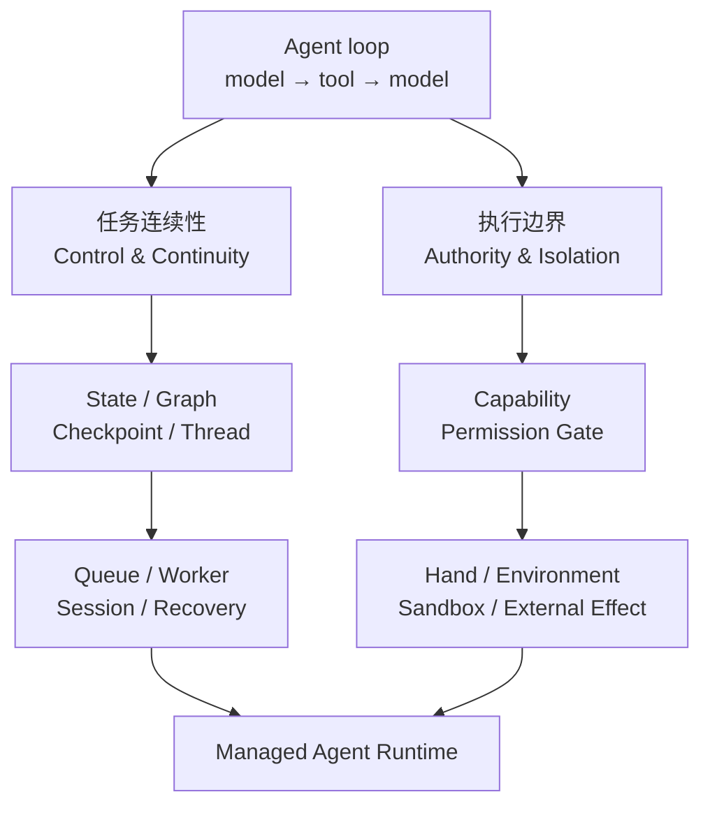
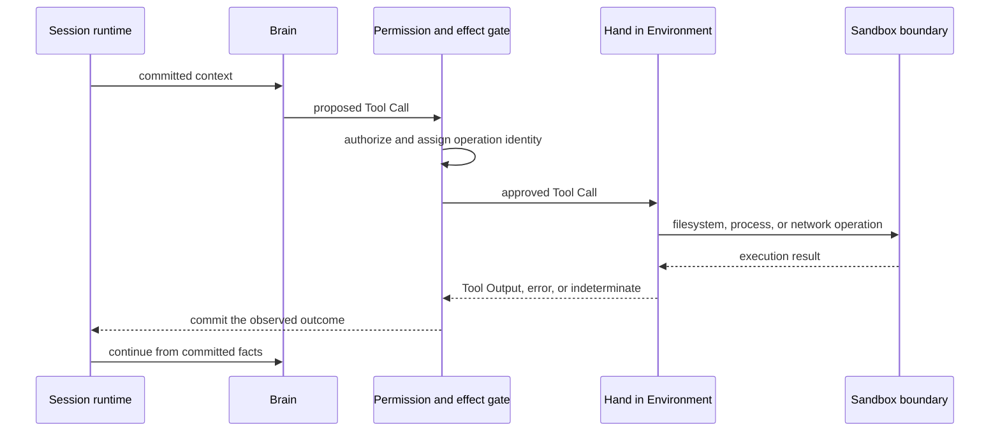

最早的 Agent 没有什么神秘的。它通常就是一个循环：把消息发给模型，模型选择工具，应用执行
工具，再把结果送回模型。直到模型给出最终回答。

```python
while True:
    response = model(messages, tools)
    if response.is_final:
        return response
    result = run_tool(response.tool_call)
    messages.extend([response.tool_call, result])
```

这个循环足以做出演示，却没有回答生产环境里最难的问题。进程中断以后从哪里继续？工具已经
执行、结果却没有返回时能不能重试？模型生成的命令可以接触哪些文件和网络？一个会持续数小时、
跨越多次人工确认的 Agent，究竟由谁保存它的事实？

过去几年的 Agent 基础设施，大体沿着这些问题逐层展开。它不是一条由某个框架通向某个产品的
单一路线，更像不同团队在撞上相同故障以后，逐渐采用了相似的边界。

## 两条问题线，最后汇合

如果只按产品发布时间看，这段历史很容易被写成 Graph、Checkpoint、Sandbox、Managed Agents
依次接棒。更通用的看法是：一个 Agent loop 同时暴露了两类问题。一条线解决任务如何继续，
另一条线解决动作如何安全落地。

| 问题线 | 它追问什么 | 逐步形成的机制 |
| --- | --- | --- |
| 任务连续性（Control & Continuity） | 任务走到哪里？暂停、崩溃或换 Worker 后，从哪一项已确认事实继续？ | State、Graph、Checkpoint、Thread、Queue、Session、Recovery |
| 执行边界（Authority & Isolation） | 这个动作能不能做？由谁在哪里执行？可以接触哪些资源？结果怎样提交？ | Capability、Permission Gate、Hand、Environment、Sandbox、Effect Commit |



两条线不能相互替代。Checkpoint 能告诉系统从哪里继续，却不能限制一个 Shell 进程读取宿主机；
Sandbox 能挡住越界的系统调用，却不知道某封邮件是否已经发送并写入 Session 事实。Managed Agent
Runtime 的关键，不是把这些名词装进同一个产品，而是让两条线在同一个 Session 生命周期里闭合。

## 循环先解决了自主决策

早期 AgentExecutor 一类设计，把模型放进 `model → tool → model` 循环。模型不再只回答一次，
而是根据工具结果决定下一步。这解决了自主决策，却把模型调用、工具代码、内存状态和应用生命周期
放在同一个运行进程里。

2024 年初发布的 LangGraph 向前走了一步。它用带循环的图表示 Agent runtime，用一个中心 State
连接节点，并允许开发者明确指定条件边、状态更新和终止条件。原来藏在 `while` 循环中的控制流，
变成了可以检查和修改的状态机。[LangGraph 最初的发布说明](https://www.langchain.com/blog/langgraph)
把目标说得很直接：给需要循环的 Agent runtime 更多控制。

这里还没有独立的执行环境。模型节点和工具节点首先是应用代码中的函数。图决定哪个节点运行，
但不负责限制这个函数能读取哪块磁盘、启动什么进程，或者把它的网络出口关在哪里。

这是第一个容易混淆的地方：**State 不是 Environment，Graph 也不是 Sandbox。**

从这里开始，演进分成两条线。先看任务连续性。

## 任务连续性：持久化让副作用问题浮出水面

接下来出现的是 Checkpoint、Thread、Interrupt 和恢复。LangGraph 可以在图步骤之间保存 State，
让运行暂停、接受人工输入，再从已有 Checkpoint 继续。后来完成的节点写入也可以单独保存，避免同一
个 super-step 中已经成功的节点被全部重算。[LangGraph Persistence](https://docs.langchain.com/oss/python/langgraph/persistence)
记录了这些能力。

持久化解决了“图运行到哪里”，却也让另一个问题无法继续回避：恢复一个节点，可能会重新触发其中
的外部调用。支付、发信、创建工单和修改仓库都不是纯函数。一个节点在暂停或崩溃前已经产生副作用，
Checkpoint 本身不能证明这个副作用有没有发生。

因此，耐久执行不能只保存 State。每个外部操作还需要稳定的操作身份、真实的重放策略，以及一个
明确的结果：成功、失败，或者结果不确定。把所有异常都改写成“请重试”，只会让系统更容易重复做事。

## 任务连续性：Agent Server 分开了入口与执行

当 Agent 进入云端，下一步通常是把 API 入口和执行 Worker 分开。现在的 LangSmith Agent Server
使用 Assistant、Thread、Run 和任务队列组织运行。API Server 接收请求并入队，Queue Worker 领取
Run、执行整张图、写入 Checkpoint，再把事件流送回客户端。[Agent Server 架构](https://docs.langchain.com/langsmith/agent-server)
描述的正是这个过程。

这是一项重要变化，但它仍然不是手脑分离。API Server 与 Queue Worker 分开的，是请求入口和图执行；
模型节点与工具节点仍可以在同一个 Worker 进程中运行。Worker 容器提供了部署边界，却不必然是每个
Session 独享、按工作负载限制权限的 Sandbox。

到这里，系统已经更擅长接住一个中断的任务，但还没有完整回答一个动作能不能做、在哪里做、能接触
什么。这正是第二条问题线。

## 执行边界：Skill 把模型输出变成了执行输入

Skill 和工具生态的扩张，确实把 Sandbox 从少数代码解释器的配套设施，推成了 Agent 平台的基础能力。
但因果关系需要说准。真正改变风险性质的不是 Skill 数量，而是模型输出开始进入文件系统、进程和网络
的执行路径。

Skill 也不等于可执行工具。它可以只是一段按需加载的流程说明，也可以带上脚本、支持文件和一组允许
调用的工具。前一种只改变模型上下文；后一种才把模型生成的参数或代码交给执行面。是否需要 Sandbox，
应由最终获得的能力决定，不能只看它是否被命名为 Skill。

当模型可以生成 Shell、Python 或其他任意代码时，提示注入和幻觉不再只是让回答变差。它们可能变成
`rm`、进程启动、凭据读取或不受限的网络请求。与此同时，不同任务开始安装彼此冲突的包、修改工作目录，
并留下需要在下一轮继续使用的文件。隔离在这里同时处理两件事：把执行权限圈在边界内，也为一次工作
提供可复现的依赖和状态。它仍不能替代工具授权、Secret 管理或副作用提交。

可以用有效能力，而不是 Agent 类型，做下面这项判断：

| 有效能力 | 本地 Sandbox | 仍然需要的控制 |
| --- | --- | --- |
| 纯文本生成、路由或 instruction-only Skill | 不需要 | 上下文边界、模型与数据访问策略 |
| 受信任代码中的固定函数，例如时间转换和结构化格式化 | 通常不需要 | 参数 schema、超时和资源上限 |
| 天气、检索、邮件或 Slack 一类 typed remote API | 不需要本地 Sandbox | 最小权限凭据、审批、幂等键与审计 |
| 通过受治理查询服务访问数据库 | 不需要本地 Sandbox | 行列权限、查询预算、脱敏与结果上限 |
| 任意代码、Shell、本地文件、动态安装依赖或处理不可信二进制 | 需要 | 文件、进程、网络、Secret 与资源隔离 |

“不需要 Sandbox”只表示 Agent runtime 不必为这次操作创建本地执行环境，并不表示操作安全。发送邮件
是远程副作用，接收端不会替调用方完成授权、去重和审计。数据库即使只读，也可能泄露敏感数据或耗尽
查询资源。Sandbox 解决执行隔离；权限门和副作用协议解决“能不能做”与“做了几次”。

按需供给也不是等模型选中高风险 Skill 后，再临时决定是否隔离。Session 准入时应先冻结 Skill、工具、
资源和执行位置，然后得到三种结果：不需要本地 Environment；必须在推理前创建 Environment；或者允许
先做纯模型推理，在第一次本地操作前实现已经声明的 Environment。只有第三种情况适合延迟启动。
Filesystem input、支持文件、动态依赖或远程执行后端如果在推理前就要使用，Environment 必须提前存在。
Warm pool 可以缩短等待时间，但不会降低所需的隔离等级。

## 执行边界：Sandbox 把环境变成一等边界

一旦有效能力要求本地执行，单纯的函数接口就不够。一个不透明进程会直接发起
`open()`、`exec()` 和网络系统调用，它不会遵守应用在工具参数上做的路径改写。隔离必须落在操作系统
或容器边界。

现在的 Deep Agents 文档区分了两种模式：[Agent in Sandbox 和 Sandbox as Tool](https://docs.langchain.com/oss/python/deepagents/sandboxes)。

| 模式 | 结构 | 得到什么 | 付出什么 |
| --- | --- | --- | --- |
| Agent in Sandbox | 模型循环和工具都进入隔离环境 | 文件访问直接，接近本地开发体验 | 模型凭据进入环境，升级要重建镜像，信任面更大 |
| Sandbox as Tool | 模型循环在外，命令和文件工具在环境内 | 凭据与提交权可以留在外部，执行边界清楚 | 多一次远程往返，还要处理断线后的不确定结果 |

Sandbox 在这里不只是“安全运行 Bash 的容器”。它开始承担工作空间、包、网络、Secret、资源配额、
进程生命周期和输出提取。到了这一步，Environment 已经不是部署脚本里的实现细节，而是 Agent
运行契约的一部分。

## 两条线在 Managed Agent Runtime 汇合

Managed Agents 再向前走一步：开发者不再只部署一段 Graph 代码，而是使用一套已经拥有 Agent loop、
持久状态、工具权限、环境供给和恢复机制的运行时。

以 Claude Managed Agents 为例，它公开四个一等概念：Agent、Environment、Session 和 Events。
Agent 保存模型、指令、工具与 Skills；Environment 定义 Session 在哪里运行；Session 保存一次持续
工作的上下文；Events 负责输入、进展、暂停和结果。[Managed Agents 概览](https://platform.claude.com/docs/en/managed-agents/overview)
给出的正是这组边界。

在托管 Cloud Environment 中，每个 Session 获得自己的 Linux Sandbox。Session 创建后就开始供给
环境，而不是等到第一次 Bash 调用。[Cloud Environment](https://platform.claude.com/docs/en/managed-agents/environments)
和 [Session 生命周期](https://platform.claude.com/docs/en/managed-agents/sessions)都把这个行为写进了
公开契约。自托管模式则保留平台侧编排，把文件、进程和网络执行移到客户控制的基础设施。

这才是 Managed Agents 与“托管一个 Agent HTTP 服务”的差别：托管的不只是入口，还包括 Session、
Environment 和工具副作用的生命周期。

## 执行边界里的 Brain 与 Hand

走到这里，“脑”和“手”才成为有用的架构词汇。

Brain 负责模型推理、上下文和下一步决策。Hand 接收已经授权的 Tool Call，在具体 Environment 中
执行，并返回 Tool Output。Sandbox 是 Hand 所处的物理边界，限制文件、进程、网络和资源。真正的
Session 事实仍由外部提交边界保存，Hand 不能自己宣布任务已经成功。



这个分离有明显收益。模型和持久状态不必进入不可信执行环境，客户可以把 Hand 留在自己的网络中，
模型与 Sandbox 也可以分别升级。代价同样具体：工具调用多了一次跨边界往返；Brain 与 Hand 必须核对
工具版本；回复丢失后，系统必须分辨“尚未执行”和“可能已经执行”。

还要避免拆得太远。如果 Brain 和 Hand 各自拥有独立调度、各自选择工作空间，同一个 Session 很快会
出现两套文件事实。更稳妥的约束是：一个 Session 在需要本地执行时只拥有一个 Environment，Hand
属于这个 Environment。Brain 与 Hand 可以在不同进程中，但不能成为两个互相竞争的生命周期权威。

## 故障之后才看得见 Managed 边界

判断一个 Agent 系统是否真的走到 Managed Runtime，不妨跳过功能列表，直接问四个问题：

1. 客户端断开以后，谁保存同一个 Session 的继续位置？
2. Worker 在工具执行期间消失，系统能否说明副作用尚未发生、已经发生，还是无法确定？
3. 谁负责 Environment 的创建、凭据投影、恢复和最终销毁？
4. Sandbox 消失以后，哪些事实仍能从持久记录中重建？

如果答案仍然是“由应用代码自己处理”，那通常还是一个被托管起来的 Agent loop。图、队列和容器都
可能已经存在，但运行责任还没有成为产品。

Managed Agent Runtime 的价值并不在于藏起 `while` 循环。循环一直都很简单。真正被托管的是循环
周围那些只会在断线、重试、越权和长时间运行时出现的麻烦。

如果你正在设计这条边界，可以继续阅读[让 Agent Session 可以恢复的三条边界](/zh/blog/2026-08-awaken-runtime-boundary/)
和 [Brain、Hand 与 Session Environment](/zh/docs/agents/concepts/brain-and-hand/)。
