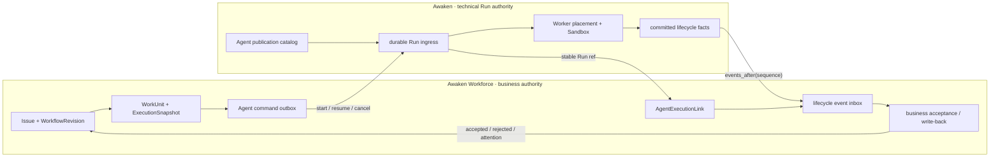
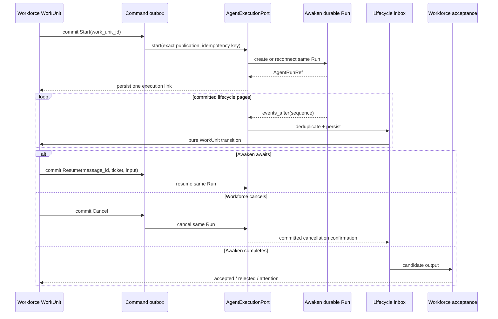

Workforce separates three objects:

- **Agent**: the business execution role and portable configuration template.
- **WorkUnit**: one business execution responsibility for an Issue/Workflow state.
- **Awaken Run**: the technical authority for publication, protocol, placement,
  Sandbox, await/resume, and terminal execution facts.

Workforce does not keep a second Agent worker kernel. It freezes
an exact `AgentPublicationRef`, starts an Awaken Run through the neutral
`AgentExecutionPort`, and consumes only committed lifecycle facts.

## Current status

| Layer | Status | Current fact |
| --- | --- | --- |
| Agent publication/control ACL | Built | Workforce publishes and freezes an exact Awaken publication and does not construct provider clients |
| WorkUnit↔Run link | Built | `AgentExecutionPort`, the command outbox, execution link, and dual-stream event inbox pass in-memory, SQLite, PostgreSQL conformance, and server causal tests |
| Sole fleet/worker authority | Built | Awaken is the sole Agent Worker, claim, recovery, and ACP/A2A authority; Workforce retains only local System/Rule execution and a read-only fleet projection |

Built describes the integration path, not product maturity. It means the
guardrails, store conformance, causal behavior, and removal of replaced paths
have been checked. Workforce remains in early preview; Built does not
claim a production SLA, customer outcome, or hosted service.

## Static structure

Workforce and Awaken do not share one state enum. Workforce WorkUnit states describe a
business attempt; Awaken Run states describe technical execution. Technical
success in Awaken is not automatic business acceptance in Workforce.

## Dynamic behavior

## Invariants

- `work_unit_id` is the start idempotency key; one WorkUnit links to one Awaken Run.
- Commands and lifecycle inbox events are durable and deduplicated.
- Only committed Awaken lifecycle events change Workforce execution state.
- Cancellation requires committed confirmation; Workforce cannot locally invent a
  terminal state.
- Awaken completion yields a candidate result. Workforce independently applies output
  contracts, revision checks, approval, and business acceptance.
- Workforce's local queue executes only System/Rule work. Restoring an Agent claimant,
  Worker registry, or ACP/A2A router in Workforce would restore the deleted second
  execution authority.
