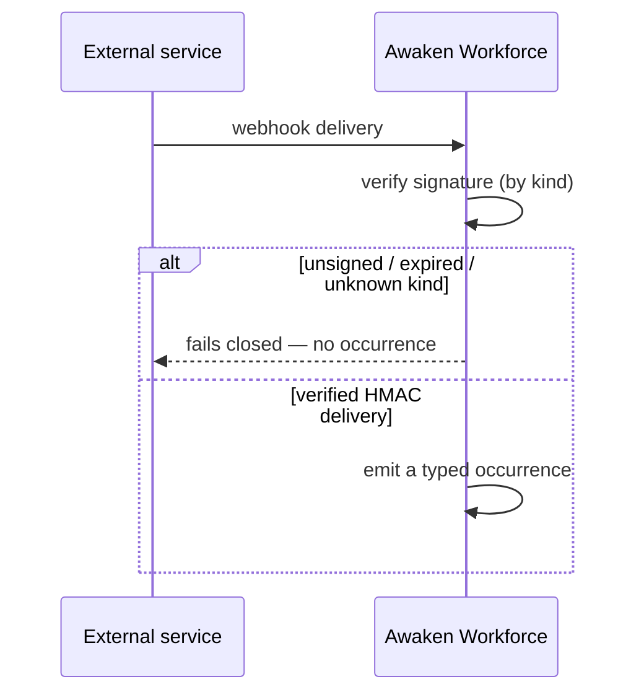

A **connector** is how a domain pack meets the outside world: inbound webhooks that
turn external events into typed [occurrences](/docs/workforce/concepts/reactions), and
outbound credentials presented to a service when work calls it. Both are
declarative and admission-checked — the domain names a strategy; crypto, HTTP, and
token state live in the platform.

## Inbound: verify before emitting

An inbound connector verifies every delivery before it becomes an occurrence:

- **Signature verification.** A connector's `kind` selects a verification scheme.
  An unknown `kind` is refused at install; an unsigned, expired, or mismatched
  delivery fails **closed** — no occurrence is emitted.

## Outbound: how a credential is presented

When work calls a service, the platform presents the credential in one of two
modes. Neither ever hands the secret to the agent — see
[credential custody](/docs/workforce/concepts/credential-custody) for that guarantee.

- **Direct** — the stored credential is injected as configured (e.g. a header).
- **Exchanged** — the platform **mints a short-lived token** from a stored
  `id + secret` against a token endpoint (a Feishu `tenant_access_token`, a GitHub
  App token, …), caches it with its TTL, and refreshes before expiry. A mint
  failure fails **closed to no auth** — never a broken or partial header.

## Non-secret configuration: `env` from a `Config` resource

A connector can inject **non-secret** environment values (a `GIT_AUTHOR_NAME`, a
region) computed from a bound `Config` resource. This is for configuration, not
secrets: an `env` entry drawn from a resource marked `secret` or `confidential` is
**refused at install**. Secrets always travel by reference, never as an env var.

## Related

- [Reactions](/docs/workforce/concepts/reactions) — what a verified inbound delivery
  becomes: an occurrence that fires a reaction.
- [Credential custody](/docs/workforce/concepts/credential-custody) — who holds a secret
  when it's used.
- [Author a domain pack](/docs/workforce/how-to/author-a-domain-pack) — where connectors
  and credentials are declared.
