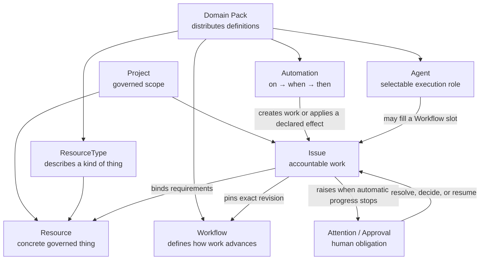
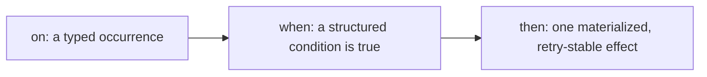
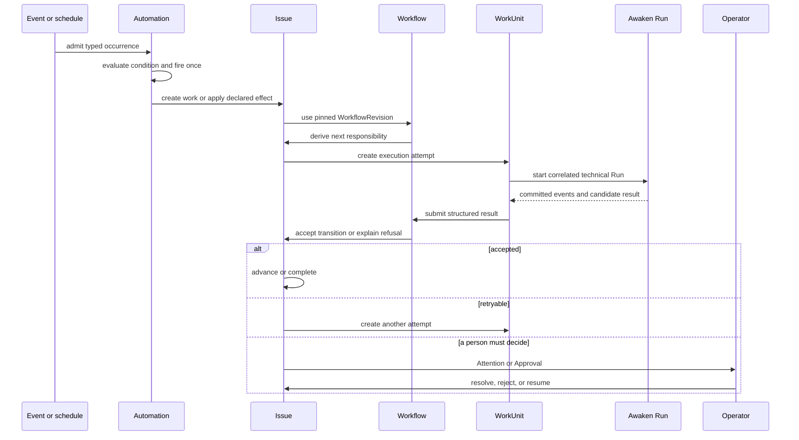

Start with a job your team already repeats. Name its scope, the things it needs,
the finish line, and the person who remains responsible when an Agent cannot
continue. Workforce's objects give each of those decisions one place to live.

## Start with one job

Suppose a team reviews every release before production:

1. Create a **Project** for the product or service being released.
2. Add the repository, test environment, and deployment target as **Resources**.
3. Define a **Workflow** with review states, responsibility slots, and an accepted result.
4. Create an **Issue** for one release. The Issue keeps its goal, owner, state, and outcome.
5. Assign an **Agent** to the review slot. Use an **Automation** only if a schedule or event should create or advance the work.
6. Raise **Attention** when the Agent cannot proceed; use **Approval** when a person must decide one specific action.

You can model the first job without touching `WorkUnit` or Awaken Run. Those
objects matter later, when you inspect an attempt or recover an interrupted one.

## Choose the object that owns each decision

| Concept | What you use it for | What it does not own |
| --- | --- | --- |
| Project | Govern one scope of work, definitions, Resources, people, and Agents | A particular piece of work or execution attempt |
| Domain Pack | Distribute exact ResourceType, Workflow, Automation, and Agent definitions | Resource instances, credentials, Issues, or runtime state |
| ResourceType | Describe a kind of governed object, its properties, actions, events, requirements, and capabilities | A concrete object instance |
| Resource | Represent a concrete governed thing such as a repository, environment, credential, or external service | The process that moves work to completion |
| Workflow | Define states, responsibility slots, inputs, outputs, transitions, guards, and completion | When a new piece of work should be created or triggered |
| Automation | Declare `on → when → then`: which occurrence to observe, which condition to evaluate, and which frozen effect to produce | A long-lived work instance or a second Workflow state machine |
| Agent | Define a selectable execution role and its published execution intent | Project authorization, credentials, or an Issue's business status |
| Issue | Preserve one accountable goal, pinned Workflow revision, state, dependencies, responsibility, and outcome | A single Agent process or Run |
| Attention | Explain why work cannot continue automatically and what an operator must inspect | A generic log line or hidden retry |
| Approval | Record a person's decision about one concrete governed action | Identity, authorization, readiness, or blanket permission |

Keep this distinction while you model the job:

> **Workflow defines how work advances. Automation decides when declared effects
> should fire. Issue keeps responsibility. Agent performs an attempt.**

## Static relationships

Definitions and instances remain separate. Saving or adopting a newer Workflow
does not retarget an existing Issue; the Issue keeps the exact revision it pinned.
A Domain Pack distributes definitions but never smuggles live credentials or
Project instances into another scope.

## Workflow and Automation

These concepts cooperate but must not overlap.

### Workflow: how existing work advances

A Workflow answers:

- Which business states can an Issue occupy?
- Who or which Agent may fill each responsibility slot?
- Which Resources and inputs are required?
- Which structured result allows a declared transition?
- What constitutes a completed, failed, or cancelled terminal outcome?

It does not poll the world or decide when an unrelated event should create work.

### Automation: when the system responds

An Automation answers:

At runtime, an occurrence is admitted as a fact, a matching binding evaluates the
condition, and a fire-once firing records the causal response. An Automation may
create accountable work or apply another declared effect, but it must not create
a parallel workflow state machine. Long-lived responsibility belongs in an Issue.

## Issue, WorkUnit, and Awaken Run

The objects below become visible when inspecting or recovering execution:

| Object | Authority |
| --- | --- |
| Issue | Workforce business truth: goal, pinned Workflow, dependencies, state, responsibility, and acceptance |
| WorkUnit | One Workforce execution responsibility/attempt for an Issue and Workflow state |
| Awaken Run | Technical Agent execution: publication, model/tool loop, Worker placement, Sandbox, await/resume, and committed run events |

Technical completion is only a candidate business result. Workforce still checks the
Workflow output contract, revision, approval, and acceptance rules before the
Issue advances.

## Dynamic behavior

## Four gates that are not synonyms

| Gate | User-visible question |
| --- | --- |
| Authorization | Is this identity allowed to request the action in this scope? |
| Readiness | Are the dependencies, Resources, configuration, and execution capacity available? |
| Approval | Has a person accepted this concrete consequential action? |
| Attention | Why can the system not continue automatically, and who must respond? |

Fix the gate that failed. Granting broader authorization does not satisfy missing
Resources, and resolving Attention does not fabricate an Approval.

## Under the hood

Commands append authoritative Facts through the owning context. Projections
rebuild query views from committed Facts. Streaming progress and logs help people
observe work, but they cannot change business state by themselves.

## Non-goals

Workforce does not implement an Agent loop, choose a model behind Awaken's back, or
accept uncommitted runtime output as business truth. Awaken owns technical Agent
execution. Workforce owns the Issue, its pinned Workflow, responsibility, and the
decision to accept or refuse the returned result.

Continue with [Issues and responsibility](/docs/workforce/concepts/issue-based-workflows/),
[Workflows](/docs/workforce/concepts/workflows/), [Automation and reactions](/docs/workforce/concepts/reactions/),
[Resources and governance](/docs/objects/concepts/permissions-resources/), and
[Workforce–Awaken execution ownership](/docs/workforce/concepts/agents-runs/).
