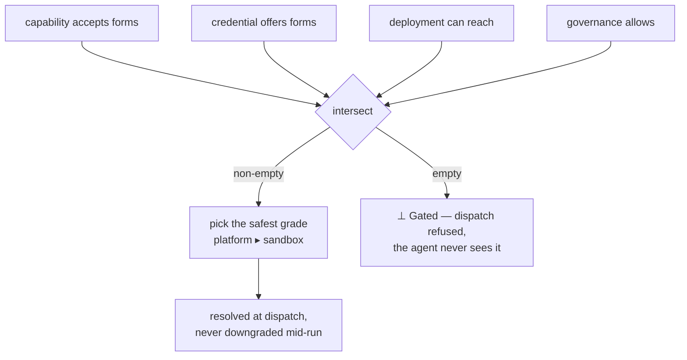

A credential reaches work along one axis that actually changes security posture:
**custody** — *who holds the secret at the moment it is used*. Everything else (a
gateway route, a socket, a mounted file) is downstream of that one choice.

## The implemented grades

The current execution path exposes two reachable grades. The platform picks the **safest reachable** one;
you never author it per run.

| Grade | Who holds the secret | What the agent sees |
| --- | --- | --- |
| `platform` | the platform injects it at the edge, per call | only a lease — never the secret |
| `sandbox` | custody is transferred into the sandbox — the secret enters the agent's trust domain | the material itself, as a mounted file (never an env var) |

`platform > sandbox`: higher means the secret stays farther from the
agent. The agent's *instructions are identical* across grades — it runs a
high-level operation (`git clone … && git push`) and the tool, not the agent,
consumes the credential. It never names a path, reads a secret, or learns the
grade — exactly like `git push` on your laptop.

## Selection is fail-closed

At dispatch the platform intersects what the capability accepts, what the
credential offers, what the deployment can actually reach, and what governance
allows — then takes the safest grade in that set:

- If the set is **empty**, the capability is **gated**: dispatch is refused and the
  agent never even sees a resource it can't safely use. The platform **never
  guesses** a grade.
- A **`custody_floor`** (e.g. `custody_floor: platform`) is a hard lower bound —
  below it, the capability gates rather than negotiating down.
- Custody is resolved **at dispatch and never downgraded mid-run**: if an edge
  fails at runtime, that one call fails — it does not silently fall to a weaker
  grade. Choosing a lower grade at all is a governed decision that carries
  obligations (short-TTL child credential, tightened lease, pinned egress
  allowlist), not an `else` branch.

Because it re-resolves every dispatch, a deployment that later gains a safer edge
**automatically reinstates the higher grade** — no pack change.

## Self-describing credentials

A credential is a typed object that declares its own **forms** — the shapes it can
be presented in. A capability declares which forms it will accept; dispatch matches
them. Delivery is expressed with a small, closed vocabulary of injection artifacts:

| Artifact | Carries a secret? | Serves |
| --- | --- | --- |
| `files` | yes — in `content` | `sandbox` (mounted file) |
| `transform` | yes — in `value` (e.g. a header) | `platform` (edge injection) |
| `env` | **no — non-secret only** | ambient wiring (names, hosts) |

A credential is always referenced (`vault:` / `file:` / `literal:`), **never
`env:`**, and secret material may appear **only** in `files[].content` or
`transform[].value`. Putting a secret in an env var is rejected at install — not a
convention, a checked rule. This is why delivery is a property of custody and
forms, not merely "derived from `data_class: secret`".

## Related

- [Permissions & resources](/docs/objects/concepts/permissions-resources) — the one
  decision contract that gates every "may this happen?".
- [Resource requirements](/docs/workforce/how-to/capability-requirements) — how to assess
  an exact type or relation need and fulfill Credentials through the write-only path.
