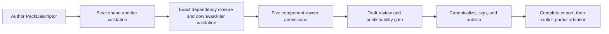

Every new Pack uses one author and release format: `PackDescriptor` with
`contract_version: 2`. YAML is a readable encoding; canonical compact JSON is the
signed artifact. The former `kind: ResourcePack` format and lowering path are not
product authoring contracts.

A descriptor contains a closed union of five component declarations:
`resource_type`, `workflow`, `automation`, `agent`, and `environment`. Resources, credentials,
WorkUnits, execution state, scripts as public objects, and validation evidence do
not become Pack components.

## Composition tiers

| Tier | Responsibility | Allowed dependencies |
| --- | --- | --- |
| `foundation` | shared platform primitives | foundation |
| `integration` | external-system adapters | foundation, integration |
| `domain` | reusable business capability / workforce | foundation, integration, domain |
| `solution` | installable end-to-end assembly | foundation, integration, domain |

A Solution cannot depend on another Solution. Its `installation` descriptor owns
bounded defaults and choices. Tier is signed, inert metadata: it does not alter
the five component owners, Registry trust, System-Pack provenance, exact
dependency closure, or partial adoption.

## Dynamic lifecycle

Import never means activation. Project overrides remain distinct, and existing
Issues keep their pinned Workflow revisions. New publications require a tier;
older immutable signed releases without one remain readable as Legacy.

Next: [Develop a Domain Pack](/docs/workforce/designing/develop-a-domain-pack) ·
[Author and validate a Pack](/docs/workforce/how-to/author-a-domain-pack).
