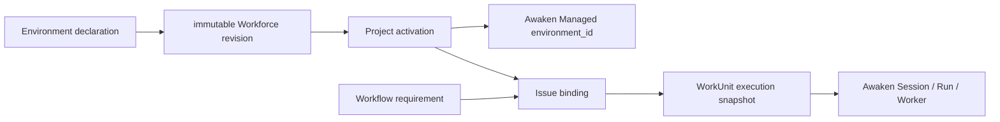

An **Environment** is reusable, versioned execution configuration. Workforce owns its
authoring identity, immutable revisions, Pack distribution, Project selection,
and activation history. [Awaken](/docs/agents/concepts/architecture/) remains
the sole owner of the executable Environment, Session, Run, and Worker.

This boundary avoids two competing runtimes: Workforce describes *what execution
configuration a Workflow requires*; Awaken turns that configuration into an
opaque `environment_id` and executes it.

## Static structure and ownership

| Concern | Authority | Contract |
| --- | --- | --- |
| Definition and revision | Workforce Environment owner | discoverability, metadata, closed `config`, immutable digest |
| Distribution and selection | Workforce Pack and Project owners | fifth Pack component; Project override and exact revision |
| Availability | Workforce Project | CAS-versioned `EnvironmentActivation` linking one exact revision to one Managed id |
| Execution | Awaken | `/v1/environments`, Session `environment_id`, Run and Worker |



The author contract is deliberately the same closed vocabulary Awaken accepts:

- `self_hosted`; or
- `cloud`, with `networking` set to `unrestricted` or `limited`;
- limited networking may declare `allowed_hosts`, `allow_mcp_servers`, and
  `allow_package_managers`;
- cloud packages may list `apt`, `cargo`, `gem`, `go`, `npm`, and `pip`
  requirements.

There is no second image, implementation, command, or backend abstraction in
Workforce. Hostnames are normalized and package values that look like command options
are rejected.

## Author and activate

Save an immutable Project revision through the existing owner path:

```http
POST /api/projects/{project}/environments/{definition}/revision
```

```json
{
  "expected_override_version": 0,
  "idempotency_key": "save-build-env-1",
  "declaration": {
    "name": "Build environment",
    "description": "Builds and tests the service",
    "icon": "lucide:container",
    "config": {
      "type": "cloud",
      "networking": {
        "type": "limited",
        "allowed_hosts": ["github.com"],
        "allow_mcp_servers": false,
        "allow_package_managers": true
      },
      "packages": { "type": "packages", "npm": ["pnpm@10"] }
    }
  }
}
```

Then materialize the Project's effective revision and create or replace a named
activation with compare-and-swap:

```http
POST /api/projects/{project}/environments/{definition}/activations/{activation_id}
{ "expected_version": 0 }
```

The command resolves the exact Workforce revision and execution Workspace, calls
Awaken's canonical `/v1/environments` API, reconstructs the returned definition,
verifies its digest, and only then commits the activation. Equal-content
revisions remain distinct identities and receive distinct Managed ids.

## Bind and execute

A Workflow declares an Environment in `requires`; an Agent-executor state names
that requirement in its `environment` field. The Issue's Workflow binding then
selects `{ "kind": "environment", "activation_id": "…" }`.

Immediately before dispatch, Workforce requires that the activation is active, still
matches the exact required revision and execution Workspace, and still points to
an unchanged Managed Environment. It freezes the activation, exact revision,
Managed id, and digest into `ExecutionSnapshotV1`. Session planning passes only
the opaque `environment_id` to Awaken. Changing the binding affects a later
dispatch; it never switches the Environment inside a live Session.

## Failure and recovery

- Missing, disabled, drifted, archived, or wrong-Workspace materialization fails
  closed and prevents dispatch.
- A transient materialization failure may retry the same idempotent command.
- Concurrent activation changes return a version conflict; reload the current
  activation and decide again.
- A crash after remote creation but before Workforce's CAS may leave an inert Managed
  object; retry discovers and reuses the exact object.
- Disabling uses `POST /api/projects/{project}/environment-activations/{activation_id}/disable`
  with the current `expected_version`; history remains available.

Use `GET /api/projects/{project}/environment-activations` to inspect Project
availability. Exact request and response schemas remain authoritative in the
[route and schema reference](/docs/workforce/reference/routes/).
