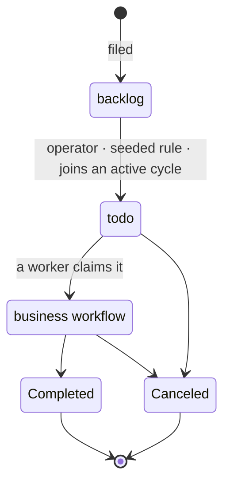

Before an Issue reaches the workflow that does its work, it passes through a
**universal intake prefix** that every Issue shares — two built-in states, the same
way every Issue gets `Completed` and `Canceled` for free.

## Two intake states

| State | Group | Meaning |
| --- | --- | --- |
| `backlog` | Backlog | Captured, but **not to be processed** yet. |
| `todo` | Ready | **Processable** — a workflow can be (or is) assigned; it waits here until it truly enters that workflow's first stage. |

These are never authored inside a business workflow. The prefix is the platform's,
not yours — a workflow you design carries only its own business stages plus the
`Completed` / `Canceled` terminals.

The picture in one line: **work waits in `backlog`, becomes ready in `todo`, and
only moves once someone actually picks it up.**

## `backlog → todo`: made ready

Promotion means "this is now assignable/processable." It happens on **any** of:

1. an **operator** moving it;
2. a **seeded per-project rule** — created (default-on, editable) when a project is
   made: *an Issue that joins an active cycle advances `backlog → todo`*. You can
   change what triggers it (a label, an intake-form submission) or switch it to
   manual-only;
3. joining an **active** cycle (which is what that seeded rule fires on). Joining an
   *upcoming* cycle does not promote — cycle membership is one trigger, never the
   definition of `todo`.

Promotion is decoupled from planning: an Issue with no cycle can still be `todo`.
Workflow **assignment and triage happen while in `todo`** — `todo` is the pull
queue, and triaging an Issue doesn't move it out.

## `todo → in progress`: claim-driven

An Issue leaves `todo` only when a worker actually starts it. While it's `todo` and
**ready** — workflow assigned, dependencies clear, a capable worker exists, and
dispatch policy (or an operator) permits — the work is offered:

1. A worker **claims** it and begins. The claim records only that the work started;
   it never writes the Issue's state directly.
2. A declared reaction sees that "started" fact and advances `todo → <workflow>`'s
   first stage through the normal transition path.

The consequence matters operationally: **"in progress" always means claimed and
running.** An Issue that's been offered but not yet picked up stays visibly in
`todo` — no phantom work-in-progress, no separate accounting to reconcile.

## Operators move along declared edges only

An operator can move an Issue **only along a declared transition whose guard passes
and whose source state's [output contract](/docs/workforce/reference/output-contracts) is
satisfied** — never a free-form jump to an arbitrary state. That contract is
actor-agnostic: it's discharged whether an agent or a human produced the output, so
a human decision step is just a normal awaited business step, not a special case.

The implemented intake prefix is `backlog → todo` through an operator, the seeded
per-project rule, or active-cycle membership, followed by claim-driven
`todo → in progress`.

## Related

- [Issues](/docs/workforce/concepts/issues) — the unit of work these states move through.
- [Workflows](/docs/workforce/concepts/workflows) and
  [parts of a workflow](/docs/workforce/concepts/workflow-parts) — the business stages
  that follow intake.
- [Cycles](/docs/workforce/how-to/cycles) — planning membership and how activation
  promotes work.
