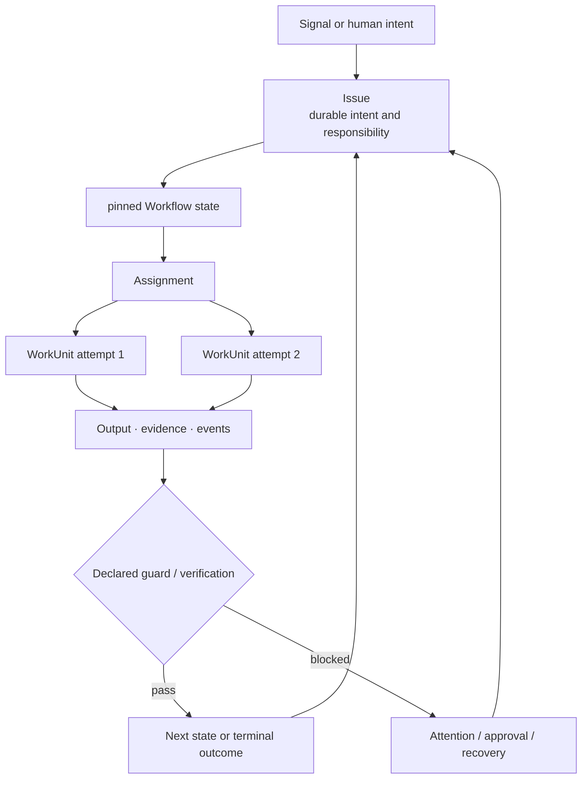

A workflow run answers: **did these steps execute?** An Issue-based workflow
answers the larger question: **has the intended outcome been reached, with the
required evidence and a responsible owner throughout?**

## The Issue outlives execution

The Issue holds the business intent and authoritative workflow position.
WorkUnits are accountable execution attempts beneath it. A failed worker, model
retry, reassignment, review cycle, or process restart does not create a new truth
about why the work exists.

## Different from a run-centric workflow

| Run-centric workflow | Issue-based workflow in Workforce |
|---|---|
| A trigger creates an execution instance | A signal creates or updates durable responsibility |
| State primarily belongs to the run | Business state belongs to the Issue |
| Nodes are the main unit | Issue, state responsibility and governed outcome are primary |
| Retry repeats a node | A new WorkUnit attempt remains attached to the same Issue |
| Human work is another task node | Human, Agent and Team are explicit accountable Actors |
| Completion means the graph stopped successfully | Completion means a declared terminal outcome and configured evidence are satisfied |
| Failure is an exception or failed run | Failure becomes typed evidence, attention, retry or recovery on the Issue |
| Context is reconstructed from logs | Intent, assignments, outputs, approvals and timeline stay queryable together |

Workforce can use graph runtimes or durable queues as execution mechanisms. It is not
trying to replace those mechanics; it adds the typed work-and-responsibility
layer above them.

## Different from an issue tracker

An issue tracker makes work visible, but status movement is usually manual or
integration-specific. Workforce resolves and pins a validated `WorkflowRevision` for an Issue, creates
Assignments on state entry, dispatches lease-bound WorkUnits, evaluates
structured results, and advances through declared transitions.

The product position is therefore neither "another DAG" nor "an issue tracker
with an Agent button":

> Awaken Workforce is an Issue-based automation system in which execution remains
> subordinate to durable intent, responsibility, evidence, and recovery.

## Why this matters for agents

Agent execution is probabilistic and can stop for reasons unrelated to the
business outcome: provider failure, missing credentials, invalid output,
permission, timeout, review rejection, or lost worker capacity. Treating the
agent run as the work makes those operational events indistinguishable from a
resolved or abandoned business problem.

Workforce keeps these layers separate:

- the Issue says what must be achieved;
- the Workflow revision says how responsibility and result data progress;
- WorkUnit records one execution attempt;
- Resource identifies governed things and operations;
- approval records a specific human decision;
- attention says why progress needs intervention;
- reactions and schedules feed new evidence or work back into the loop.

## Completion is an outcome, not a summary

Workforce never routes from free-form model prose. A state declares named output,
typed Resource production, downstream requirements, transition guards, and any
configured verification. Reaching a terminal state is authoritative; a model
saying "done" is not.

Not every domain check is built in. Authors must supply the relevant tests,
Resource scripts, policies or integrations. The guarantee is that once a check
is declared, the workflow can use its structured result without reinterpreting
a transcript.

Continue with [Issues](/docs/workforce/concepts/issues/) and
[Workflows](/docs/workforce/concepts/workflows/).
