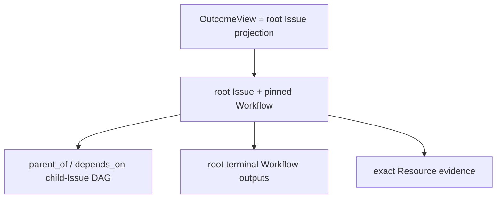

An **Issue** is Workforce's durable, accountable unit of work. It owns the business
state, exact `WorkflowRevision` binding, relations, WorkUnits, approvals,
Attention, accepted outputs, and timeline evidence across retries and recovery.

An **Outcome** is the user-facing, rebuildable view of a commissioned root Issue.
Its id is the root Issue id; it has no separate table, command path, status, or
lifecycle. Workforce derives objective, stage, progress, acceptance contract, final
outputs, and Resource evidence from existing Work and Resource truth.

Every root Workflow output appears in `acceptance_deliverables` with its
`output_id`, exact output `contract`, optional `fulfillment`, and derived
`acceptance_state`. `acceptance_summary` reports `total`, `fulfilled`, and
`complete`. Neither field is another store: both are rebuilt from the pinned
Workflow and the root Issue's accepted state-output envelopes.

## Dynamic work is Issue decomposition

When one Agent cannot determine all work at authoring time, its Planner calls the
bounded `issue.decompose` operation. One atomic command creates 1–32 ordinary
child Issues plus `parent_of` and `depends_on` edges. An exact retry replays the
same graph; changed content conflicts; invalid or cyclic input writes nothing.
Nesting reuses the same command and is bounded to eight levels.

Each Workflow state has at most one accountable Executor. Parallelism belongs in
the visible child-Issue DAG—not hidden slot branches, a `GraphPlan`, a join
service, or output aggregation. Dependencies gate dispatch and a canceled
prerequisite raises Attention instead of satisfying its edge.

## Completion has one authority

Completing the last child makes its parent **ready**; it does not complete the
parent or accept the Outcome. The parent Executor reads child terminal outputs,
integrates the result, produces the root Workflow's declared outputs, and passes
its review or human-acceptance transition. Only the root Issue's terminal
completion makes the Outcome accepted.

| Root completion | Formal fulfillment | Deliverable state | Outcome effect |
| --- | --- | --- | --- |
| `open` | missing | `pending` | continue work |
| `open` | present | `fulfilled` | evidence exists, but acceptance has not happened |
| `completed` | present | `accepted` | formal delivery is accepted |
| `canceled` | either | `canceled` | no accepted Outcome |

A completed root with a missing declared output is inconsistent and fails the
Outcome projection; completion cannot silently turn missing evidence into
acceptance. An accepted Outcome also requires a non-empty, complete formal
delivery contract.

Cycle membership is independent. Closing a Cycle cannot complete, cancel, or
accept an Issue or Outcome.

Use [Commission and follow an Outcome](/docs/workforce/how-to/manage-outcomes) for the
user journey and [Workflows](/docs/workforce/concepts/workflows) for the definition and
runtime boundaries.
