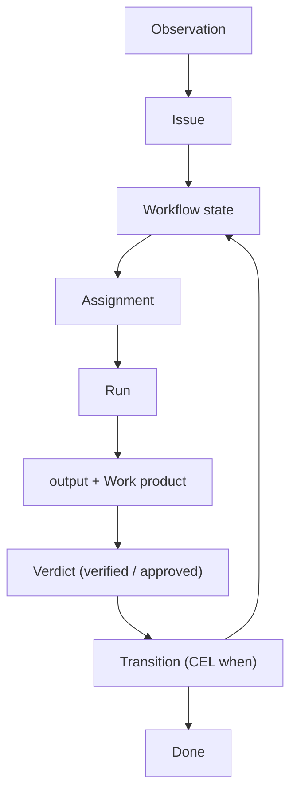

Awaken Workforce's kernel is **domain-neutral**: it knows a small set of primitives and
nothing about "marketing", "customer", or "coder". Domain meaning is added by
[domain packs](/docs/workforce/concepts/domain-packs). Understanding the few core
objects — and how they connect — is the key to everything else. If you haven't
read [A type system for agents](/docs/objects/concepts/type-system) yet, read it
first: this page is that model made concrete.

## Facts, projections, and the two planes

Before the objects, the substrate they all sit on.

- **Fact** — an append-only, immutable, typed ledger entry. Facts are the stored
  **history**: no `UPDATE`, no `DELETE`; a correction is a new fact that supersedes.
  Every object below records its truth as facts.
- **Fact log** — the per-subject append-only stream; the authoritative history the
  audit trail, reactions, and outbox all read from.
- **Projection** — a pure, total, replayable derivation *over* facts (a board, a
  backlog, a metric). A projection is the **derived** read layer — display-only,
  rebuildable from the log, never the source of truth and never repaired in place.

Two **planes** keep the replayable world separate from runtime reality:

- **Pure plane** — facts and their projections: deterministic, replayable,
  clock-free.
- **Live plane** — runtime reality: a run's **lease**, a credential's availability,
  a connector's connection. Wall-clock-bound and non-replayable.

A reference is **typed by the plane it points into**, and a Pure (replayable)
computation cannot read a Live thing — so "is it alive right now?" is a **Live view**
over a lease, never a stored flag. This is the two-plane fence from the
[type system](/docs/objects/concepts/type-system#two-planes-replayable-vs-live).

> **A subtlety worth getting right.** It is *not* true that "everything is a
> projection." An Issue's own **workflow position** — its `state_key` and whether it
> is terminal — is **authoritative typed state**, held under a **version** and
> updated in place; every transition also appends one immutable state-entry fact in
> the same step (that is the history). What is forbidden is a stored *run-status*
> column: run status, "is it live?", scheduling status, and the inbox are all
> **derived** — projections or Live views, never mutated fields.

## Kernel objects

The kernel is anchored on a **bounded, justified set of aggregate roots** — each a
consistency boundary with its own fact stream. The set is deliberately small:
adding a new root requires an explicit design decision showing an invariant the
existing roots can't carry.

- **Actor** — an identity that can raise issues, react, or own runs (a User, Agent,
  or Team).
- **Resource** — a governed thing that issues are raised against (a repo, a
  connector, a work product, a script, a credential kind — one catalog, facet-typed).
- **Issue** — a durable, visible unit of work against a resource; the primary
  process-backed **Subject**.
- **Reaction** — the system's declared response to an issue; the automation spine.
- **Run** — a leased, accountable, event-streamed execution that produces a declared
  output which advances a Subject.

Plus one mechanism root, not a data object:

- **The decision maker** — the one engine every "may this happen?" routes through
  (authorization, admission, readiness, selection, egress). See
  [Permissions & resources](/docs/objects/concepts/permissions-resources).

### Typed structure inside the process layer

Workflows and their parts are **not** top-level primitives — they are the typed
structure *inside* the Issue/process layer that gives a Subject its lifecycle:

- **Workflow** — a first-class Work-owned definition published as an immutable
  `WorkflowRevision`; its internal `ProcessSpec` specification contains states,
  transitions, slots, typed hand-off, and bounded iteration. Project selection
  resolves an exact revision, and each new Issue pins that `WorkflowRevisionRef`.
- **State** (`ProcessState`) — one phase, with slots, declared output exports and
  required inputs, optional fan-in, and a WIP limit.
- **Transition** — one guarded edge between states; a CEL `when` predicate decides
  if it fires (first match wins).
- **Agent** — an Agent Actor plus an editable `AgentDef` (`role_prompt` and optional
  model handle); the executor is a *facet* of a WorkUnit, not a separate root.
- **Tool** — a callable capability, invocation-gated by approval.

### Resources are typed objects with operations (the thing model)

The **Resource** root is where "an agent perceives an object-oriented world" becomes
concrete. A `ResourceType` is declared as a **thing model** — a typed shape plus the
operations that act on it:

- **Properties** — typed attributes: declared state, immutable-once or projected
  state, a static value, a **computed getter**, or durable **Content** represented
  by a closed descriptor while immutable bytes remain behind the content store.
- **Actions** — arg-taking methods on the object.
- **Events** — what the object can emit (each with an ingress-normalization script);
  these are the emission points for [reactions](/docs/workforce/concepts/reactions).
- **Lifecycle** — host-only hooks (`verify`, `resolve`, `health`) the platform runs,
  never the agent.

There is **one catalog and one noun, `Resource`**; a type is distinguished by its
**facets, not by subclassing**, and declares exactly one governance kind:
`object`, `configuration`, `credential`, or `connector`. Actions are dispatched
by name against a typed instance. Cross-object forwarding is declared through a
typed requirement role and `via: role.action`; Agents receive only explicitly
granted reads, mutations, and exact Actions—there is no ambient generic invoke
tool. Every operation runs in a governed, sandboxed, lease-checked boundary (see
[Develop a domain pack](/docs/workforce/designing/develop-a-domain-pack)). So an
agent operates on **typed domain objects with exact Actions and computed
properties** rather than a flat bag of tools.

> **What ships.** The governed object model—types, exact Actions, dispatch,
> computed properties, and durable Content—is available through the owning API,
> Workflow, observation, and realization paths. The scope-console MCP endpoint
> exposes five fixed operations: `resource.types`, `resource.query`,
> `resource.get`, `resource.realize`, and `resource.changes`. An Agent interaction
> derives a narrower tool list from its exact grant and may add relations,
> content read, terminal submission, or exact Action tools. It never receives an
> ambient object-operation capability.

### The scope tree

Every object roots in an ownership tree: **Org ⊃ Workspace ⊃ Project**. An **Org** is
the tenant boundary; a **Workspace** groups work inside it; a **Project** is the
innermost container an object belongs to. A single-node deployment seeds a singleton
Org, so the local and hosted shapes are one model.

## Work & execution objects

How work actually runs:

- **Assignment** (`Assignment`) — who is responsible for a state on an
  Issue, created when the state is entered.
- **Run** (`WorkUnit`) — one execution instance bound to a Subject;
  `queued → active → succeeded | failed | cancelled`. Approval/pause are events,
  not status variants.
- **Dispatch & lease** — a run waits in the dispatch queue behind typed gates
  (credential, plan, lock, WIP, approval), then holds a **lease** — the single
  authority binding its worker token and side effects.
- **Accepted output** — the WorkUnit's structured JSON completion record. Named
  exports, variants, required inputs, and Resource production make its contract
  explicit.
- **Work product ref** — a typed, attestable reference to a deliverable
  (`{kind, locator}`); the kernel carries and compares it, never interprets it.
- **Cycle / Delivery target** — planning and release surfaces. They are members of
  the same process-backed `Subject` family as an Issue, so their workflow position is
  authoritative typed state too; what's *derived* is their scheduling/rollup status —
  a projection over the spine, never a separately stored enum.
- **Attention signal** — an operator-visible record when work stalls
  (stalled run, stale lease, missing credential), with typed recovery actions.

## Identity & assignment objects

Who can be assigned and who can act:

- **Workspace actor** — the common assignment identity over a **User**, **Agent**,
  or **Team**. Slots resolve to workspace actors.
- **Team** — a participation/selection grouping. A slot currently selects a concrete
  Actor or resolves through a Team; authorization remains separate.
- **Principal** — the typed identity authorization checks (`User`, `Agent`,
  `Team`, `ApiToken`, `System`); the canonical execution chain is
  `[User(dispatcher), Agent(agent)]`.

> A role grants **eligibility to be assigned**, not API capability. Authorization
> is always a separate check - see [Permissions & resources](/docs/objects/concepts/permissions-resources).

## How it fits together

1. An inbound **observation** (webhook, report, schedule) is deduplicated and
   lands as an **Issue** bound to a workflow.
2. Entering a **state** creates **assignments** from its slots; each waits behind
   dispatch gates.
3. A cleared assignment starts a **run** under a **lease**; the agent works and
   may call approval-gated **tools**.
4. The run produces a structured **output** and a **work product ref**, checked by
   a **verdict**.
5. A **transition**'s CEL `when` reads the structured output and routes to the
   next state — never guessing from free text.
6. The Issue reaches a **terminal** state (`completed` or `canceled`).

Next: [the parts of a workflow](/docs/workforce/concepts/workflow-parts) ·
[Issues](/docs/workforce/concepts/issues) ·
[Agents & runs](/docs/workforce/concepts/agents-runs).
