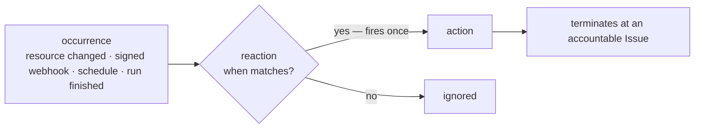

A Workflow describes how one piece of work advances. A user authors an
**Automation** to declare how the system responds when *something happens* — a
Resource changed, a signed webhook arrived, a Schedule fired, or a Run finished.
Occurrence, binding, firing, and frozen effect are the runtime reaction semantics
that make the Automation durable and fire-once.

The whole point is that responding to the world is **not** "poll a status column and
branch on it." That pattern drifts — the flag and the event that should define it get
out of sync. Here the event itself is the unit, and the response is declared, fires
once, and always lands on something accountable.

## An occurrence is a fact, not a flag

An **occurrence** is an append-only fact: *something happened*. The thing (a resource
row) and the event (an occurrence) are two separate rows that never merge — a reaction
subscribes to the **occurrence**, and must never be driven by reading a sticky
`status == X` projection. (That "sticky state" anti-pattern is exactly what the model
forbids.)

An occurrence only ever reaches the ledger through an admission port — a script,
agent, or connector never writes an occurrence row directly. There are three emission
paths:

| Source | How it emits |
|---|---|
| **Internal** | the owning domain service emits within its own commit transaction |
| **External webhook** | a signed connector event passes a signature gate |
| **External poll** | a reconciler computes a before/after edge |

A [resource type](/docs/objects/concepts/object-model)'s declared **events** are
the emission points for that object.

## A Reaction is a declared response

A **Reaction** binds a predicate over an occurrence to an action —
`when(predicate over the occurrence's structured payload) → action`. The binding is
**stateless**: it carries no cursor of its own; progress lives in the firing ledger
(below). The predicate is evaluated by the same decision maker that runs every other
decision, and it reads **only declared, structured payload — never free text or
display names** (the same "route on structured output, not an LLM summary" rule that
governs [workflows](/docs/workforce/concepts/workflows)).

Reactions show up in a few shapes, all the same mechanism:

| Shape | Occurrence → action |
|---|---|
| **Trigger** | an event → dispatch a work unit / open an [Issue](/docs/workforce/concepts/issues) |
| **Transition** | a workflow edge's `when` over the run's structured output |
| **Intake routing** | an intake event → which lifecycle a new Subject enters |
| **Schedule** | a time tick → an action |

## Firings happen once

Acting on an occurrence is a **firing**, recorded in an append-only **firing ledger**.
A firing is **fire-once**, keyed by `(binding, dedupe_key)` and absorbed idempotently
by the store — the same occurrence delivered twice does not act twice. Each firing
carries a causal spine (`correlation_id` / `causation_id`), so you can always trace
*which event, through which binding, caused which action*.

## Inbound never drives outbound directly

An external event never fans straight out into side effects. It lands on an
**accountable Issue** that closes through the [process spine](/docs/workforce/concepts/workflows) —
so every reaction has an owner, a state, and an audit trail, instead of a
fire-and-forget webhook handler no one can account for.

## Status

The reaction model is **decided and largely shipped**. The generic reaction engine
lives in `awaken-flow-reaction` (`FiringKey`, `FireOutcome`, `FiringSink::fire_once`,
`CausalSpine`), and the domain wiring in `awaken-flow-automation` carries the
occurrence/firing **ledger** (`ledger.rs` — `OccurrencePayload`, `FiringRecord`,
`register_admission`). Stateless **bindings**, the **fire-once** guarantee, and the
**activity-feed** and **lineage** read surfaces are wired
(`GET /api/scopes/{scope}/activity`, `GET /api/scopes/{scope}/lineage/{correlation_id}`,
and `GET /api/bindings/{id}/firings`), and a signed-webhook → rule-engine → real Issue
loop is tested end to end.

Still in progress: **physical partitioning** of the ledger, and the full
**intake-routing** catalog — treat those two as the direction, not a finished surface.

## See also

- [The object model](/docs/objects/concepts/object-model) — where an object's **events** are declared
- [Issues](/docs/workforce/concepts/issues) — the accountable Subject a reaction terminates at
- [Workflows](/docs/workforce/concepts/workflows) — transitions are the "reaction" shape inside a process
