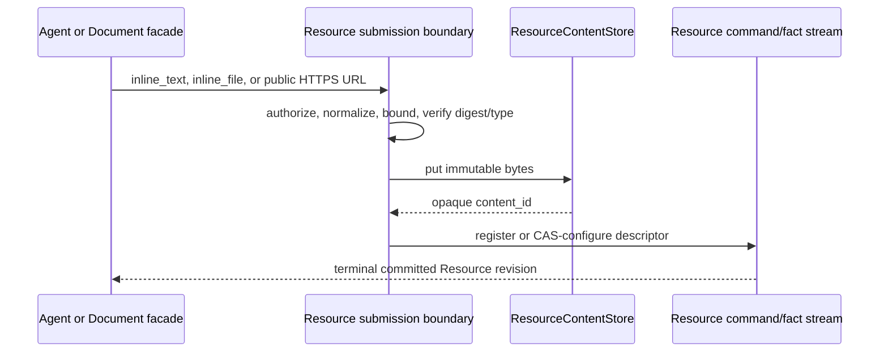

A **Resource** is an identity-bearing governed enterprise object with one exact
ResourceType revision, owner root, lifecycle, properties, relations, behavior,
and provenance. It may exist before, during, after, or without any Issue. Issue
closure or deletion never retires it.

## Static ownership

| Concern | Authority |
| --- | --- |
| object identity, facts, revisions, links, observation, realization | Resource domain |
| durable content identity and descriptor | Resource fact stream; immutable bytes sit behind `ResourceContentStore` |
| Resource availability at a scope | ResourceBinding + `ResourceScopeResolver` |
| Issue raised against an object | immutable Issue `raised_against: ResourceRef` |
| Workflow use | requirement binding, then frozen execution snapshot |
| created/attested object provenance | Resource-owned `ResourceCausation` |
| inverse “Issues for Resource” | rebuildable Work/product query |

There is no universal bidirectional Issue–Resource relation and no Resource
`issue_id`. `awaken-flow-resource` does not depend on the Work domain.

HTTP, MCP, interactive Agents, Workflow, Automation, and Connector ingress reuse
the same scoped `awaken-flow-resource-operations` application services for query,
history, Action, observation, and realization. They must not reimplement
visibility, redaction, exact-revision checks, approval, or dispatch. Resource
remains embedded in Workforce; this code boundary does not imply a second database or
network service.

## Agent access

An Agent declaration may carry a closed `resource_access` contract. Each entry
targets an exact ResourceType or capability, grants selected `query`, `get`,
`relations`, `history`, and `content` reads, allow-lists exact Actions, and may
grant the `submit` mutation. With no Actions or mutations the target is
read-only. Activation and each session/WorkUnit freeze a grant; every call still
revalidates scope, visibility, redaction, revision, and approval.

Workflow-selected access may narrow the Agent declaration. There is no ambient
`resource.invoke`, arbitrary tool-name authority, direct FactStore access, or
Agent-owned synchronization loop.

## Durable content is a Resource property

Text and files do not introduce a Document or blob aggregate. A ResourceType may
declare a `Content` property with allowed normalized MIME types and a byte limit.
The Resource fact stores only a closed `ContentDescriptor`:

```text
content_id + media_type + size_bytes + sha256 + optional filename
```

`content_id` is opaque. Filesystem paths, bucket keys, signed URLs, Session ids,
and Artifact ids never enter Resource truth. The byte-custody port reuses
Awaken's immutable content-addressed `FileStore`, but Resource identity, revision,
relations, authorization, and lifecycle remain in Workforce's one fact stream. The
typed Document HTTP facade is only a Markdown-oriented view over the system
`document` ResourceType and this same content path.



`resource.submit` is the sole Agent custody path; `resource.content.get` is the
explicit content read. A stale CAS, unsafe URL, invalid base64, disallowed media,
oversized input, digest mismatch, external state authority, missing bytes, or
revoked grant fails terminally. The ordered boundary is **put immutable bytes,
then append the Resource fact**: failure may leave unreferenced immutable bytes,
but can never expose a Resource pointing at uncommitted mutable content. Awaken
Session Files and recovered Artifacts remain execution evidence, not Resource
authority.

## Observation is not Workflow

Provider push, platform pull, manual refresh, and post-Action verification enter
Connector normalization, then the Resource observation service. The observation
pump owns leases and retries; Resource admission owns identity, schema, ordering,
relations, and atomic facts. Workflow remains accountable multi-step work and
Automation remains business `on → when → then` response—neither is an ETL or CDC
engine.

See [Domain Packs](/docs/workforce/concepts/domain-packs), [permissions and
resources](/docs/objects/concepts/permissions-resources), and [credential
custody](/docs/workforce/concepts/credential-custody).
