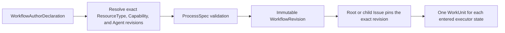

**Workflow** is the first-class definition selected by users, Projects, and
Packs. Each save creates or reuses an immutable `WorkflowRevision`. The portable
author shape is `WorkflowAuthorDeclaration`; Workforce resolves its symbolic Pack
references and lowers it through the one canonical validator into the internal
`ProcessSpec` runtime payload.

An Issue pin wins over later Project overrides or Pack adoption. Existing work
cannot be silently retargeted.

## Static boundary

| Owner | Contract |
| --- | --- |
| Pack / Project authoring | symbolic `WorkflowAuthorDeclaration` |
| Work domain | exact `ProcessSpec`, state transitions, typed ports and validation |
| Issue | exact Workflow binding and current business state |
| WorkUnit | one attempt for one state entry and at most one accountable Executor |

States may also declare reviewer, approver, aggregator, or custom responsibility
slots, but the validator permits at most one `executor`. Workflow states declare
typed inputs/outputs, requirements, transitions, session policy, tool profile,
WIP limit, and bounded iteration. They do not declare a mutable tool allow-list.

## Dynamic parallelism

Author the stable business state machine; let a Planner decompose uncertain work
into ordinary child Issues through `issue.decompose`. The existing
`parent_of`/`depends_on` DAG is scheduling, cancellation, progress, and audit
truth. There is no `join_policy`, hidden branch WorkUnit, `GraphPlan`, or second
workflow invocation aggregate. The parent resumes only when dependencies make it
ready, then integrates child terminal outputs explicitly.

Next: [Workflow specification](/docs/workforce/reference/workflow-config) ·
[Issues and Outcomes](/docs/workforce/concepts/issues) ·
[Domain Packs](/docs/workforce/concepts/domain-packs).
