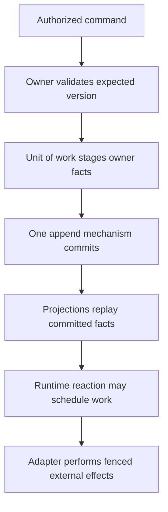

Extend Awaken Workforce by changing the **one authoritative owner** of a behavior.
Do not introduce a second Resource, Workflow, Agent, event append, authorization,
or execution mechanism.

## Static ownership

| Change | Authoritative owner | Extension seam |
| --- | --- | --- |
| Domain rule or object | purpose-named `domain` crate | command/repository ports and facts owned by that context |
| Lease, wake, provision, execution, egress | `runtime` crate | narrow mechanism port |
| Persistence, IAM, MCP, Pack distribution | `adapter` crate | domain-defined port / anti-corruption layer |
| HTTP, process topology, backend selection | `app` crate | assembly over lower layers |
| Agent execution | Awaken through `awaken-flow-runtime` | the single Runtime ACL; never a parallel executor |

Dependencies point downward: `lib → domain → runtime → adapter → app`. An app
may compose lower layers; a lower layer must never import product, transport, or
persistence vocabulary from above.

## Change workflow

1. Read the source repository's architecture overview, invariant registry, and
   requirements-coverage owner for the change.
2. Search code, tests, public API snapshots, and ADRs for an existing mechanism.
3. Extend the authoritative implementation and migrate all callers; remove any
   competing path before continuing.
4. Add or amend an ADR only for a contested, cross-crate, or invariant-reaching
   decision.
5. Name the enforcer and validation for every new guardrail.
6. Update the public API snapshot when the change is deliberately public.
7. Run `scripts/ci/check-docs.sh` and `scripts/ci/check-all.sh`.

## Dynamic write path

Failures before commit produce no partial domain truth. Live effects use leases,
idempotency, reconciliation, or checkpoint boundaries appropriate to their
mechanism; retry must not invent a second business decision.

Start with [architecture and vocabulary](/docs/objects/concepts/object-model/),
[Workforce–Awaken execution ownership](/docs/workforce/concepts/agents-runs/), and
[testing a Domain Pack](/docs/workforce/how-to/test-and-validate-a-pack/). The source
repository's ADRs and invariant registry remain the design authority; this page
is a contributor route, not a duplicate architecture corpus.
