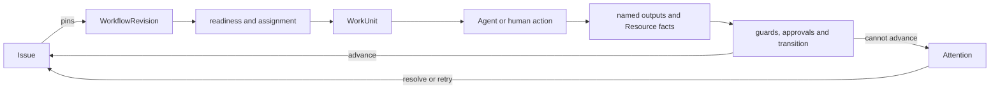

Use Workforce when one job must keep moving across Agent runs, human decisions, and
external systems. Start with the job itself: who owns it, what result is needed,
what may block it, and which system can say that it is complete.

Workforce is available through focused early access. The
first useful result is one Issue that you can create, advance, stop with an exact reason, and resume
without replacing its owner or Workflow revision.

## Start from the decision in front of you

The browser console groups the same product facts by the decision a person needs
to make:

| If you need to… | Open | What you can decide there |
| --- | --- | --- |
| commission and direct delivery across Projects | Workspace **Home** | define an Outcome, see the Commission → Decompose → Execute → Accept path, and identify delivery that needs intervention |
| resolve a human decision or exception | **Needs you** | filter approvals, Issue Attention, and Agent/platform readiness signals without watching every Run |
| resume a temporary Agent conversation | Workspace **Chats** | continue one URL-addressed Awaken Session and issue an explicit command without turning Flow into a transcript owner |
| check whether one Project can move | Project **Overview** | review execution readiness, dispatch health, open work, and the next blocking configuration |
| inspect or accept a commissioned result | **Outcomes** → **Outcome Review** | compare formal deliverables with the acceptance boundary and take only the transitions currently permitted |
| review one persistent interactive result | Project **Canvases** | open one exact admitted `canvas_artifact` Resource revision, review or edit it, and explicitly send a request back to an Agent |
| understand one accountable unit of work | **Issues** → Issue detail | inspect owner, next action, diagnosis, Workflow position, worklog, approvals, relationships, and Agent conversation |
| use a solution-specific operating view | solution **Workbench** | follow the installed value path, metrics, and queues while the underlying Issue and Workflow remain authoritative |

**Runs** and **Agent Center** project Agents execution health into the composed
console. **Resources** projects Objects business facts and actions. Workforce
uses those products without taking ownership of their Session, Run, Resource, or
Action truth.

**Chats** is a command workbench projected over an Awaken conversation; it is
not a Flow transcript, Issue, or execution record. **Canvases** is an Objects-owned
Resource surface with immutable revisions, isolated Preview, review, and an
explicit Send-to-Agent bridge; it is not a second Design backend or Workforce
aggregate.

## How the three products work together

| Product | Owns | Role in one Outcome |
| --- | --- | --- |
| **Awaken Workforce** | Outcome, Issue, Workflow, responsibility, Attention, formal deliverables, acceptance | commission the result, coordinate work, and record the final decision |
| **Awaken Objects** | ResourceType, Resource, Relation, Action, Observation, provenance, exact business revision | supply governed context, allowed changes, and external business evidence |
| **Awaken Agents** | Agent publication, Session, Run, tools, Worker, Sandbox, committed execution and recovery | perform the delegated WorkUnit and return committed execution evidence |

The composed path is **Workforce commissions → Objects grounds context and
actions → Agents executes → evidence returns → Workforce accepts**. A technical
Run can finish before the Outcome is ready for acceptance.

## Create the first Issue

1. Follow the [quickstart](/docs/workforce/quickstart/) to validate the
   deployment, start the local topology, and bootstrap a Project.
2. Create an Issue with an owner and the outcome you expect. Add its required
   inputs and active dependencies before dispatch.
3. Pin the Workflow revision that defines states, named outputs, approvals, and
   transitions. Later edits produce another revision; they do not change this
   Issue underneath you.
4. Assign the ready WorkUnit to an Agent, person, or automation. The assignment
   and each attempt remain attached to the Issue.
5. If a required input, approval, or check is missing, resolve the recorded
   Attention and retry. End the Issue only after its declared completion
   conditions pass.

The visible result is an Issue with one pinned process, a current state, and a
reason for every advance or stop. Workforce can evaluate declared Workflow rules and
recorded facts. Put an external check behind the Connector or verifier owned by
that system, then record its returned fact.

Workforce is the work, responsibility, and outcome plane. [Awaken](/docs/agents/)
is the sole Agent execution and control plane. A WorkUnit may use an Agent
configured in Awaken, a supported compatible Agent, or an existing publication;
none of those choices replaces the Issue as the work record.

## How Workforce carries that Issue

A schedule can recheck later, a reaction can recompute after facts change, and
an active dependency can withhold dispatch until its upstream Issue terminates.
Those paths return to the same Issue and Workflow authority; they are not
parallel task systems.

## Static structure and ownership

| Component | Owns | Does not own |
| --- | --- | --- |
| Issue + pinned `WorkflowRevision` | durable intent, process state, dependency and terminal outcome | an Agent process or transcript |
| Workflow | states, slots, requirements, named produces/requires, guards and transitions | undeclared external truth |
| WorkUnit | one assigned attempt and its event/state history | Issue completion policy |
| Resource / ResourceType | governed objects, actions, events and credential roles | model/provider configuration |
| Approval and Attention | explicit human decision or exact non-progress reason | a second lifecycle |
| Awaken Agent plane | Agent publication, model/credential resolution and governed execution | Workforce's business-work truth |

The separation is deliberate: Workforce owns work and responsibility; Awaken owns
Agent configuration and execution. Deployment TOML selects process composition
but does not duplicate the persisted model catalog or credential vault.

## Continue with the task you need

| Goal | Start here |
| --- | --- |
| Start Workforce, bootstrap a Project, and create an Issue | [Quickstart](/docs/workforce/quickstart/) |
| Manually advance one declared Workflow transition | [API Workflow tutorial](/docs/workforce/tutorials/first-agent-run/) |
| Create, follow, and recover work | [Use Workforce](/docs/workforce/how-to/) |
| Design Resources, Workflows, Agents, and Packs | [Design and automate](/docs/workforce/designing/) |
| Deploy and operate separated roles | [Deployment topologies](/docs/workforce/operating/deployment-topologies/) |
| Look up generated and typed contracts | [Reference](/docs/workforce/reference/) |
| Extend the kernel | [Contribute and extend](/docs/workforce/contributing/) |

For application-facing Agent configuration, protocols, durable sessions, and
sandbox operations, use [Awaken](/docs/agents/). Enter
[Awaken Agents internals](/docs/agents/runtime/) only when embedding or extending its
Rust execution kernel.
