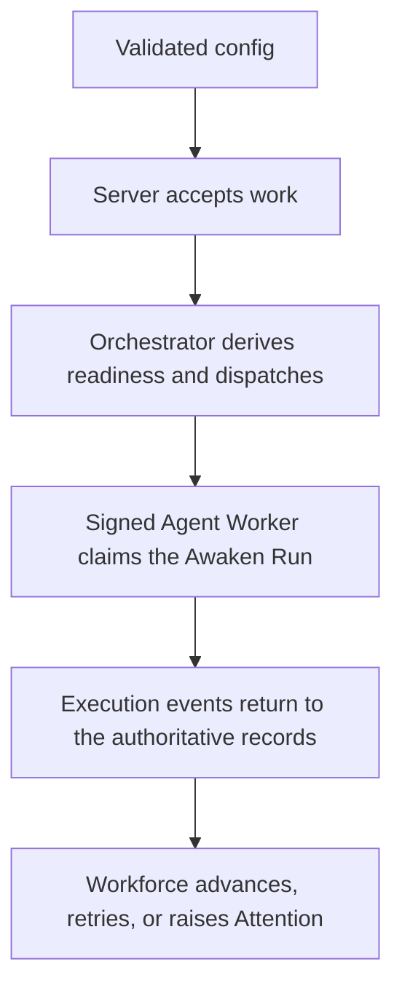

Awaken Workforce has **one binary, one deployment document, and three explicit process
roles**. Start with the complete topology; separate roles only when isolation or
scale requires it.

## Static structure

| Role | Owns | Does not own |
| --- | --- | --- |
| Server | HTTP API, realtime interaction, IAM assembly, Worker control | Agent execution placement outside its configured embedded roles |
| Orchestrator | scheduling, reconciliation, recovery, clocks, realization | public HTTP traffic |
| Agent Worker | signed Awaken Worker registration and Agent execution | Workforce database or business truth |

All roles read the same schema-versioned TOML. Model providers, API keys, and
model routes do not belong in this file; Awaken's catalog and credential vault
own them.

## Prepare and validate configuration

Start from the deployment example included with your preview distribution,
replace every path and credential, and keep secret files outside source
control. Then validate before binding a port:

```sh
cargo run -p awaken-flow-server -- config validate --config ./awaken-flow.toml
cargo run -p awaken-flow-server -- config show --config ./awaken-flow.toml
```

`config show` prints a normalized, secret-safe view. A syntax error, unknown
field, unsupported schema version, missing file, or invalid reference stops the
process before startup.

## Choose a topology

### Complete local topology

```sh
cargo run -p awaken-flow-server -- --config ./awaken-flow.toml
```

With both embedding flags enabled, this starts Server, an embedded Orchestrator,
and an embedded Agent Worker. Success means `/healthz` responds and the startup
diagnostic reports both embedded roles.

### Split control and execution

Set `server.embedded_agent_worker = false`, start the Server, then start a Worker
with a configured signing credential and `agent_worker.control_url`:

```sh
cargo run -p awaken-flow-server -- server --config ./awaken-flow.toml
cargo run -p awaken-flow-server -- agent-worker --config ./awaken-flow.toml
```

The database-less Worker registers with the Server. Invalid or unaccepted
credentials fail closed; inspect Server and Worker startup diagnostics before
changing workload state.

### Fully split topology

Set both embedding flags to `false` and run:

```sh
cargo run -p awaken-flow-server -- server --config ./awaken-flow.toml
cargo run -p awaken-flow-server -- orchestrator --config ./awaken-flow.toml
cargo run -p awaken-flow-server -- agent-worker --config ./awaken-flow.toml
```

Only Server owns HTTP. Orchestrator and Agent Worker must remain independently
live; use the metrics, Worker directory, scheduling projection, and attention
signals to diagnose delivery.

## Dynamic behavior and recovery



Leases fence stale execution. Reapers and reconciliation recover abandoned work;
they do not make uncommitted Worker output authoritative. During a rollout, stop
accepting new work, drain or revoke active leases through the supported control
surface, deploy one role at a time, and verify `/healthz`, `/metrics`, Worker
registration, and a canary Issue before restoring traffic.

## Verify a deployment

These checks are for deployment maintainers, not prerequisites for everyday
product use:

```sh
curl -fsS http://127.0.0.1:7979/healthz
curl -fsS http://127.0.0.1:7979/api/openapi.json \
  > /tmp/awaken-flow-openapi.json
cargo run -q -p awaken-flow-server -- openapi \
  > /tmp/awaken-flow-openapi-from-cli.json
```

Confirm that startup diagnostics report the configured embedded roles and
storage boundary, the expected Workers appear in Fleet, and `/metrics` is
available to the configured observability system. Both OpenAPI documents are
generated from the router; use the document from the exact checkout being run
instead of maintaining a copied route table.

Continue with [deployment configuration](/docs/workforce/reference/config/) and
[monitoring runs](/docs/workforce/operating/monitoring-runs/).
