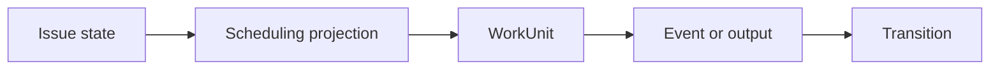

Awaken Workforce's operator promise is simple: **you should not need a transcript to
know where work is or why it stopped**. Business position, scheduling, execution,
approvals, and attention are separate typed surfaces.

## Daily loop

1. Create or inspect work in **Issues**, then switch between list, board, or tree.
2. Open Issue detail and inspect diagnosis/scheduling before dispatching; it names backlog,
   dependency, Resource, attention, running, ready, or closed state.
3. Read `/api/issues/{id}/work-units`, then the chosen WorkUnit's `/events` and
   `/state`.
4. Resolve visible attention on Issue detail; use `/api/inbox` or
   `/api/tool-approvals` when operating across Issues through an integration.
5. Fix the cause behind an attention signal, then mark it resolved.
6. Use audited WorkUnit controls to message, pause, resume, interrupt, redirect, or
   cancel live work.

## Why this earns trust

- Status is a projection of committed facts, not a manually curated label.
- Routing reads declared structured output, never an LLM summary.
- Required inputs and stale approvals fail closed.
- Every privileged execution is fenced by a lease and frozen route snapshot.
- Pack and Resource operations use the same admission and authorization paths as
  direct API actions.

The product UI is a client of these same contracts. It is the default human
surface, while the API supports integration and deeper diagnosis. The UI does
not duplicate lifecycle truth: commands and projections remain server-owned.
