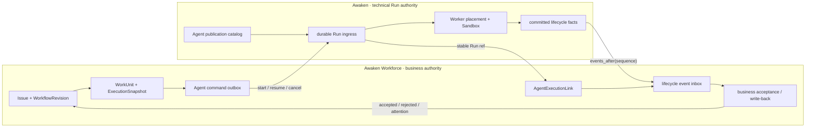
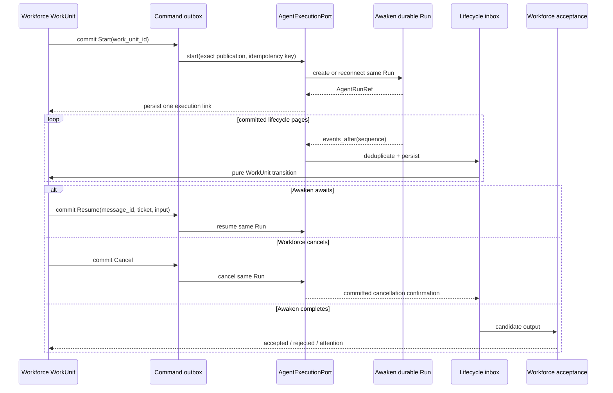

Workforce 把三个对象分开：

- **Agent**：业务执行角色及其可移植配置模板。
- **WorkUnit**：针对一个 Issue/Workflow state 的业务执行责任。
- **Awaken Run**：publication、协议、placement、Sandbox、等待/恢复和技术终态的执行权威。

Workforce 不再把“Agent worker”作为第二套执行内核。它冻结精确
`AgentPublicationRef`，通过中立 `AgentExecutionPort` 启动 Awaken Run，再只消费已经提交
的 lifecycle facts。

## 当前状态

| 层级 | 状态 | 当前事实 |
| --- | --- | --- |
| Agent publication/control ACL | Built | Workforce 发布并冻结 Awaken exact publication；不直接构造 provider client |
| WorkUnit↔Run link | Built | `AgentExecutionPort`、command outbox、execution link 与双流 event inbox 在内存、SQLite、PostgreSQL conformance 和 server causal tests 中通过 |
| 唯一 fleet/worker authority | Built | Awaken 是唯一 Agent Worker、claim、恢复与 ACP/A2A 权威；Workforce 只保留 System/Rule 本地执行和只读 fleet 投影 |

这里的 Built 描述接入路径，不代表产品成熟度。它表示 guardrail、存储 conformance、
因果行为与替代路径移除已经完成检查。Workforce 仍处于提前预览阶段；Built 不代表
生产 SLA、客户结果或托管服务。

## 静态结构

Workforce 与 Awaken 不共享一个状态枚举。Workforce 的 `queued/active/succeeded/failed/cancelled`
描述业务 attempt；Awaken 的 Run state 描述技术执行。Awaken 技术成功不自动等于 Workforce
业务接受。

## 动态行为

## 关键不变量

- `work_unit_id` 是 start idempotency key；一个 WorkUnit 只能连接一个 Awaken Run。
- command 和 lifecycle inbox 都持久化并去重。
- 只有 committed Awaken lifecycle event 能改变 Workforce execution state。
- cancel 需要 Awaken committed confirmation，Workforce 不能在本地提前伪造终态。
- Awaken 技术终态只提交候选结果；Workforce 仍独立执行 output contract、revision、approval 和
  业务 acceptance。
- Workforce 的本地队列只执行 System/Rule；任何 Agent claim、Worker registry 或 ACP/A2A routing
  回到 Workforce 都会恢复已经删除的第二套执行权威。
