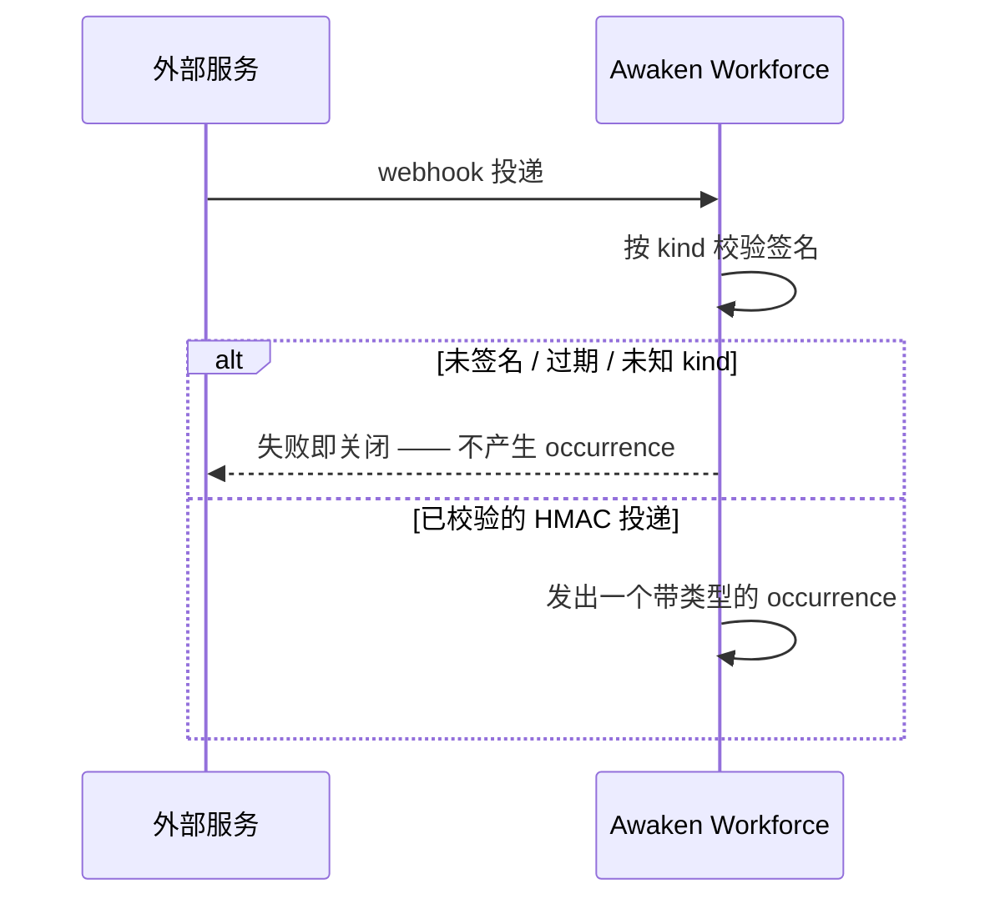

**连接器（connector）**是一个领域包与外部世界相遇的方式：把外部事件转成带类型
[occurrence](/zh/docs/workforce/concepts/reactions) 的入站 webhook，以及工作调用某个服务时向其
呈现的出站凭证。二者都是声明式的、经准入检查的——领域命名一个策略，而 crypto、HTTP 与
token 状态住在平台里。

## 入站：校验后才能发出 occurrence

一个入站连接器在每次投递成为 occurrence 之前先校验它：

- **签名校验。** 一个连接器的 `kind` 选择一个校验方案。未知的 `kind` 在安装时被拒；一次未签名、
  过期或不匹配的投递**失败即关闭**——不会发出任何 occurrence。

## 出站：一份凭证如何被呈现

当工作调用一个服务时，平台以两种模式之一呈现凭证。二者都从不把密钥交给 Agent——那条
保证见[凭证托管](/zh/docs/workforce/concepts/credential-custody)。

- **Direct（直接）**——存储的凭证按配置注入（例如一个 header）。
- **Exchanged（交换）**——平台从一个存储的 `id + secret` 对着一个 token 端点**铸造一个短时
  token**（一个 Feishu `tenant_access_token`、一个 GitHub App token……），按其 TTL 缓存，并在
  过期前刷新。一次铸造失败**失败即关闭到无鉴权**——绝不会出现一个残缺或不完整的 header。

## 非密钥配置：来自 `Config` 资源的 `env`

一个连接器可以注入从绑定的 `Config` 资源计算得来的**非密钥**环境值（一个 `GIT_AUTHOR_NAME`、
一个区域）。这是给配置用的，不是给密钥用的：一个从被标记为 `secret` 或 `confidential` 的资源
取得的 `env` 条目会在**安装时被拒**。密钥总是按引用传递，绝不作为环境变量。

## 相关

- [Reactions](/zh/docs/workforce/concepts/reactions) — 一次经校验的入站投递会变成什么：一个触发
  reaction 的 occurrence。
- [凭证托管](/zh/docs/workforce/concepts/credential-custody) — 密钥被使用时谁持有它。
- [编写一个领域包](/zh/docs/workforce/how-to/author-a-domain-pack) — 连接器与凭证在何处声明。
