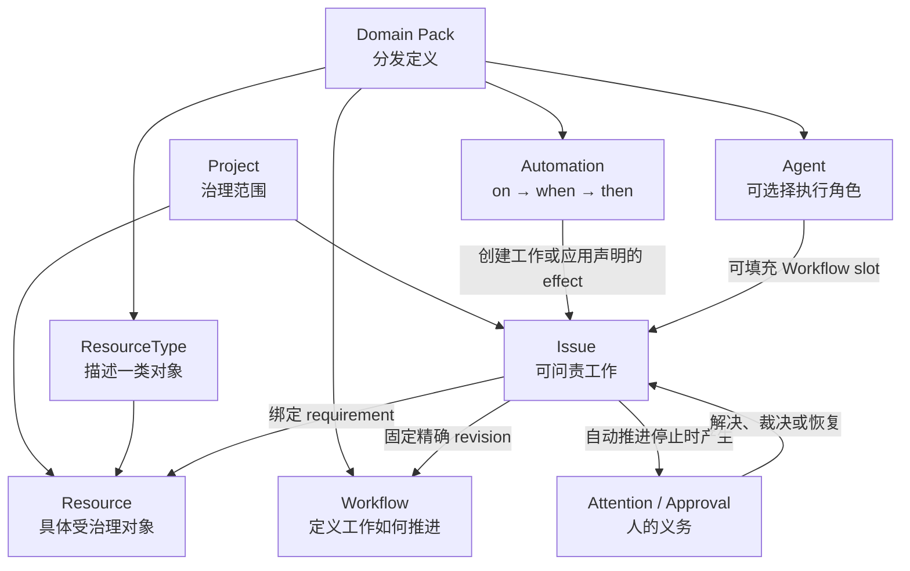
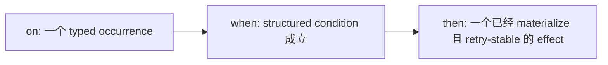
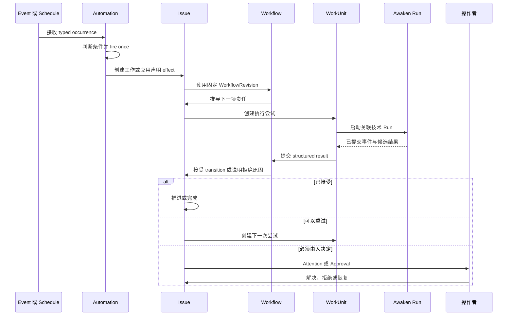

从团队已经反复执行的一项工作开始。先写清范围、需要哪些对象、怎样才算完成，以及 Agent
无法继续时由谁负责。Workforce 的每个核心对象只承接其中一种决定。

## 从一项工作开始

假设团队需要在每次发布到生产环境前完成审查：

1. 为待发布的产品或服务建立一个 **Project**。
2. 把代码仓、测试环境和部署目标加入为 **Resource**。
3. 用 **Workflow** 定义审查状态、责任 slot 和可接受的结果。
4. 为某次发布建立 **Issue**。Issue 保存目标、负责人、状态与结果。
5. 把 **Agent** 分配到审查 slot。只有当 schedule 或 event 需要创建或推进工作时，才使用 **Automation**。
6. Agent 无法继续时产生 **Attention**；需要人判断某个具体动作时使用 **Approval**。

建立第一项工作时，不需要接触 `WorkUnit` 或 Awaken Run。只有在检查一次执行尝试，或恢复中断
的尝试时，才需要理解这两个对象。

## 选择承接每项决定的对象

| 概念 | 用户用它做什么 | 它不拥有什么 |
| --- | --- | --- |
| Project | 治理一组工作、定义、Resource、人员与 Agent | 某一项具体工作或执行尝试 |
| Domain Pack | 分发精确 ResourceType、Workflow、Automation 与 Agent 定义 | Resource instance、credential、Issue 或运行状态 |
| ResourceType | 描述一类受治理对象及其 property、action、event、requirement 与 capability | 一个具体对象实例 |
| Resource | 表示代码仓、环境、credential 或外部服务等具体受治理对象 | 工作如何走向完成的流程 |
| Workflow | 定义状态、责任 slot、输入输出、transition、guard 与完成条件 | 何时创建或触发一项新工作 |
| Automation | 声明 `on → when → then`：观察什么 occurrence、判断什么条件、产生什么冻结 effect | 长期工作实例或第二套 Workflow 状态机 |
| Agent | 定义可选择的执行角色及其已发布执行意图 | Project 授权、credential 或 Issue 业务状态 |
| Issue | 保存一项工作的目标、固定 Workflow revision、状态、依赖、责任与结果 | 一次 Agent 进程或 Run |
| Attention | 说明工作为何无法自动继续，以及操作者应检查什么 | 普通日志或隐藏 retry |
| Approval | 记录人对一个具体受治理动作的决定 | Identity、authorization、readiness 或全局权限 |

建模时始终保持这组区别：

> **Workflow 定义工作如何推进；Automation 决定何时触发声明的效果；Issue 保存责任；
> Agent 执行一次尝试。**

## 静态关系

定义与实例始终分开。保存或 adopt 新 Workflow 不会重定向已有 Issue；Issue 保留创建时固定
的精确 revision。Domain Pack 只分发定义，不会把实时 credential 或 Project instance
夹带到另一个 Scope。

## Workflow 与 Automation

两者协作，但职责不能重叠。

### Workflow：已有工作如何推进

Workflow 回答：

- Issue 可以处于哪些业务状态？
- 哪个人或 Agent 可以填充责任 slot？
- 需要哪些 Resource 与输入？
- 哪种 structured result 允许经过声明的 transition？
- 什么构成完成、失败或取消的终态？

它不会轮询外部世界，也不决定何时由一个无关事件创建工作。

### Automation：系统何时响应

Automation 回答：

运行时，occurrence 作为 Fact 进入系统，匹配的 binding 判断条件，fire-once firing 记录因果
响应。Automation 可以创建可问责工作或应用其他声明 effect，但不能建立并行 Workflow
状态机。长期责任必须落在 Issue 上。

## Issue、WorkUnit 与 Awaken Run

检查或恢复执行时，会看到以下对象：

| 对象 | 权威范围 |
| --- | --- |
| Issue | Workforce 业务真相：目标、固定 Workflow、依赖、状态、责任与验收 |
| WorkUnit | 某个 Issue 与 Workflow state 的一次 Workforce 执行责任或尝试 |
| Awaken Run | 技术 Agent 执行：publication、模型/工具循环、Worker placement、Sandbox、await/resume 与已提交 run event |

技术执行成功只是候选业务结果。Issue 推进前，Workforce 仍会检查 Workflow output contract、
revision、Approval 与验收规则。

## 动态行为

## 四种不能混用的 Gate

| Gate | 用户可见问题 |
| --- | --- |
| Authorization | 该 identity 是否可以在当前 Scope 请求此动作？ |
| Readiness | 依赖、Resource、配置与执行容量是否已经可用？ |
| Approval | 人是否批准这个具体的高后果动作？ |
| Attention | 系统为何无法自动继续，应该由谁响应？ |

应修复真正失败的 Gate。扩大 authorization 不会补齐缺失 Resource；解决 Attention 也不会
凭空产生 Approval。

## 系统内部如何实现

Command 通过所属 context 追加权威 Fact，Projection 从已提交 Fact 重建查询视图。流式进度
和日志帮助人观察工作，但不能自行改变业务状态。

## 非目标

Workforce 不实现 Agent loop，不绕过 Awaken 选择模型，也不把未提交的 runtime output
当作业务事实。Awaken 拥有 Agent 的技术执行；Workforce 拥有 Issue、固定的 Workflow、责任，
以及接受或拒绝返回结果的决定。

继续阅读[Issue 与责任](/zh/docs/workforce/concepts/issue-based-workflows/)、
[Workflow](/zh/docs/workforce/concepts/workflows/)、[Automation 与 Reaction](/zh/docs/workforce/concepts/reactions/)、
[Resource 与治理](/zh/docs/objects/concepts/permissions-resources/)和
[Workforce–Awaken 执行所有权](/zh/docs/workforce/concepts/agents-runs/)。
