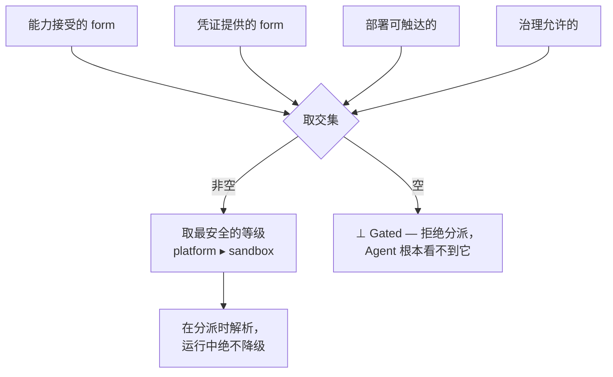

一份凭证沿着唯一真正改变安全姿态的轴抵达工作：**托管（custody）**——*在它被使用的那一刻，
谁持有这份密钥*。其余一切（一条网关路由、一个 socket、一个挂载的文件）都是这一选择的下游。

## 当前实现的等级

当前执行路径暴露两个可触达等级。平台挑选**可触达范围内最安全的**那个；你从不按 run 去指定它。

| 等级 | 谁持有密钥 | Agent 看到什么 |
| --- | --- | --- |
| `platform` | 平台在边缘按每次调用注入 | 只有一个租约——绝不是密钥本身 |
| `sandbox` | 托管被转移进沙箱——密钥进入 Agent 的信任域 | 材料本身，作为挂载的文件（绝不是环境变量） |

`platform > sandbox`：越高，密钥离 Agent 越远。跨等级，Agent 的*指令完全相同*——
它执行一个高级操作（`git clone … && git push`），由工具而非 Agent 消费凭证。它从不命名
路径、从不读取密钥、也从不得知等级——就像在你笔记本上 `git push` 一样。

## 选择是失败即关闭的

在分派时，平台把"能力接受什么""凭证提供什么""部署实际能触达什么""治理允许什么"取交集，
然后取集合中最安全的等级：

- 如果集合为**空**，该能力被**门控（gated）**：分派被拒绝，Agent 甚至看不到一个它无法安全
  使用的资源。平台**从不猜测**等级。
- 一个 **`custody_floor`**（例如 `custody_floor: platform`）是一个硬性下界——低于它，能力
  会门控而不是向下协商。
- 托管在**分派时**解析，且**运行中绝不降级**：如果某条边在运行时失败，那一次调用失败——它
  不会悄悄退到更弱的等级。选择更低的等级本身就是一个带义务的受治理决策（短 TTL 的子凭证、
  收紧的租约、钉死的出口白名单），而非一个 `else` 分支。

因为它每次分派都重新解析，一个后来获得更安全边的部署会**自动恢复到更高的等级**——无需改包。

## 自描述的凭证

一份凭证是一个带类型的对象，声明它自己的 **form**——它可被呈现的形状。一个能力声明它会
接受哪些 form；分派时进行匹配。投递用一小撮封闭词汇的注入工件来表达：

| 工件 | 携带密钥？ | 服务于 |
| --- | --- | --- |
| `files` | 是——在 `content` 里 | `sandbox`（挂载文件） |
| `transform` | 是——在 `value` 里（例如一个 header） | `platform`（边缘注入） |
| `env` | **否——仅限非密钥** | 环境预接线（名称、主机） |

一份凭证总是**按引用**（`vault:` / `file:` / `literal:`）指定，**绝不用 `env:`**，而密钥材料
**只能**出现在 `files[].content` 或 `transform[].value` 里。把密钥放进环境变量会在安装时被拒
——这不是约定，而是一条被检查的规则。这正是为什么投递是托管与 form 的属性，而不仅仅是
"从 `data_class: secret` 派生"。

## 相关

- [权限与资源](/zh/docs/objects/concepts/permissions-resources) — 裁决每个"这件事可以发生吗？"的
  单一决策契约。
- [Resource 要求](/zh/docs/workforce/how-to/capability-requirements) — 如何评估精确 type 或
  relation 需求，并通过只写路径满足 Credential。
