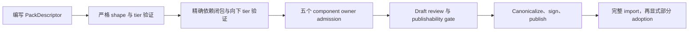

所有新 Pack 使用唯一的作者与发布格式：`contract_version: 2` 的 `PackDescriptor`。YAML 只是
可读编码，canonical compact JSON 才是签名制品。旧 `kind: ResourcePack` 格式及其 lowering
路径不再是产品 authoring 契约。

Descriptor 只包含五种 component declaration：`resource_type`、`workflow`、`automation`、
`agent` 和 `environment`。Resource 实例、credential、WorkUnit、执行状态、作为公开对象的脚本及验证证据
都不是 Pack component。

## 组合层级

| Tier | 责任 | 可依赖 |
| --- | --- | --- |
| `foundation` | 共享平台原语 | foundation |
| `integration` | 外部系统适配 | foundation、integration |
| `domain` | 可复用业务能力 / workforce | foundation、integration、domain |
| `solution` | 可安装端到端组合 | foundation、integration、domain |

Solution 不能依赖另一个 Solution；其 `installation` descriptor 拥有有界默认值与选择。
Tier 是签名但惰性的元数据，不改变五个 component owner、Registry trust、System-Pack 来源、
精确依赖闭包或部分 adoption。

## 动态生命周期

Import 不等于 activation；Project override 仍独立，已有 Issue 保持固定 Workflow revision。
新发布必须声明 tier；历史不可变签名 release 缺失 tier 时仍可作为 Legacy 读取。

下一步：[开发 Domain Pack](/zh/docs/workforce/designing/develop-a-domain-pack) ·
[编写并验证 Pack](/zh/docs/workforce/how-to/author-a-domain-pack)。
