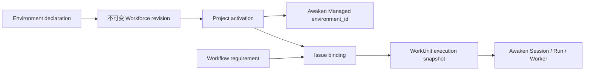

**Environment** 是可复用、版本化的执行配置。Workforce 拥有 authoring identity、不可变
revision、Pack 分发、Project 选择与 activation 历史；[Awaken](/zh/docs/agents/concepts/architecture/)
仍是可执行 Environment、Session、Run 与 Worker 的唯一权威。

这个边界避免了两套相互竞争的 runtime：Workforce 描述“Workflow 需要什么执行配置”，Awaken
把配置变成不透明 `environment_id` 并负责执行。

## 静态结构与所有权

| 关注点 | 权威 | 契约 |
| --- | --- | --- |
| Definition 与 revision | Workforce Environment owner | discoverability、metadata、封闭 `config`、不可变 digest |
| 分发与选择 | Workforce Pack 与 Project owner | 第五种 Pack component、Project override 与精确 revision |
| 可用性 | Workforce Project | CAS 版本化 `EnvironmentActivation`，连接精确 revision 与 Managed id |
| 执行 | Awaken | `/v1/environments`、Session `environment_id`、Run 与 Worker |



作者契约刻意与 Awaken 接受的封闭 vocabulary 保持一致：

- `self_hosted`；或
- `cloud`，其 `networking` 为 `unrestricted` 或 `limited`；
- limited networking 可声明 `allowed_hosts`、`allow_mcp_servers` 与
  `allow_package_managers`；
- cloud package 可列出 `apt`、`cargo`、`gem`、`go`、`npm` 与 `pip` requirement。

Workforce 不提供第二套 image、implementation、command 或 backend abstraction。Hostname 会被
规范化；看起来像命令选项的 package value 会被拒绝。

## 编写与激活

通过既有 owner 路径保存不可变 Project revision：

```http
POST /api/projects/{project}/environments/{definition}/revision
```

```json
{
  "expected_override_version": 0,
  "idempotency_key": "save-build-env-1",
  "declaration": {
    "name": "Build environment",
    "description": "Builds and tests the service",
    "icon": "lucide:container",
    "config": {
      "type": "cloud",
      "networking": {
        "type": "limited",
        "allowed_hosts": ["github.com"],
        "allow_mcp_servers": false,
        "allow_package_managers": true
      },
      "packages": { "type": "packages", "npm": ["pnpm@10"] }
    }
  }
}
```

然后物化 Project 当前有效 revision，并用 compare-and-swap 创建或替换命名 activation：

```http
POST /api/projects/{project}/environments/{definition}/activations/{activation_id}
{ "expected_version": 0 }
```

该命令解析精确 Workforce revision 与 execution Workspace，调用 Awaken 规范
`/v1/environments` API，重建返回的 definition、核对 digest，最后才提交 activation。
即使内容相同，不同 revision identity 仍会得到不同 Managed id。

## 绑定与执行

Workflow 在 `requires` 中声明 Environment；Agent executor state 用 `environment` 字段指向
该 requirement。Issue 的 Workflow binding 再选择
`{ "kind": "environment", "activation_id": "…" }`。

dispatch 前一刻，Workforce 要求 activation 仍为 active、仍匹配精确 requirement 与 execution
Workspace，并且 Managed Environment 未漂移。随后把 activation、精确 revision、Managed id
与 digest 冻结进 `ExecutionSnapshotV1`；Session planning 只向 Awaken 传递不透明
`environment_id`。改变 binding 只影响后续 dispatch，不会在 live Session 内切换 Environment。

## 失败与恢复

- materialization 缺失、disabled、漂移、归档或 Workspace 错误时 fail closed，不会 dispatch。
- 临时 materialization 故障可用同一个幂等命令重试。
- 并发 activation 变化返回 version conflict；应重载当前 activation 后重新决定。
- remote 创建后、Workforce CAS 前崩溃可能留下 inert Managed object；重试会发现并复用精确对象。
- 禁用时调用 `POST /api/projects/{project}/environment-activations/{activation_id}/disable`，
  并提交当前 `expected_version`；历史仍保留。

使用 `GET /api/projects/{project}/environment-activations` 查看 Project 可用性。精确请求与
响应 schema 以[路由与 schema 参考](/zh/docs/workforce/reference/routes/)为准。
