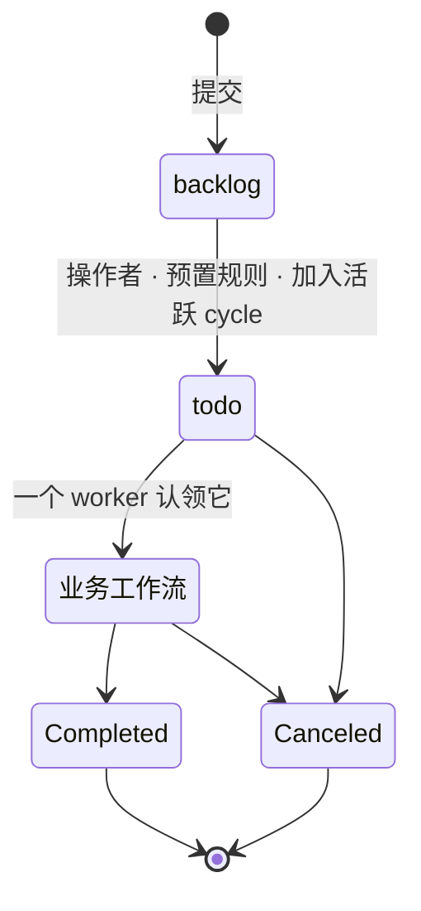

在一个 Issue 抵达做它工作的工作流之前，它会经过一个**每个 Issue 共享的通用接收前缀**——
两个内置状态，就像每个 Issue 都免费获得 `Completed` 和 `Canceled` 一样。

## 两个接收状态

| 状态 | 分组 | 含义 |
| --- | --- | --- |
| `backlog` | Backlog | 已捕获，但**尚不处理**。 |
| `todo` | Ready | **可处理**——一个工作流可以（或已经）被指派；它在此等待，直到真正进入该工作流的第一个阶段。 |

它们从不在业务工作流内部被作者声明。前缀属于平台，而非你——你设计的工作流只承载它自己
的业务阶段，外加 `Completed` / `Canceled` 终态。

一句话看懂：**工作在 `backlog` 等待，在 `todo` 变为就绪，只有当有人真正拿起它时才移动。**

## `backlog → todo`：变为就绪

推进意味着"这现在可被指派/处理"。它在**任一**情形下发生：

1. 一个**操作者**移动它；
2. 一个**按项目预置的规则**——在项目创建时生成（默认开启、可编辑）：*一个加入活跃 cycle 的
   Issue 从 `backlog → todo` 前进*。你可以更改触发条件（一个标签、一次接收表单提交），或把
   它切换为仅手动；
3. 加入一个**活跃**的 cycle（这正是那条预置规则所触发的）。加入一个*即将到来*的 cycle 不会
   推进——cycle 成员关系是一个触发器，而绝非 `todo` 的定义。

推进与规划解耦：一个没有 cycle 的 Issue 仍然可以是 `todo`。工作流的**指派与分诊在 `todo`
中发生**——`todo` 是拉取队列，分诊一个 Issue 不会把它移出。

## `todo → 进行中`：由认领驱动

一个 Issue 只有当一个 worker 真正开始它时才离开 `todo`。当它处于 `todo` 且**就绪**时——已
指派工作流、依赖已清、存在有能力的 worker、且分派策略（或一个操作者）允许——工作被提供
出来：

1. 一个 worker **认领（claim）**它并开始。认领只记录工作已开始；它从不直接写 Issue 的状态。
2. 一个声明式 reaction 看到那条"已开始"事实，通过正常的转移路径把 `todo → <工作流>` 的第一个
   阶段推进。

其运营意义很重要：**"进行中"总是意味着已认领且在运行。** 一个被提供但尚未被拿起的 Issue
仍然可见地停留在 `todo`——没有幻影的在制品，没有需要对账的独立核算。

## 操作者只能沿声明的边移动

一个操作者只能**沿一条声明的转移移动 Issue——其守卫通过、且其来源状态的
[输出契约](/zh/docs/workforce/reference/output-contracts)被满足**——绝不能自由跳到任意状态。该契约
与 actor 无关：无论是 Agent 还是人产出了输出，它都会被履行，因此一个人的决策步骤只是一个
正常的、被等待的业务步骤，而非特例。

当前实现的接收前缀是通过操作者、预置的按项目规则或活跃 Cycle 成员关系完成
`backlog → todo`，随后由认领驱动 `todo → 进行中`。

## 相关

- [Issues](/zh/docs/workforce/concepts/issues) — 这些状态所推进的工作单元。
- [Workflows](/zh/docs/workforce/concepts/workflows) 与
  [工作流的组成部分](/zh/docs/workforce/concepts/workflow-parts) — 接收之后的业务阶段。
- [Cycles](/zh/docs/workforce/how-to/cycles) — 规划成员关系，以及激活如何推进工作。
