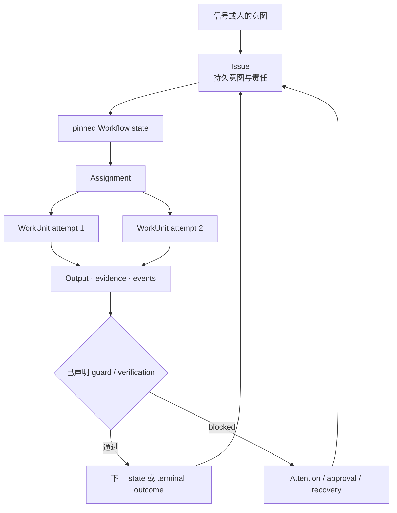

普通 workflow run 回答：**这些步骤是否执行了？**基于 Issue 的 Workflow 回答更大的
问题：**目标结果是否已经达成、所需证据是否齐备，而且整个过程中是否始终有人负责？**

## Issue 比执行活得更久

Issue 保存业务意图和权威 workflow position；WorkUnit 是其下的一次可问责执行 attempt。
Worker 失败、model retry、重新指派、review 循环或进程重启，都不会产生另一份“这项工作
为何存在”的真相。

## 与 run-centric workflow 的区别

| Run-centric workflow | Workforce 的 Issue-based Workflow |
|---|---|
| Trigger 创建一个执行实例 | Signal 创建或更新一项持久责任 |
| State 主要属于 run | 业务 state 属于 Issue |
| Node 是主要单位 | Issue、state responsibility 与受治理结果是主要单位 |
| Retry 重复一个 node | 新 WorkUnit attempt 仍连接到同一 Issue |
| 人工工作是另一个 task node | Human、Agent 与 Team 是明确可问责 Actor |
| Graph 成功停止就算完成 | 已声明 terminal outcome 和配置的证据满足才算完成 |
| Failure 是 exception 或 failed run | Failure 成为 Issue 上的 typed evidence、attention、retry 或 recovery |
| 从 log 重新拼接 context | Intent、assignment、output、approval 与 timeline 保持可共同查询 |

Workforce 可以使用 graph runtime 或 durable queue 作为执行机制；它并不试图替代这些机制，
而是在其上增加类型化工作与责任层。

## 与 Issue tracker 的区别

Issue tracker 让工作可见，但 status 推进通常依赖人工或每个 integration 自己实现。Workforce
为 Issue 解析并固定经过验证的 `WorkflowRevision`，在进入 state 时创建 Assignment，分派
lease-bound WorkUnit，评估结构化结果，并通过已声明 transition 推进。

因此它既不是“另一个 DAG”，也不是“加了 Agent 按钮的 Issue tracker”：

> Awaken Workforce 是一套基于 Issue 的自动化系统；执行始终从属于持久意图、责任、证据与恢复。

## 为什么这对 Agent 尤其重要

Agent 执行具有概率性，也可能因为与业务结果无关的原因停止：provider failure、缺少
credential、invalid output、permission、timeout、review rejection 或 worker capacity。
如果把 Agent run 当成工作本身，就无法区分一次运维事件与业务问题已经解决或被放弃。

Workforce 保持这些层次分离：

- Issue 说明必须达成什么；
- Workflow revision 说明责任与结果数据如何推进；
- WorkUnit 记录一次执行 attempt；
- Resource 标识受治理对象与 operation；
- approval 记录一次具体的人类决定；
- attention 说明为何需要干预；
- reaction 与 schedule 把新证据或工作送回闭环。

## 完成是一项结果，而不是一段总结

Workforce 不从自由形式的模型文本路由。State 声明具名 output、typed Resource production、
下游 requirement、transition guard 与配置的 verification。抵达 terminal state 才是
权威完成；模型说“done”并不是。

领域检查并不全是内建的。作者仍需提供对应 test、Resource script、policy 或 integration。
保证在于：检查一旦声明，workflow 就能使用其结构化结果，而不必重新解释 transcript。

继续阅读 [Issues](/zh/docs/workforce/concepts/issues/)和
[Workflows](/zh/docs/workforce/concepts/workflows/)。
