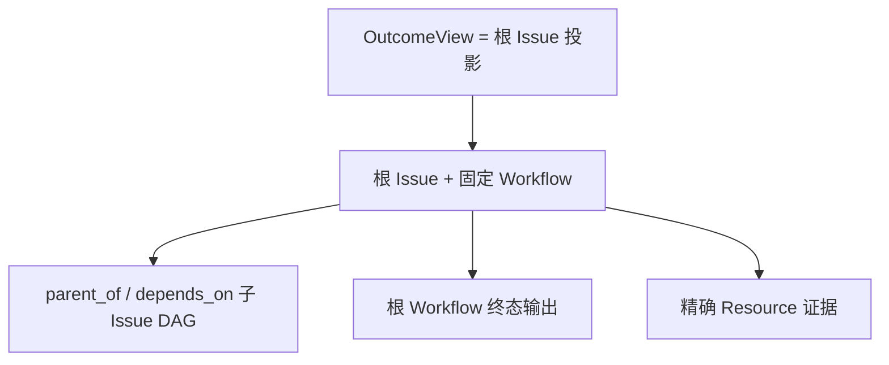

**Issue** 是 Workforce 中持久、可问责的工作单元。它跨重试与恢复拥有业务状态、精确的
`WorkflowRevision` 绑定、关系、WorkUnit、审批、Attention、已接受输出和时间线证据。

**Outcome** 是面向用户、可重建的委托根 Issue 视图。它的 id 就是根 Issue id；没有独立
表、命令入口、状态或生命周期。Workforce 从既有 Work 与 Resource 事实派生目标、阶段、进度、
验收契约、最终输出和 Resource 证据。

根 Workflow 的每个 output 都会出现在 `acceptance_deliverables` 中，其内含
`output_id`、精确 output `contract`、可选 `fulfillment` 与派生
`acceptance_state`。`acceptance_summary` 汇总 `total`、`fulfilled` 与
`complete`。两者都不是新 store：它们由固定 Workflow 与根 Issue 已接受的
state-output envelope 重建。

## 动态工作就是 Issue 分解

当作者期无法预知全部工作时，Planner Agent 调用受限的 `issue.decompose`。一个原子命令
创建 1–32 个普通子 Issue 以及 `parent_of`、`depends_on` 边。完全相同的重试重放同一图；
内容改变会冲突；无效或成环输入不写入。嵌套复用同一命令，最大深度为 8。

每个 Workflow state 最多一个可问责 Executor。并行性属于可见的子 Issue DAG，而不是
隐藏 slot 分支、`GraphPlan`、join service 或输出聚合。依赖负责阻止 dispatch；前置 Issue
取消会产生 Attention，不会满足依赖。

## 完成只有一个权威

最后一个子 Issue 完成只会让父 Issue **ready**，不会完成父 Issue 或验收 Outcome。父级
Executor 读取子 Issue 终态输出、整合结果、产出根 Workflow 声明的输出，并通过 review
或人工验收 transition。只有根 Issue 终态完成，Outcome 才是 accepted。

| 根 completion | 正式 fulfillment | Deliverable state | Outcome 效果 |
| --- | --- | --- | --- |
| `open` | 缺失 | `pending` | 继续工作 |
| `open` | 存在 | `fulfilled` | 证据已存在，但尚未验收 |
| `completed` | 存在 | `accepted` | 正式交付已验收 |
| `canceled` | 任意 | `canceled` | 没有已验收 Outcome |

根 Issue completed 但缺少已声明 output 时，Outcome projection 会视其为不一致并失败；
completion 不能把缺失证据静默变成 acceptance。已验收 Outcome 还要求一个非空且
完整的正式交付契约。

Cycle membership 与此正交；关闭 Cycle 不会完成、取消或验收 Issue / Outcome。

用户路径见[委托并跟踪 Outcome](/zh/docs/workforce/how-to/manage-outcomes)，定义与运行边界见
[Workflow](/zh/docs/workforce/concepts/workflows)。
