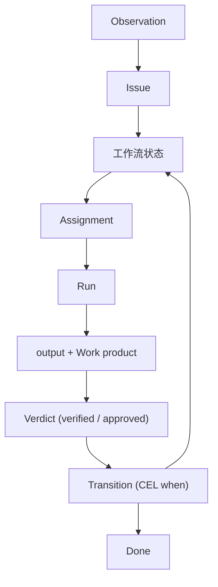

Awaken Objects 的内核是**领域中立**的：它只认识一小组原语，对“营销”、“客户”或“程序员”一无所知。领域含义由[领域包](/zh/docs/workforce/concepts/domain-packs)添加。理解这少数几个核心对象，以及它们如何连接，是掌握其他一切的关键。如果你还没读过[面向 Agent 的类型系统](/zh/docs/objects/concepts/type-system)，请先读它：本页是那个模型的具体化。

## 事实、投影与两个平面

在讲对象之前，先讲它们全都栖身其上的基底。

- **事实（Fact）**——一条仅追加、不可变、带类型的账本条目。事实是被存储的**历史**：没有 `UPDATE`，没有 `DELETE`；一次更正是一条取代旧事实的新事实。下面每个对象都以事实来记录其真相。
- **事实日志（Fact log）**——按主体划分的仅追加流；是审计轨迹、反应与 outbox 都从中读取的权威历史。
- **投影（Projection）**——一个*对*事实的纯粹、全总、可重放的派生（一块看板、一个待办列表、一项指标）。投影是**派生的**读取层——只用于展示、可从日志重建、绝非真相之源，也绝不就地修复。

两个**平面（plane）**让可重放的世界与运行时现实保持分离：

- **Pure 平面**——事实及其投影：确定性、可重放、无时钟。
- **Live 平面**——运行时现实：一个 run 的 **lease**、一份凭证的可用性、一个连接器的连接。受挂钟约束、不可重放。

一个引用**由它所指向的平面定型**，而一个 Pure（可重放）计算无法读取一个 Live 的东西，因此“它此刻还活着吗？”是对一个 lease 的 **Live 视图**，绝非一个被存储的标志。这就是来自[类型系统](/zh/docs/objects/concepts/type-system#two-planes-replayable-vs-live)的两平面围栏。

> **一个值得弄清楚的细微之处。** “一切皆投影”这句话*并不*成立。一个 Issue 自身的**工作流位置**——它的 `state_key` 以及它是否终止——是**权威的带类型状态**，在一个**版本**下持有并就地更新；每一次转移也会在同一步骤中追加一条不可变的状态条目事实（那就是历史）。被禁止的是一个被存储的*运行状态*列：运行状态、“它是活的吗？”、调度状态以及收件箱，全都是**派生的**——是投影或 Live 视图，绝非被改动的字段。

## 内核对象

内核锚定在一个**有界、有据可依的一组聚合根（aggregate root）**上——每个都是一个带有自身事实流的一致性边界。这组根被刻意保持得很小：新增一个根需要一个显式的设计决策，以证明存在一个现有的根无法承载的不变量。

- **Actor** — 一个能提出 issue、做出反应或拥有 run 的身份（一个 User、Agent 或 Team）。
- **Resource** — 一个受治理的东西，issue 针对它被提出（一个仓库、一个连接器、一个工作产物、一个脚本、一种凭证种类——同一份目录，按 facet 定型）。
- **Issue** — 针对某个 resource 的、持久且可见的工作单元；主要的、由流程支撑的 **Subject**。
- **Reaction** — 系统对某个 issue 声明的响应；自动化的主干。
- **Run** — 一次持有租约、可问责、以事件流形式呈现的执行，产出一份推进某个 Subject 的声明式输出。

外加一个机制根，它不是一个数据对象：

- **决策者（the decision maker）** - 每一个“这件事可以发生吗？”都经由的那一个引擎（authorization、admission、readiness、selection、egress）。见[权限与资源](/zh/docs/objects/concepts/permissions-resources)。

### 流程层内部的带类型结构

工作流及其各部分**不是**顶层原语——它们是 Issue/流程层*内部*的带类型结构，赋予一个 Subject 其生命周期：

- **Workflow** — Work owner 的一等定义，以不可变 `WorkflowRevision` 发布；内部 `ProcessSpec` specification 表达 state、transition、slot、typed handoff 与 bounded iteration。Issue 创建时固定精确 revision。
- **State**（`ProcessState`）— 一个阶段，包含 slot、声明的 output export 与 required input，以及可选 fan-in 和 WIP limit。
- **Transition** — 状态之间一条带守卫的边；由一个 CEL `when` 谓词决定它是否触发（首个匹配者胜出）。
- **Agent** — Agent Actor 加 editable `AgentDef`（`role_prompt` 和可选 model handle）；executor 是 WorkUnit 的一个 *facet*，而非单独的根。
- **Tool** — 一项可调用的能力，调用时受审批门控。

### 资源是带操作的带类型对象（物模型）

**Resource** 根是“一个 agent 感知到一个面向对象的世界”变得
具体之处。一个 `ResourceType` 被声明为一个**物模型（thing model）**——一个带类型的形状加上
作用于它的操作：

- **属性（Properties）** — 带类型的 declared state、immutable-once/projected state、静态值、
  **计算 getter**，或持久 **Content**。Content 在 fact 中是封闭 descriptor，不可变 byte
  位于 content store 之后。
- **动作（Actions）** — 对象上带参数的方法。
- **事件（Events）** — 对象能发出什么（各带一个入站规范化脚本）；
  这些是 [reaction](/zh/docs/workforce/concepts/reactions) 的发出点。
- **生命周期（Lifecycle）** — 仅 host 的钩子（`verify`、`resolve`、`health`），由平台运行，
  绝不由 agent 运行。

只有**一份目录和一个名词，`Resource`**；一个类型由它的
**facet 区分，而非通过子类化**，并且只声明一种 governance kind：
`object`、`configuration`、`credential` 或 `connector`。Action 按名字对类型化实例派发。
跨对象 forwarding 通过类型化 requirement role 与 `via: role.action` 声明；Agent 只获得
显式授予的 read、mutation 与精确 Action，不存在 ambient generic invoke tool。
每个操作都在受治理、沙箱化、被检查 lease 的边界内运行（见
[开发一个领域包](/zh/docs/workforce/designing/develop-a-domain-pack)）。于是一个
agent 操作的是**拥有精确 Action 与计算属性的带类型领域对象**，而非一袋扁平的工具。

> **已交付。** 受治理的对象模型——类型、精确 Action、派发、计算属性与持久
> Content——已经过 owner API、Workflow、observation 与 realization 路径交付。
> Scope-console MCP endpoint 暴露五个固定操作：`resource.types`、`resource.query`、
> `resource.get`、`resource.realize` 与 `resource.changes`。Agent interaction 从精确 grant
> 派生更窄的 tool list，并可增加 relation、content read、terminal submission 或精确
> Action tool；它不会获得 ambient object-operation capability。

### 作用域树

每个对象都扎根于一棵所有权树：**Org ⊃ Workspace ⊃ Project**。一个 **Org** 是
租户边界；一个 **Workspace** 在其内部把工作分组；一个 **Project** 是
一个对象所属的最内层容器。一个单节点部署会播种一个单例的
Org，于是本地形态与托管形态是同一个模型。

## 工作与执行对象

工作实际上如何运行：

- **Assignment**（`Assignment`）— 谁对某个 Issue 上的某个状态负责，在进入该状态时创建。
- **Run**（`WorkUnit`）— 绑定到 Subject 的一个执行实例；
  `queued → active → succeeded | failed | cancelled`。Approval/pause 是 event，不是 status variant。
- **Dispatch 与 lease** — 一个 run 在分发队列中排在若干带类型的门（凭证、计划、锁、WIP、审批）之后等待，然后持有一个 **lease**——绑定其 worker token 与副作用的唯一权威。
- **Accepted output** — WorkUnit 的结构化 JSON 完成记录；named export、variant、required input 与 Resource production 显式组成契约。
- **Work product ref** — 对某个交付物的带类型、可证实的引用（`{kind, locator}`）；内核携带并比较它，但从不解释它。
- **Cycle / Delivery target** — 规划与发布的表面。它们与 Issue 同属那个由流程支撑的 `Subject` 家族，因此它们的工作流位置也是权威的带类型状态；*派生的*是它们的调度/汇总状态——一个对主干的投影，绝非单独存储的枚举。
- **Attention signal** — 当工作停滞（run 卡住、lease 过期、缺失凭证）时一条对操作员可见的记录，附带带类型的恢复操作。

## 身份与指派对象

谁可以被指派以及谁可以行动：

- **Workspace actor** — 跨越 **User**、**Agent** 或 **Team** 的通用指派身份。槽位解析为 workspace actor。
- **Team** — participation/selection 分组。Slot 当前选择具体 Actor 或通过 Team 解析；authorization 始终独立。
- **Principal** — 授权检查所用的带类型身份（`User`、`Agent`、`Team`、`ApiToken`、`System`）；规范的执行链是
  `[User(dispatcher), Agent(agent)]`。

> 角色授予的是**被指派的资格**，而非 API 能力。授权始终是一项独立的检查，见[权限与资源](/zh/docs/objects/concepts/permissions-resources)。

## 它们如何组合在一起

1. 一条入站**观察**（webhook、报告、计划任务）被去重，并作为一个绑定到某工作流的 **Issue** 落地。
2. 进入一个**状态**会从它的槽位创建出多个 **assignment**；每个都在分发门之后等待。
3. 一个已放行的 assignment 在某个 **lease** 下启动一个 **run**；Agent 开始工作，并可能调用受审批门控的**工具**。
4. 该 run 产出一份结构化的 **output** 和一个 **work product ref**，由一个 **verdict** 检查。
5. 一个 **transition** 的 CEL `when` 读取结构化输出并路由到下一个状态——绝不从自由文本中猜测。
6. 该 Issue 到达一个**终止**状态（`completed` 或 `canceled`）。

下一步：[工作流的各部分](/zh/docs/workforce/concepts/workflow-parts) ·
[Issues](/zh/docs/workforce/concepts/issues) ·
[Agents 与 runs](/zh/docs/workforce/concepts/agents-runs)。
