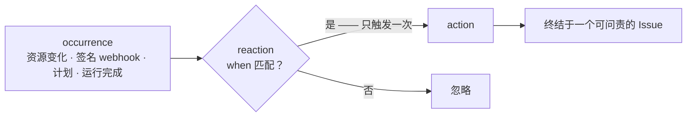

Workflow 描述一项工作如何推进。用户通过 **Automation** 声明系统如何响应“发生了什么”——
Resource 变化、签名 webhook 到达、Schedule 触发或 Run 完成。Occurrence、binding、
firing 与 frozen effect 是让 Automation 持久且 fire-once 的运行时 Reaction 语义。

关键在于，响应世界**不是**“轮询一个状态列并对它分支”。那个模式会漂移——那个标志与本应定义它的事件会失去同步。这里事件本身就是单元，而响应是被声明的、只触发一次、并总是落在某个可问责的东西上。

## occurrence 是事实，不是标志

一个 **occurrence** 是一条仅追加的事实：*某事发生了*。那个东西（一个资源行）与那个事件（一个 occurrence）是从不合并的两个独立行——一个 reaction 订阅那个 **occurrence**，而绝不能被读取一个粘性的
`status == X` 投影所驱动。（那个“粘性状态”反模式正是这个模型所禁止的。）

一个 occurrence 只会通过一个 admission 端口抵达账本——一个脚本、agent 或连接器绝不直接写入一个 occurrence 行。有三条发出路径：

| 来源 | 它如何发出 |
|---|---|
| **Internal** | 拥有它的领域服务在自己的提交事务内发出 |
| **External webhook** | 一个签名的连接器事件通过一道签名门 |
| **External poll** | 一个 reconciler 计算出一个 before/after 的边沿 |

一个[资源类型](/zh/docs/objects/concepts/object-model)所声明的**事件**就是那个对象的发出点。

## 一个 Reaction 是一个被声明的响应

一个 **Reaction** 把一个作用于某个 occurrence 的谓词绑定到一个动作——
`when(predicate over the occurrence's structured payload) → action`。这个绑定是
**无状态的**：它不携带自己的游标；进度存在于 firing 账本中
（见下）。谓词由运行每一个其他决策的同一个决策者求值，且它只读**已声明的、结构化的 payload——绝不读自由文本或
显示名**（与治理[工作流](/zh/docs/workforce/concepts/workflows)的那条“对结构化输出而非一个 LLM 摘要做路由”的规则相同）。

Reaction 以几种形态出现，全都是同一套机制：

| 形态 | occurrence → 动作 |
|---|---|
| **Trigger** | 一个事件 → 派发一个工作单元 / 开启一个 [Issue](/zh/docs/workforce/concepts/issues) |
| **Transition** | 一条工作流边作用于该 run 的结构化输出的 `when` |
| **Intake routing** | 一个 intake 事件 → 一个新 Subject 进入哪个生命周期 |
| **Schedule** | 一个时间滴答 → 一个动作 |

## firing 只发生一次

对一个 occurrence 采取行动是一次 **firing**，被记录在一个仅追加的 **firing 账本**中。
一次 firing 是**只触发一次**的，以 `(binding, dedupe_key)` 为键并被存储幂等地吸收——同一个 occurrence 被投递两次不会行动两次。每次 firing
都携带一条因果脊柱（`correlation_id` / `causation_id`），于是你总能追溯
*哪个事件、通过哪个绑定、导致了哪个动作*。

## 入站绝不直接驱动出站

一个外部事件绝不直接扇出为副作用。它落在一个
**可问责的 Issue** 上，该 Issue 通过[流程脊柱](/zh/docs/workforce/concepts/workflows)闭合——
于是每个 reaction 都有一个 owner、一个状态和一条审计轨迹，而不是一个没人能问责的 fire-and-forget webhook 处理器。

## 状态

reaction 模型是**已决定且大体已交付的**。通用 reaction 引擎位于
`awaken-flow-reaction`（`FiringKey`、`FireOutcome`、`FiringSink::fire_once`、
`CausalSpine`），领域接线位于 `awaken-flow-automation`，其中承载着 occurrence/firing
**账本**（`ledger.rs`——`OccurrencePayload`、`FiringRecord`、`register_admission`）。
无状态**绑定**、**只触发一次**的保证，以及**活动流**与**血缘**读取表面都已接线
（`GET /api/scopes/{scope}/activity`、`GET /api/scopes/{scope}/lineage/{correlation_id}`
和 `GET /api/bindings/{id}/firings`），并且一条“签名 webhook → 规则引擎 → 真实 Issue”
的闭环已端到端测试。

仍在进行中：账本的**物理分区**，以及完整的 **intake 路由**目录——请把这两者视为方向，而非一个完成的表面。

## 另见

- [对象模型](/zh/docs/objects/concepts/object-model) —— 一个对象的**事件**在哪里被声明
- [Issues](/zh/docs/workforce/concepts/issues) —— 一个 reaction 终结于的那个可问责 Subject
- [Workflows](/zh/docs/workforce/concepts/workflows) —— transition 是一个流程内部的“reaction”形态
