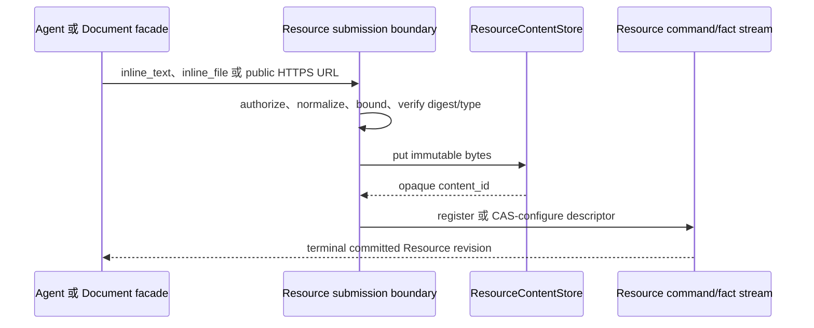

**Resource** 是具有身份的受治理企业对象，拥有一个精确 ResourceType revision、owner root、
生命周期、属性、关系、行为和来源。它可以在 Issue 之前、期间、之后或完全没有 Issue 时存在；
Issue 关闭或删除不会退役 Resource。

## 静态所有权

| 关注点 | 权威 |
| --- | --- |
| 对象身份、fact、revision、link、observation、realization | Resource domain |
| 持久 content 身份与 descriptor | Resource fact stream；不可变 byte 位于 `ResourceContentStore` 之后 |
| 某 scope 中 Resource 可用性 | ResourceBinding + `ResourceScopeResolver` |
| Issue 针对某对象提出 | 不可变 Issue `raised_against: ResourceRef` |
| Workflow 使用 | requirement binding，随后冻结 execution snapshot |
| 创建/证明对象的来源 | Resource 拥有的 `ResourceCausation` |
| “Resource 的 Issues”反向查询 | 可重建 Work/product query |

系统没有通用双向 Issue–Resource relation，也没有 Resource `issue_id`；
`awaken-flow-resource` 不依赖 Work domain。

HTTP、MCP、交互 Agent、Workflow、Automation 与 Connector ingress 复用同一组 scoped
`awaken-flow-resource-operations` application service，处理 query、history、Action、
observation 和 realization；不得各自重写 visibility、redaction、精确 revision、approval 或
dispatch。Resource 仍嵌入 Workforce，这个代码边界不意味着第二个数据库或网络服务。

## Agent access

Agent declaration 可以携带封闭 `resource_access` 契约。每项针对精确 ResourceType 或 capability，
选择性授予 `query`、`get`、`relations`、`history`、`content` 读取，allow-list
精确 Action，并可授予 `submit` mutation。没有 Action 和 mutation 时目标为只读。
Activation 与每次 session/WorkUnit 冻结 grant；每次调用仍重新验证 scope、visibility、
redaction、revision 与 approval。

Workflow 选择的访问面可以收窄 Agent declaration。不存在 ambient `resource.invoke`、任意
工具名 authority、直接 FactStore access 或 Agent 自有同步循环。

## 持久 content 是 Resource property

文本与文件不会引入 Document 或 blob aggregate。ResourceType 可声明 `Content` property，
指定允许的规范 MIME type 与 byte limit。Resource fact 只保存封闭 `ContentDescriptor`：

```text
content_id + media_type + size_bytes + sha256 + optional filename
```

`content_id` 是 opaque 值。Filesystem path、bucket key、signed URL、Session id 与 Artifact id
都不进入 Resource truth。Byte-custody port 复用 Awaken 的不可变 content-addressed
`FileStore`，但 Resource 的身份、revision、relation、authorization 与 lifecycle 仍留在
Workforce 唯一 fact stream 中。类型化 Document HTTP facade 只是 system `document`
ResourceType 与同一 content path 上的 Markdown-oriented view。



`resource.submit` 是唯一 Agent custody path；`resource.content.get` 是显式 content read。
过期 CAS、不安全 URL、无效 base64、不允许 media、超限输入、digest mismatch、
external state authority、byte 缺失或 grant 撤销都会 terminally fail。一致性顺序是
**先 put 不可变 byte，再 append Resource fact**：失败可能留下未引用的不可变 byte，
但不会暴露指向未提交可变 content 的 Resource。Awaken Session File 与恢复的
Artifact 仍是执行证据，不是 Resource authority。

## Observation 不是 Workflow

Provider push、platform pull、手动刷新和 Action 后验证先进入 Connector normalization，再进入
Resource observation service。Observation pump 拥有 lease 与 retry；Resource admission 拥有
identity、schema、ordering、relation 与原子 fact。Workflow 仍是可问责多步骤工作，Automation
仍是业务 `on → when → then` 响应；两者都不是 ETL / CDC 引擎。

另见 [Domain Pack](/zh/docs/workforce/concepts/domain-packs)、[权限与资源](/zh/docs/objects/concepts/permissions-resources)
和[凭据托管](/zh/docs/workforce/concepts/credential-custody)。
