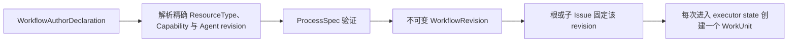

**Workflow** 是用户、Project 与 Pack 选择的一等定义。每次保存创建或复用不可变的
`WorkflowRevision`。可移植作者格式是 `WorkflowAuthorDeclaration`；Workforce 解析其中符号化的
Pack 引用，再经唯一的规范验证器降级为内部 `ProcessSpec` 运行载荷。

Issue 固定的 revision 优先于之后的 Project override 或 Pack adoption，已有工作不会被静默改向。

## 静态边界

| 所有者 | 契约 |
| --- | --- |
| Pack / Project authoring | 符号化 `WorkflowAuthorDeclaration` |
| Work domain | 精确 `ProcessSpec`、state transition、类型化端口与验证 |
| Issue | 精确 Workflow 绑定与当前业务状态 |
| WorkUnit | 一次 state entry 的一次尝试，且最多一个可问责 Executor |

State 还可声明 reviewer、approver、aggregator 或 custom responsibility slot，但验证器最多
允许一个 `executor`。Workflow state 声明类型化输入/输出、requirement、transition、session
policy、tool profile、WIP 上限与有界迭代；不声明可变工具 allow-list。

## 动态并行

作者只描述稳定业务状态机；不确定工作由 Planner 通过 `issue.decompose` 分解为普通子 Issue。
既有 `parent_of` / `depends_on` DAG 是调度、取消、进度与审计事实。系统没有 `join_policy`、
隐藏分支 WorkUnit、`GraphPlan` 或第二个 workflow invocation aggregate。依赖使父 Issue ready
后，父级才显式整合子 Issue 的终态输出。

下一步：[Workflow 规范](/zh/docs/workforce/reference/workflow-config) ·
[Issue 与 Outcome](/zh/docs/workforce/concepts/issues) ·
[Domain Pack](/zh/docs/workforce/concepts/domain-packs)。
