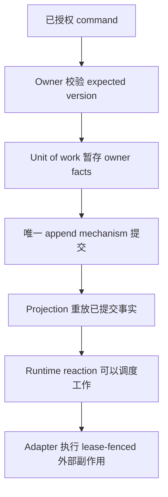

扩展 Awaken Workforce 时，应修改行为的**唯一权威所有者**。不要建立第二套 Resource、Workflow、
Agent、event append、authorization 或执行机制。

## 静态所有权

| 变更 | 权威所有者 | 扩展接缝 |
| --- | --- | --- |
| 领域规则或对象 | purpose-named `domain` crate | 该 context 拥有的 command/repository port 与 fact |
| Lease、wake、provision、execution、egress | `runtime` crate | 窄机制端口 |
| Persistence、IAM、MCP、Pack distribution | `adapter` crate | 领域定义的端口或 ACL |
| HTTP、进程拓扑、backend selection | `app` crate | 对下层组件的装配 |
| Agent 执行 | Awaken，通过 `awaken-flow-runtime` | 唯一 Runtime ACL，不能增加并行 executor |

依赖向下：`lib → domain → runtime → adapter → app`。App 可以组合下层；下层不能从上层
引入产品、传输或持久化词汇。

## 变更流程

1. 阅读源码仓的 architecture overview、invariant registry 与该需求的 coverage owner。
2. 搜索代码、测试、public API snapshot 和 ADR，确认是否已有机制。
3. 扩展权威实现并迁移全部 caller；继续之前先移除竞争路径。
4. 只有出现争议选择、跨 crate 影响或不变量影响时才新增或修订 ADR。
5. 每条新 guardrail 都要命名 enforcer 与 validation。
6. 有意改变公共 API 时同步更新 public API snapshot。
7. 运行 `scripts/ci/check-docs.sh` 与 `scripts/ci/check-all.sh`。

## 动态写入路径

提交前失败不会产生部分领域真相。Live effect 按机制使用 lease、idempotency、
reconciliation 或 checkpoint；retry 不能发明第二次业务决策。

从[架构与词汇](/zh/docs/objects/concepts/object-model/)、
[Workforce–Awaken 执行所有权](/zh/docs/workforce/concepts/agents-runs/)和
[测试 Domain Pack](/zh/docs/workforce/how-to/test-and-validate-a-pack/)开始。源码仓 ADR 与
invariant registry 仍是设计权威；本页只是贡献入口，不复制架构语料。
