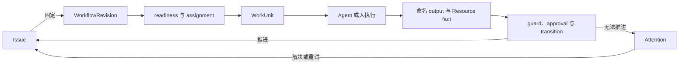

当一项工作必须跨越 Agent Run、人工决定与外部系统继续推进时，使用 Workforce。先说明工作
本身：谁负责、需要什么结果、什么会阻塞，以及哪个系统有权确认完成。

Workforce 通过聚焦的提前体验合作提供。第一个有用结果是一项可以创建、推进、带着明确
原因停止并继续的 Issue，而且负责人和 Workflow revision 不会在中途被替换。

## 从眼前需要作出的决定进入

浏览器 Console 按用户要作出的决定组织同一组产品事实：

| 你需要…… | 打开 | 可以在这里决定什么 |
| --- | --- | --- |
| 跨 Project 委托并指挥交付 | Workspace **Home** | 定义 Outcome，查看“委托 → 分解 → 执行 → 验收”路径，并找到需要介入的交付 |
| 处理人工决定或例外 | **Needs you** | 筛选 approval、Issue Attention 与 Agent/平台就绪信号，不必持续盯住每次 Run |
| 继续一段临时 Agent 对话 | Workspace **Chats** | 继续一个有 URL 身份的 Awaken Session 并发出明确命令，不让 Flow 成为 transcript 权威 |
| 检查一个 Project 能否继续 | Project **Overview** | 查看执行就绪、dispatch health、开放工作和下一项阻塞配置 |
| 检查或验收一个已委托结果 | **Outcomes** → **Outcome Review** | 对照验收边界检查正式交付物，并且只执行当前允许的 transition |
| 评审一份持久交互结果 | Project **Canvases** | 打开一个精确、已准入的 `canvas_artifact` Resource revision，评审或编辑，再明确发送给 Agent |
| 理解一项可问责工作 | **Issues** → Issue 详情 | 查看 owner、下一动作、diagnosis、Workflow 位置、worklog、approval、关系与 Agent conversation |
| 使用面向方案的运营界面 | 方案 **Workbench** | 查看已安装 value path、metric 与 queue，同时保持底层 Issue 和 Workflow 权威不变 |

**Runs** 与 **Agent Center** 将 Agents 的执行健康投影到组合 Console；**Resources** 投影
Objects 的业务事实与动作。Workforce 使用这些产品，但不拥有它们的 Session、Run、Resource
或 Action 真相。

**Chats** 是对 Awaken conversation 的命令工作台投影，不是 Flow transcript、Issue 或执行记录。
**Canvases** 是 Objects 拥有的 Resource 界面，带不可变 revision、隔离 Preview、评审与明确的
Send-to-Agent bridge；它不是第二套 Design 后台，也不是 Workforce aggregate。

## 三个产品如何协作

| 产品 | 拥有 | 在一个 Outcome 中的职责 |
| --- | --- | --- |
| **Awaken Workforce** | Outcome、Issue、Workflow、责任、Attention、正式交付物、验收 | 委托结果、协调工作并记录最终决定 |
| **Awaken Objects** | ResourceType、Resource、Relation、Action、Observation、provenance、精确业务 revision | 提供受治理上下文、允许的变化与外部业务证据 |
| **Awaken Agents** | Agent publication、Session、Run、工具、Worker、Sandbox、已提交执行与恢复 | 执行被委托的 WorkUnit，并返回已提交执行证据 |

组合路径是 **Workforce 委托 → Objects 提供上下文和动作 → Agents 执行 → 证据返回 →
Workforce 验收**。技术 Run 可以先结束，但 Outcome 仍可能尚未达到验收条件。

## 创建第一项 Issue

1. 按照[快速开始](/zh/docs/workforce/quickstart/)校验部署、启动本地拓扑并 bootstrap Project。
2. 创建 Issue，填写负责人和预期结果。分派前加入所需输入与 active dependency。
3. 固定定义 state、具名 output、approval 与 transition 的 Workflow revision。后续修改会
   产生新 revision，不会在 Issue 运行中替换它。
4. 把 ready WorkUnit 分派给 Agent、人或自动化系统。Assignment 与每次 attempt 都留在
   同一项 Issue 上。
5. 如果缺少输入、approval 或 check，处理已经记录的 Attention 后再重试。只有已声明的
   completion condition 通过，才结束 Issue。

你应该看到一项带有固定流程、当前状态，以及每次推进或停止原因的 Issue。Workforce 判断已经
声明的 Workflow rule 和已经记录的 fact。外部检查由拥有对应事实的 Connector 或 verifier
完成，再把返回的事实记录进 Workforce。

Workforce 是工作、责任与结果平面，[Awaken](/zh/docs/agents/) 是唯一 Agent 执行与控制平面。
WorkUnit 可以使用在 Awaken 中配置的 Agent、受支持的兼容 Agent 或已有 publication；
这些选择都不会取代 Issue 这份工作记录。

## Workforce 如何承载这项 Issue

Schedule 负责稍后复查，reaction 在事实变化后重算，active dependency 会在上游 Issue
终结前阻止 dispatch。所有路径都回到同一个 Issue 与 Workflow 权威，不形成平行任务系统。

## 静态结构与所有权

| 组件 | 拥有什么 | 不拥有什么 |
| --- | --- | --- |
| Issue + 固定 `WorkflowRevision` | 持久 intent、流程状态、依赖与终态结果 | Agent 进程或 transcript |
| Workflow | state、slot、requirement、命名 produces/requires、guard 与 transition | 未声明的外部真相 |
| WorkUnit | 一次已分派 attempt 及其 event/state history | Issue 完成策略 |
| Resource / ResourceType | 受治理对象、action、event 与 credential role | model/provider 配置 |
| Approval 与 Attention | 明确的人类决定或精确 non-progress 原因 | 第二套 lifecycle |
| Awaken Agent plane | Agent publication、model/credential resolution 与受治理执行 | Workforce 的业务工作真相 |

该边界是有意设计：Workforce 拥有工作与责任，Awaken 拥有 Agent 配置与执行。部署 TOML 只选择
进程装配，不复制持久化 model catalog 或 credential vault。

## 继续完成你需要的任务

| 目标 | 从这里开始 |
| --- | --- |
| 启动 Workforce、bootstrap Project 并创建 Issue | [快速开始](/zh/docs/workforce/quickstart/) |
| 手动推进一条已声明 Workflow transition | [API Workflow 教程](/zh/docs/workforce/tutorials/first-agent-run/) |
| 创建、跟进并恢复工作 | [使用 Workforce](/zh/docs/workforce/how-to/) |
| 设计 Resource、Workflow、Agent 与 Pack | [设计与自动化](/zh/docs/workforce/designing/) |
| 部署并运营拆分角色 | [部署拓扑](/zh/docs/workforce/operating/deployment-topologies/) |
| 查询生成式与类型化契约 | [参考](/zh/docs/workforce/reference/) |
| 扩展内核 | [贡献与扩展](/zh/docs/workforce/contributing/) |

面向应用的 Agent 配置、协议、durable session 与 Sandbox 运营请进入
[Awaken](/zh/docs/agents/)；只有嵌入或扩展 Rust runtime 时才进入
[Awaken Agents 内部机制](/zh/docs/agents/runtime/)。
