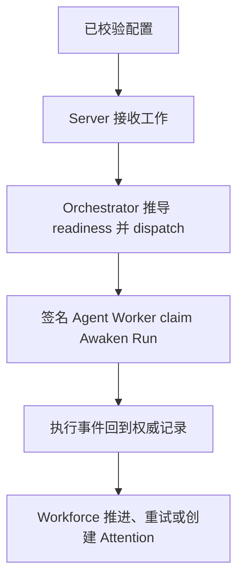

Awaken Workforce 采用**一个 binary、一份部署文档和三个显式进程角色**。默认从完整拓扑开始，
只有隔离或规模要求出现时才拆分角色。

## 静态结构

| 角色 | 拥有内容 | 不拥有内容 |
| --- | --- | --- |
| Server | HTTP API、实时交互、IAM 装配、Worker control | 配置的内嵌角色之外的 Agent 执行位置 |
| Orchestrator | 调度、reconciliation、恢复、clock、realization | 公共 HTTP 流量 |
| Agent Worker | 签名 Awaken Worker 注册与 Agent 执行 | Workforce 数据库或业务真相 |

三个角色读取同一份带 schema version 的 TOML。模型 provider、API key 与 model route
不属于该文件；它们由 Awaken catalog 与 credential vault 拥有。

## 准备并校验配置

从预览分发包附带的部署示例开始，替换其中路径和 credential，并把 secret 文件放在源码
控制之外。绑定端口之前先执行：

```sh
cargo run -p awaken-flow-server -- config validate --config ./awaken-flow.toml
cargo run -p awaken-flow-server -- config show --config ./awaken-flow.toml
```

`config show` 输出规范化且不泄露 secret 的配置。语法错误、未知字段、不支持的 schema
version、文件缺失或引用无效都会在启动前终止进程。

## 选择拓扑

### 完整本地拓扑

```sh
cargo run -p awaken-flow-server -- --config ./awaken-flow.toml
```

当两个 embedding flag 都启用时，会启动 Server、内嵌 Orchestrator 与内嵌 Agent Worker。
成功信号是 `/healthz` 可访问，且启动诊断明确报告两个内嵌角色。

### 拆分控制与执行

设置 `server.embedded_agent_worker = false`，启动 Server，再使用配置好的签名 credential
和 `agent_worker.control_url` 启动 Worker：

```sh
cargo run -p awaken-flow-server -- server --config ./awaken-flow.toml
cargo run -p awaken-flow-server -- agent-worker --config ./awaken-flow.toml
```

无数据库 Worker 向 Server 注册。无效或未接受的 credential 会 fail closed；改变工作状态前，
先检查 Server 与 Worker 的启动诊断。

### 完全拆分拓扑

把两个 embedding flag 都设为 `false`，然后运行：

```sh
cargo run -p awaken-flow-server -- server --config ./awaken-flow.toml
cargo run -p awaken-flow-server -- orchestrator --config ./awaken-flow.toml
cargo run -p awaken-flow-server -- agent-worker --config ./awaken-flow.toml
```

只有 Server 拥有 HTTP。Orchestrator 与 Agent Worker 必须分别保持存活；通过 metrics、
Worker directory、scheduling projection 与 attention signal 诊断交付问题。

## 动态行为与恢复



Lease 会隔离过期执行。Reaper 与 reconciliation 恢复遗弃工作，但不会让未提交的 Worker
输出成为权威事实。滚动升级时应停止接收新工作，通过受支持的控制面 drain 或 revoke 活跃
lease，逐个部署角色，并验证 `/healthz`、`/metrics`、Worker 注册与 canary Issue 后再恢复流量。

## 验证部署

以下检查面向部署维护者，不是普通用户使用产品的前置步骤：

```sh
curl -fsS http://127.0.0.1:7979/healthz
curl -fsS http://127.0.0.1:7979/api/openapi.json \
  > /tmp/awaken-flow-openapi.json
cargo run -q -p awaken-flow-server -- openapi \
  > /tmp/awaken-flow-openapi-from-cli.json
```

确认启动诊断准确报告配置的内嵌角色与存储边界，预期 Worker 已出现在 Fleet，且 `/metrics`
能够接入配置的观测系统。两个 OpenAPI 文档都由 router 生成；应使用实际运行 checkout 的
文档，不要另行维护复制的 route 表。

继续阅读[部署配置](/zh/docs/workforce/reference/config/)和
[监控运行](/zh/docs/workforce/operating/monitoring-runs/)。
