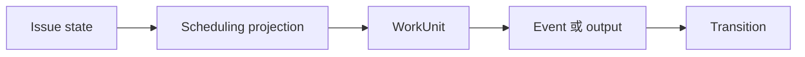

Awaken Workforce 对操作者的承诺很简单：**无需阅读 transcript，也应知道工作在哪里、为何停止**。
业务位置、scheduling、execution、approval 与 attention 是分开的带类型表面。

## 日常循环

1. 在 **Issues** 中创建或查看工作，并在列表、看板与树之间切换。
2. Dispatch 前打开 Issue 详情中的 diagnosis/scheduling；它会明确 backlog、dependency、
   Resource、attention、running、ready 或 closed。
3. 读取 `/api/issues/{id}/work-units`，再读取所选 WorkUnit 的 `/events` 与 `/state`。
4. 在 Issue 详情处理可见 attention；跨 Issue 集成运营时再使用 `/api/inbox` 或
   `/api/tool-approvals`。
5. 修复 attention signal 背后的原因，再标记 resolved。
6. 通过可审计 WorkUnit control 对 live work 执行 message、pause、resume、interrupt、
   redirect 或 cancel。

## 为什么值得信任

- Status 是 committed fact 的 projection，不是人工维护标签。
- 路由读取声明式结构化输出，不读取 LLM summary。
- 必需输入与 stale approval 会失败即关闭。
- 每次 privileged execution 都受 lease 与 frozen route snapshot 围栏。
- Pack/Resource operation 与直接 API action 使用同一 admission/authorization 路径。

产品 UI 是这些契约的客户端，也是人的默认操作面；API 服务于集成与深度诊断。UI 不复制
lifecycle 真相，command 与 projection 仍由服务端拥有。
