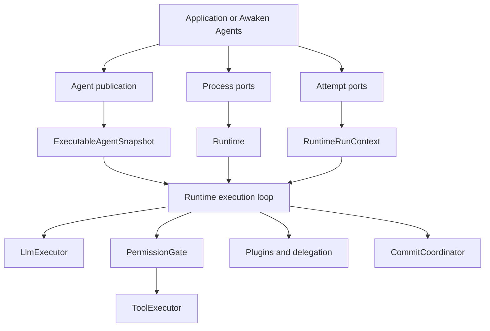

Use this path when an Agent needs a capability that must be implemented in
Rust. Put actions, lifecycle constraints, provider adapters, and storage ports
in code. Put behavior that should change without rebuilding the process in
typed or managed configuration.

## Start from the change

| You need to change | Continue with | Keep as the single owner |
| --- | --- | --- |
| Agent instructions, model choice, Tool visibility, or limits | [Configure Agent behavior](/docs/agents/how-to/configure-agent-behavior/) | Agent publication |
| Runtime assembly in an application | [Embed an Agent](/docs/agents/runtime/how-to/build-an-agent/) | application process |
| A model-requested action | [Implement a typed Tool](/docs/agents/runtime/how-to/add-a-tool/) | Tool implementation plus derived descriptor |
| Lifecycle context, filtering, or policy | [Add a Plugin](/docs/agents/runtime/how-to/add-a-plugin/) | Runtime Plugin path |
| State scope, merge, replay, or persistence | [State and storage](/docs/agents/runtime/state-and-storage/) | staged commands plus commit coordinator |
| A controlled child result | [Invoke a sub-Agent from a Tool](/docs/agents/runtime/how-to/invoke-sub-agent-from-tool/) | Run delegation service |
| Long work that outlives the turn | [Start background work from a Tool](/docs/agents/runtime/how-to/start-background-work-from-a-tool/) | ordinary durable Run and ingress |
| One Agent taking over the conversation | [Use Agent handoff](/docs/agents/runtime/how-to/use-agent-handoff/) | active-Agent transition at a step boundary |
| HTTP, protocols, Workers, Sandboxes, or managed credentials | [Awaken Agents](/docs/agents/) | service and operations planes |

If the requested behavior already has an owner in this table, extend that owner.
Do not add a frontend dispatcher, prompt-only permission rule, private state
store, or second retry loop.

## Static structure

The Runtime depends on typed ports and immutable data. HTTP services, tenancy,
placement, credentials, and deployment depend inward on that kernel; the kernel
does not depend back on them.

## Dynamic behavior

1. The host resolves one immutable snapshot and the ports for one attempt.
2. The Runtime asks the model for the next step.
3. A Tool request passes through canonical id resolution and one permission
   gate before one executor runs it.
4. Messages, state commands, facts, and disposition remain staged until the
   step commit succeeds.
5. The run continues, waits on a resumable ticket, or returns one terminal
   `RunState`.

Tool errors are model-visible results. Waiting is resumed through the committed
ticket. Inference has bounded in-loop retry. A previous commit remains the
recovery point after an interrupted step. These are system behaviors, not a
reason to add a troubleshooting section.

## Decisions to make before coding

| Decision | Question | Existing owner |
| --- | --- | --- |
| Consequence | Does the action read, write, execute, call a network, or use a credential? | Tool plus permission policy |
| Lifetime | Is the value process-wide, publication-pinned, attempt-only, or committed state? | Runtime, snapshot, context, or coordinator |
| Concurrency | Can two calls write the same key? | `MergePolicy` at commit |
| Recovery | Is an external effect non-recoverable, replay-safe, or idempotent? | Tool recovery contract |
| Continuation | Does work return now, wait, run in the background, or transfer control? | Tool result, awaiting, ordinary Run, or handoff |

Record these choices in the implementation and its tests. Documentation should
tell the next maintainer which owner to change and which observable result to
verify.

## Finish the change

Before considering a Runtime capability complete:

1. run the smallest checked example that shares its boundary;
2. derive a cause/effect table for success, rejection, waiting, retry, and
   terminal failure;
3. keep that design in comments beside the corresponding tests;
4. run the focused tests, then the owning crate tests;
5. review the diff for a second owner or compatibility path.

## Keep nearby

- [Runtime architecture](/docs/agents/runtime/explanation/architecture/) for component
  ownership and the full run sequence.
- [Architecture invariants](/docs/agents/runtime/explanation/architecture-invariants/)
  before changing the kernel.
- [Runtime reference](/docs/agents/runtime/reference/overview/) for exact contracts.
