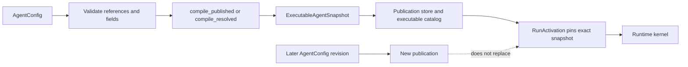
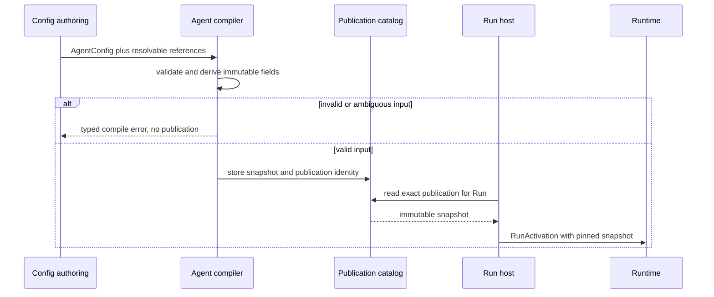

Use this page when changing how authored Agent behavior becomes executable.
Configuration resolution ends at an immutable `ExecutableAgentSnapshot`; it
does not run inference, choose a Worker, or delegate to another Agent.

## Keep authored and executable data separate

| Form | Owner | Can change? | Used by an active Run? |
| --- | --- | --- | --- |
| `AgentConfig` | configuration authoring | yes | no |
| publication | configuration store | new versions may be added | only through its pinned snapshot |
| `ExecutableAgentSnapshot` | Runtime contract | no | yes |
| provider credential material | final execution boundary | may rotate under its own policy | never serialized into the snapshot |

The snapshot contains the behavior a Run may use: instructions, model
candidates, Tool descriptors, Plugins, context policy, limits, and a content
identity. It carries references and resolved choices, not plaintext secrets or
service-owned mutable records.

## Resolution sequence

`awaken-config-resolver` supplies the management plane's read and resolution
face for model offerings and credentials. Its concrete `ResolvedInference`
type is for preview and probe operations. Production publication emits
secret-free model candidates; Runtime does not call the management resolver
during a Run.

## Failure and change behavior

- Missing, ambiguous, or incompatible references fail before publication.
- A Run that cannot obtain its exact snapshot is rejected before execution; it
  does not fall forward to the latest Agent version.
- Publishing a new version changes later Runs. Running, waiting, and retried
  Runs keep their original behavior identity.
- Credential materialization and Worker placement occur after publication and
  remain owned by their execution boundaries.

These are resolution outcomes, not troubleshooting procedures. Correct the
authored reference or restore the exact publication named by the reported
result; automatic retries must not select different behavior.

Delegation is a separate execution path. See [Invoke a sub-Agent from a
Tool](/docs/agents/runtime/how-to/invoke-sub-agent-from-tool/) and [Multi-Agent
patterns](/docs/agents/runtime/explanation/multi-agent-patterns/).
