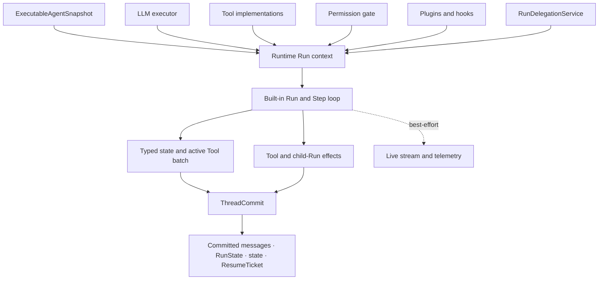
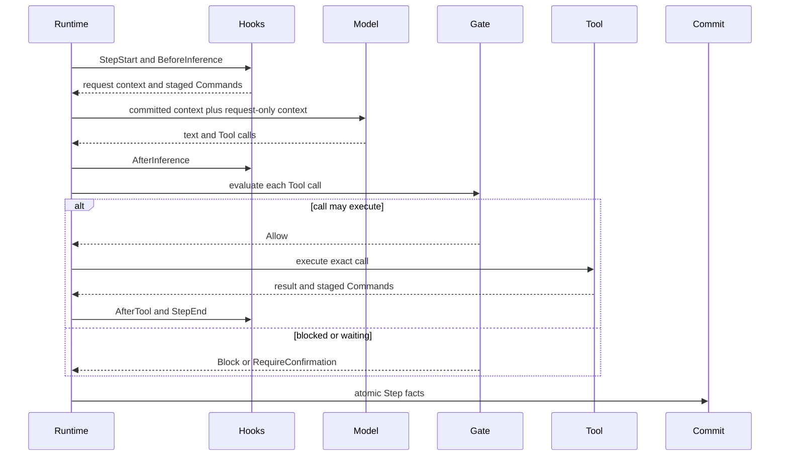

An Awaken Agent is an immutable behavior definition executed by the shared
Runtime loop. Change the smallest owning part; do not replace the loop to add a
Tool, context rule, permission check, or child Agent.

## Start from the change

| You need to change | Owner | Continue with |
| --- | --- | --- |
| instructions, models, visible Tools, Plugins, or limits | Agent publication | [Resolve an Agent publication](/docs/agents/runtime/explanation/agent-resolution/) |
| one model-requested action | typed Tool | [Implement a typed Tool](/docs/agents/runtime/how-to/add-a-tool/) |
| lifecycle context, filtering, or policy | Plugin and hooks | [Tool and Plugin boundary](/docs/agents/runtime/explanation/tool-and-plugin-boundary/) |
| authorization or approval | permission gate | [Capability and permission](/docs/agents/runtime/explanation/capability-and-permissions/) |
| recoverable Run or Thread data | typed state and `ThreadCommit` | [State and snapshot model](/docs/agents/runtime/explanation/state-and-snapshot-model/) |
| another Agent performing bounded work | `RunDelegationService` | [Multi-Agent patterns](/docs/agents/runtime/explanation/multi-agent-patterns/) |
| HTTP, IAM, scheduling, Worker, or Sandbox behavior | Agents service layer | [Agents architecture](/docs/agents/concepts/architecture/) |

## Static structure

The snapshot identifies behavior. Runtime ports supply executable capability.
The loop orders inference, gates, Tools, hooks, state, and commits. Only
committed facts are recovery authority; a live stream is an interaction surface.

## One Step

The detailed phase and batch state machine has one owner in [Run, Step, and
Tool batches](/docs/agents/runtime/explanation/run-lifecycle-and-phases/). This page
does not repeat its transition table.

## What the Runtime handles

- A Tool error becomes a model-visible result; the model may correct its next call.
- `RequireConfirmation` and delegated waiting become committed `Awaiting` states
  with resume identity.
- Step facts cross one commit boundary. A retry continues from the accepted
  frontier rather than replaying an uncommitted stream as truth.
- Cancellation, limits, and terminal causes use the existing Run lifecycle.

These are normal loop outcomes. Repair guidance belongs only beside a surfaced
configuration, registration, executor, or commit rejection that an external
maintainer can correct.
