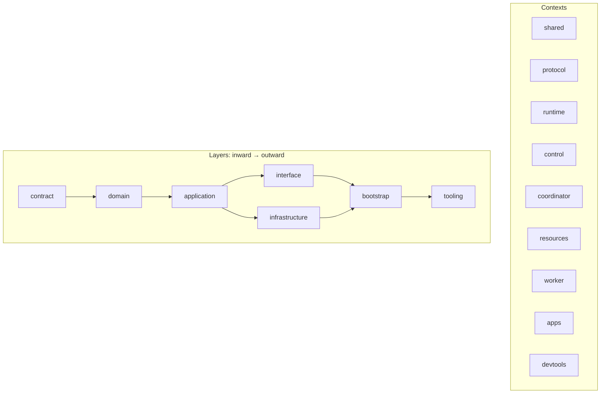
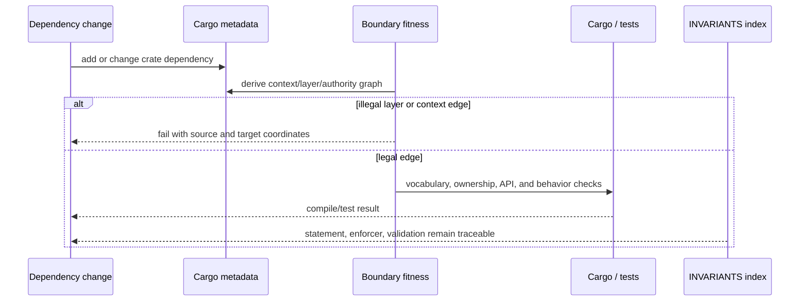
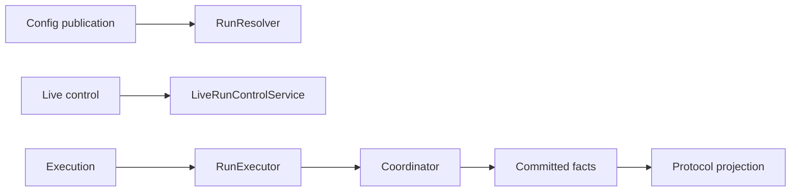

Use this page before adding a crate dependency, moving a type across contexts,
or changing an authority port. Find the owning invariant in
`docs/INVARIANTS.md`, preserve its enforcer and validation, then run the
metadata-derived boundary check. [Architecture](/docs/agents/runtime/explanation/architecture/)
owns the Runtime layer model; this page owns the maintenance rule.

## Critical path: one owner for truth

The runtime core consists of `awaken-agent-contract`,
`awaken-runtime-contract`, and `awaken-runtime`. It owns neutral Agent execution
concepts: Run/Thread identity, the loop, tool and plugin ports, typed state, and
the commit boundary. Public protocols, Workspace policy, vaults, deployment,
Session orchestration, and persistence adapters remain outside that core.

Three invariants define the critical path:

1. Durable Runtime writes cross one `Coordinator` boundary; public projections
   read committed facts.
2. An executable Run receives immutable `ExecutableAgentSnapshot` data; config
   authoring and publication do not enter the loop.
3. Permission is the only grant path. Discovery, visibility, compatibility,
   health, plugin bounds, and placement cannot grant tool authority.

## Static structure: context, layer, and authority

Every workspace crate declares exactly one
`package.metadata.awaken.{context,layer,authority}` tuple in its `Cargo.toml`.
The tuple, not the physical directory name and not `deny.toml`, is the source of
truth for dependency direction.



Cross-context contract dependencies are the normal integration seam.
`interface` and `infrastructure` are sibling outer rings. Process `bootstrap`
mounts adapters, while `apps` and `devtools` are composition roots. The exact
allowed-context and allowed-layer matrices live once in
`scripts/ci/_crate_dependency_fitness.py`.

The main ownership boundaries are:

| Concern | Authoritative owner | Runtime-facing contract |
|---|---|---|
| Agent execution truth | Runtime context | `RunExecutor`, `RunState`, `Coordinator` |
| Immutable executable config | Control publication, consumed by Runtime | `ExecutableAgentSnapshot`, `RunResolver` |
| Live steering | Run-ingress application | `LiveRunControl`, `LiveRunControlService` |
| Public wire vocabulary | Protocol adapters | neutral activation, resume, event, and result values |
| Durable storage | Store/resource infrastructure | `Coordinator`, `CheckpointReader`, domain repositories |

These are separate owners, not synchronized alternative implementations.

## Dynamic behavior: a change reaches CI



`scripts/ci/check_crate_boundaries.py` is the executable entry point. It runs the
metadata dependency matrix plus focused fitness checks for runtime secrets,
execution ownership, coordinator authority, resources, Sessions, migrations,
and public Managed protocol boundaries. The same check runs from repository
hooks and CI. `cargo deny check bans` remains dependency-hygiene tooling; it does
not duplicate the architecture matrix.

Run it from the Awaken repository root:

```console
python3 scripts/ci/check_crate_boundaries.py
```

An illegal edge reports its source and target coordinates. Correct the metadata
or move the dependency to the owning contract; do not add an exception in a
second checker. A successful boundary check establishes repository conformance,
not production deployment or runtime behavior.

## Neutral vocabulary and anti-corruption boundaries

The boundary check scans the three neutral core crates. Product-hosting
vocabulary such as `managed`, concrete built-in tool ids and symbols, secret
resolution, and retired execution-placement abstractions cannot enter the core.
Concrete tools live in extensions; public DTO names live in protocol adapters;
secret and deployment policy are resolved before Runtime execution.

This is an anti-corruption boundary in the Domain-Driven Design sense: adapters
translate public or deployment vocabulary into neutral values at the edge. It is
not a claim that every outer concept can be represented by one generic core
type.

## Separate authority axes

Config publication, live control, loop execution, durable commit, and public
projection stay on separate ports:



No Runtime API authors config, steers active Runs, executes the loop, commits
truth, and emits public DTOs as one controller. A cancel or wake is persisted and
correlated by the run-ingress application; the core only receives the neutral
control operation.

## Illegal lifecycle states are unrepresentable

A committed Run has one lifecycle authority:
`RunState::Running`, `RunState::Awaiting`, or
`RunState::Ended(EndCause)`. `RunDisposition` carries exactly the data legal for
the next commit: an awaiting variant owns its `ResumeTicket`, while running and
ended variants cannot carry one. `ThreadCommit::validate` rejects empty or
cross-Thread identities before a store write.

Public status, outcome, and error fields are derived projections. They are not
parallel stored facts. Likewise, `CommittedThreadView::run` and `latest_run`
derive different queries from the same committed fact prefix; neither creates a
second persistence path.

## Related

- [Architecture](/docs/agents/runtime/explanation/architecture/)
- [Design Tradeoffs](/docs/agents/runtime/explanation/design-tradeoffs/)
- [Thread Model](/docs/agents/runtime/reference/thread-model/)
- [Capability and Permissions](/docs/agents/runtime/explanation/capability-and-permissions/)
